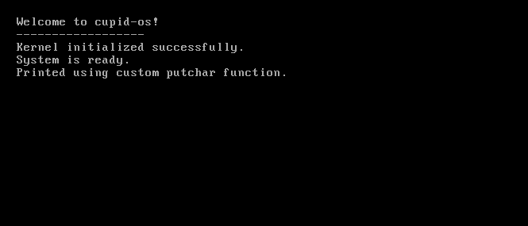

# cupid-os
A modern, 32-bit operating system written in C and x86 Assembly that combines clean design with nostalgic aesthetics. This project implements core OS functionality including:

- Custom bootloader with protected mode transition
- Comprehensive interrupt handling system
- Advanced PS/2 keyboard driver with full US layout support
- High-precision programmable timer system
- VGA text mode graphics with custom character rendering

The goal of cupid-os is to create an accessible, well-documented operating system that serves as both a learning platform and a foundation for experimental OS concepts. Drawing inspiration from TempleOS, OsakaOS, and classic game systems, it focuses on combining technical excellence with an engaging user experience.

## Philosophy
cupid-os embraces a philosophy of complete user empowerment and transparency, inspired by TempleOS. Like TempleOS, cupid-os gives users full, unrestricted access to the entire system:

- No security boundaries or privilege levels - all code runs in ring 0
- Direct hardware access from user programs
- Full memory access with no virtual memory restrictions
- Complete visibility into and control over all system internals
- No artificial limitations or "protections" getting in the way

The goal is to create a pure, simple environment where users have complete freedom to explore, experiment, and truly understand how their computer works at the lowest level. While this approach sacrifices security and isolation, it maximizes learning potential and enables direct hardware manipulation that modern OSes restrict.

This design choice reflects our belief that users should be trusted and empowered rather than constrained. For educational and experimental purposes, having full access to bare metal is invaluable.

## Structure
- `boot/` - Bootloader code (16-bit to 32-bit mode transition)
  - `boot.asm` - Main bootloader implementation
- `kernel/` - Kernel source code (32-bit protected mode C code)
  - `kernel.c` - Main kernel file
  - `idt.c/h` - Interrupt Descriptor Table implementation
  - `isr.c/h` - Interrupt Service Routines
  - `isr.asm` - Assembly interrupt service routines
  - `irq.c/h` - Hardware interrupt request handlers
  - `pic.c/h` - Programmable Interrupt Controller driver
  - `ports.h` - I/O port access functions
  - `types.h` - Custom type definitions
- `drivers/` - Device drivers
  - `keyboard.c/h` - PS/2 keyboard driver
  - `timer.c/h` - System timer implementation
  - `pit.c/h` - Programmable Interval Timer driver
- `link.ld` - Linker script for kernel
- `Makefile` - Build system
- `LICENSE` - GNU General Public License v3

## Features
- Custom bootloader that switches from 16-bit real mode to 32-bit protected mode
- Basic VGA text mode driver (80x25 characters)
- Screen output with support for:
  - Character printing
  - String printing
  - Newline handling
  - Screen scrolling
  - Screen clearing
- Interrupt handling:
  - Interrupt Descriptor Table (IDT)
  - Basic exception handlers with detailed error messages
  - Hardware interrupt support
  - PIC (Programmable Interrupt Controller) configuration
  - Custom interrupt handler registration
  - Debug exception handling
- Keyboard support:
  - PS/2 keyboard driver
  - Scancode to ASCII mapping
  - Full US keyboard layout support
  - Key state tracking
  - Event buffer system with circular buffer implementation
  - Interrupt-driven input handling (IRQ1)
  - Comprehensive modifier key support (Shift, Ctrl, Alt, Caps Lock)
  - Extended key support (e.g., right ctrl/alt)
  - Function keys support (F1-F12)
  - Key repeat handling with configurable delays
  - Key debouncing
  - Special key support (backspace, tab, enter)
- Timer functionality:
  - PIT (Programmable Interval Timer) implementation
  - Basic system clock
  - Timer interrupts
  - System tick counter
  - Basic sleep/delay functions
  - Timer calibration using CPU timestamp counter (TSC)
  - Multi-channel PIT support:
    - Channel 0: System timer (100Hz)
    - Channel 1: Custom timing events
    - Channel 2: PC Speaker control (planned)
  - Configurable timer frequencies per channel
  - Hardware-based timing precision
  - CPU frequency detection
  - Microsecond delay support
  - Power-efficient sleep modes
  - High-precision measurement capabilities
  - Timer event callbacks

## Development Roadmap
The development roadmap outlined below represents our current plans and priorities. However, it's important to note that this roadmap is flexible and will evolve based on:

- New requirements discovered during development
- Technical challenges and learning opportunities encountered
- Community feedback and contributions
- Integration needs between different system components
- Performance optimization requirements
- Hardware support requirements
- Testing and debugging needs

As we progress, new phases and tasks may be added, existing ones may be modified, and priorities may shift to ensure we're building the most robust and useful system possible.

### Phase 1 - Core System Infrastructure
1. **Interrupt Handling** (✅ Complete)
   - ✅ Implement IDT (Interrupt Descriptor Table)
   - ✅ Set up basic exception handlers
   - ✅ Handle hardware interrupts
   - ✅ Implement PIC configuration
   - ✅ Add detailed error messages for exceptions
   - ✅ Support for custom interrupt handlers

2. **Keyboard Input** (✅ Complete)
   - ✅ Implement PS/2 keyboard driver
   - ✅ Basic input buffer
   - ✅ Scancode handling
   - ✅ Input event processing
   - ✅ Keyboard state management
   - ✅ Modifier key support (Shift, Caps Lock)
   - ✅ Additional modifier keys (Ctrl, Alt)
   - ✅ Key repeat handling
   - ✅ Function keys support
   - ✅ Extended key support
   - ✅ Key debouncing
   - ✅ Circular buffer implementation

3. **Timer Support** (🔄 In Progress)
   - ✅ PIT (Programmable Interval Timer) implementation
   - ✅ Basic system clock
   - ✅ Timer interrupts
   - ✅ System tick counter
   - ✅ Sleep/delay functions
   - ✅ Timer calibration
   - ✅ Multiple timer channels
   - 🔄 Variable frequency support
   - ⭕ PC Speaker support
   - ⭕ High-precision timing modes

4. **Memory Management** (⭕ Planned)
   - ⭕ Physical memory manager
   - ⭕ Simple memory allocation/deallocation
   - ⭕ Basic paging setup
   - ⭕ Memory protection
   - ⭕ Heap management
   - ⭕ Memory mapping
   - ⭕ Virtual memory support
   - ⭕ Memory statistics tracking

### Phase 2 - Extended Features
5. **Shell Interface** (⭕ Planned)
   - ⭕ Command parsing
   - ⭕ Basic shell commands
   - ⭕ Command history
   - ⭕ Tab completion

6. **Process Management** (⭕ Planned)
   - ⭕ Process creation/termination
   - ⭕ Basic scheduling
   - ⭕ Process states
   - ⭕ Context switching

7. **Basic Device Drivers** (⭕ Planned)
   - ✅ PS/2 Keyboard
   - ⭕ VGA graphics
   - ⭕ Serial port
   - ⭕ Real-time clock

8. **Simple Filesystem** (⭕ Planned)
   - ⭕ Basic file operations
   - ⭕ Directory structure
   - ⭕ File permissions

### Phase 3 - Advanced Features
10. Custom compiler
11. Advanced memory management
12. Extended device support
13. Multi-process scheduling

## Example of cupid-os


## Requirements
- NASM (Netwide Assembler) for bootloader compilation
- GCC (32-bit support required)
- GNU Make
- QEMU for testing (qemu-system-i386)
- Linux environment (or equivalent Unix-like system)

## Building
1. Install dependencies (Ubuntu/Debian):
```bash
sudo apt-get install nasm gcc make qemu-system-x86
```

2. Build the OS:
```bash
make
```

3. Run in QEMU:
```bash
make run
```

## Project Structure Details
### Bootloader (`boot/boot.asm`)
- Loads at 0x7C00 (BIOS loading point)
- Sets up initial environment
- Loads kernel from disk
- Switches to protected mode
- Jumps to kernel at 0x1000

### Kernel Components
#### Main Kernel (`kernel/kernel.c`)
- Entry point at 0x1000
- Implements basic screen I/O
- VGA text mode driver
- System initialization
- IDT initialization

#### Interrupt System (`kernel/idt.c`, `kernel/isr.asm`)
- Complete IDT setup and management
- Exception handlers with detailed error messages
- Hardware interrupt support (IRQ0-15)
- Programmable Interrupt Controller (PIC) configuration
- Custom interrupt handler registration
- Debug exception handling

#### Input System (`drivers/keyboard.c`, `drivers/keyboard.h`)
- PS/2 keyboard driver with:
  - Full US keyboard layout support
  - Shift and Caps Lock modifiers
  - Key state tracking
  - Interrupt-driven input handling (IRQ1)
  - Debouncing support
  - Extended key support (e.g. right ctrl/alt)
  - Circular buffer for key events
  - Support for special keys (backspace, tab, enter)

### Memory Layout
- Bootloader: 0x7C00
- Kernel: 0x1000
- Stack: 0x90000
- IDT: Dynamically allocated

## Development
To modify or extend the OS:

1. Bootloader changes:
   - Edit `boot/boot.asm`
   - Modify GDT if adding memory segments
   - Update kernel loading if kernel size changes

2. Kernel changes:
   - Edit `kernel/kernel.c`
   - Update `kernel/link.ld` if changing memory layout
   - Modify Makefile if adding new source files

## Debugging
1. Debug with QEMU monitor:
```bash
make run
# Press Ctrl+Alt+2 for QEMU monitor
```

2. Debug with GDB:
```bash
# Terminal 1
qemu-system-i386 -s -S -boot a -fda cupidos.img

# Terminal 2
gdb
(gdb) target remote localhost:1234
```

## Contributing
1. Fork the repository
2. Create your feature branch
3. Commit your changes
4. Push to the branch
5. Create a Pull Request

## License
GNU v3

## Recent Updates
- Implemented comprehensive keyboard driver with full modifier key support
- Added function key handling (F1-F12)
- Implemented key repeat functionality with configurable delays
- Added debouncing support for more reliable key input
- Enhanced exception handling with detailed error messages
- Implemented basic PIT timer with system tick counter
- Added initial delay/sleep functionality using timer ticks