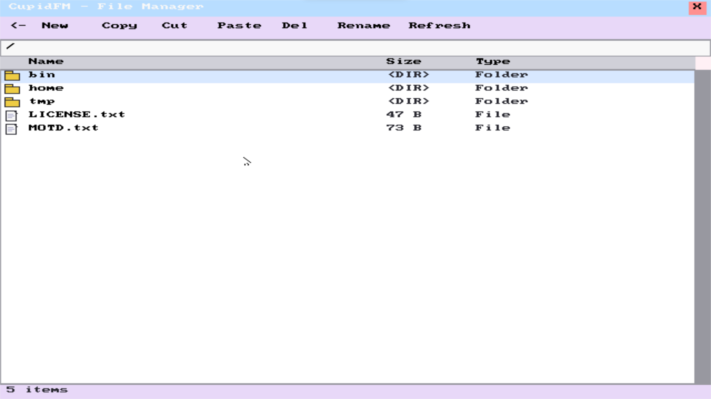
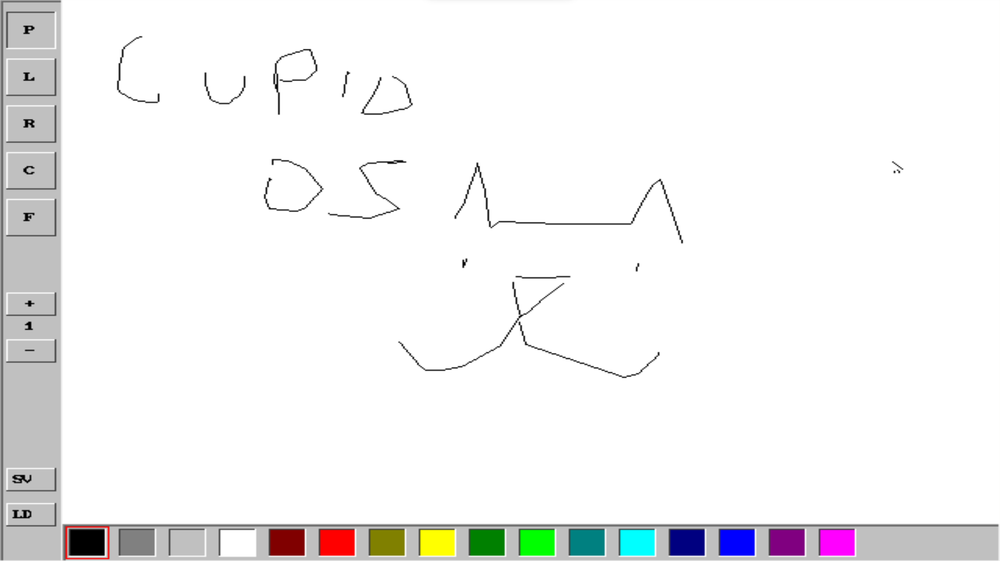
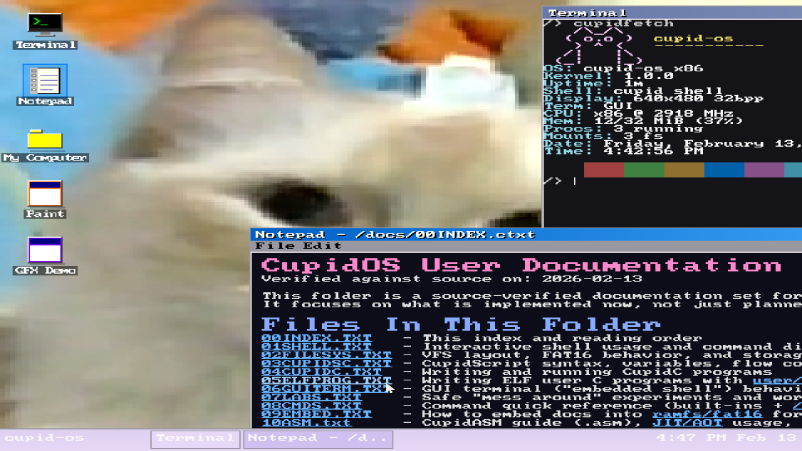

# cupid-os
A modern, 32-bit operating system written in C and x86 Assembly that combines clean design with nostalgic aesthetics. The project implements core OS functionality while serving as both a learning platform and a foundation for experimental OS concepts. Inspired by systems like TempleOS and OsakaOS, cupid-os aims to provide a transparent, hands-on environment where users can directly interact with hardware.

## Example of cupid-os





**Key Features:**
- VBE 640×480 32bpp desktop environment with window manager
- CupidC compiler (HolyC-inspired) - JIT and AOT compilation
- CupidASM assembler - Intel-syntax x86-32 with JIT/AOT modes
- CupidScript - Bash-like scripting language with pipes and redirects
- 40+ shell commands with advanced features (pipes, redirects, jobs)
- VFS with RamFS, DevFS, and FAT16 disk support
- Process scheduler with 32 kernel threads
- Custom bootloader with unreal mode for loading above 1MB
- Comprehensive interrupt handling system
- Advanced PS/2 keyboard and mouse drivers
- High-precision programmable timer system

The goal of cupid-os is to create an accessible, well-documented operating system that serves as both a learning platform and a foundation for experimental OS concepts. Drawing inspiration from TempleOS, OsakaOS, and classic game systems, it focuses on combining technical excellence with an engaging user experience.

## Philosophy
cupid-os embraces a philosophy of complete user empowerment and transparency, inspired by TempleOS. Like TempleOS, cupid-os gives users full, unrestricted access to the entire system:

- No security boundaries or privilege levels - all code runs in ring 0
- Direct hardware access from user programs
- Full memory access with no virtual memory restrictions
- Complete visibility into and control over all system internals
- No artificial limitations or "protections" getting in the way

The goal is to create a pure, simple environment where users have complete freedom to explore, experiment, and truly understand how their computer works at the lowest level. While this approach sacrifices security and isolation, it maximizes learning potential and enables direct hardware manipulation that modern OSes restrict.

This design choice reflects our belief that users should be trusted and empowered rather than constrained. For educational and experimental purposes, having full access to bare metal is invaluable.

With that being said cupid-os also will have a mix of influence from mostly Linux and UNIX-like systems, with some visual and other inspiration coming from both templeOS, and OsakaOS. 

## Project Structure

- **boot/**  
  - `boot.asm` - Bootloader that sets up the environment, loads the kernel, and switches to protected mode.

- **kernel/**  
  - `kernel.c` - Main kernel file handling VGA initialization, timer calibration, and overall system startup.
  - `idt.c/h` - IDT setup and gate configuration.
  - `isr.asm` - Assembly routines for common ISR/IRQ stubs.
  - `irq.c/h` - IRQ dispatch and handler installation.
  - `pic.c/h` - PIC (Programmable Interrupt Controller) initialization and masking functions.
  - `math.c/h` - Math utilities including 64-bit division, itoa, and hex printing.
  - `shell.c/h` - A basic shell interface that handles user input and simple commands.
  - `string.c/h` - Basic string manipulation functions.
  - `cpu.h` - CPU utility functions (including `rdtsc` and CPU frequency detection).
  - `kernel.h` - Core kernel definitions and shared globals (e.g., VGA parameters).

- **drivers/**  
  - `keyboard.c/h` - PS/2 keyboard driver with enhanced key support (arrow keys, delete, and modifiers).
  - `timer.c/h` - Timer functions including sleep/delay, tick counting, and multi-channel support.
  - `pit.c/h` - PIT configuration and frequency setup.
  - `speaker.c/h` - PC speaker driver with tone and beep functionality.

- **link.ld** - Linker script defining the kernel image layout.
- **Makefile** - Build configuration that compiles the bootloader, kernel, and drivers into a bootable image.
- **LICENSE** - GNU General Public License v3.

# Features

- **Custom Bootloader & Protected Mode Transition**  
  - Two-stage bootloader with unreal mode support
  - Loads kernel above 1MB (0x100000) via chunked CHS reads
  - Enables A20 line and sets up VBE 640×480 32bpp graphics
  - Sets up a Global Descriptor Table (GDT) for proper memory segmentation

- **CupidC Compiler (HolyC-inspired)**
  - Single-pass recursive descent C compiler built into the kernel
  - JIT mode: compile and run `.cc` files instantly in-memory
  - AOT mode: compile to ELF32 binaries on disk
  - Full ring-0 access with kernel bindings for I/O, memory, VFS, graphics
  - Inline assembly support
  - Struct support with up to 16 fields
  - 128KB code, 32KB data, 256 functions, 512 symbols

- **CupidASM Assembler**
  - Intel-syntax x86-32 assembler with NASM-compatible syntax
  - JIT mode: assemble and execute `.asm` files in-memory
  - AOT mode: assemble to ELF32 binaries
  - 62 mnemonics, 24 registers (8/16/32-bit)
  - Kernel bindings for direct function calls (print, malloc, VFS, etc.)
  - 128KB code, 32KB data, 512 labels, single-pass with forward references
  - 8 demo programs included (hello, math, loops, recursion, sorting)

- **CupidScript Language**
  - Bash-like scripting language with `.cup` extension
  - Variables, loops (`for`, `while`), conditionals (`if`/`else`)
  - Functions with parameters and return values
  - Pipes (`|`), redirects (`>`, `>>`), background jobs (`&`)
  - Arrays and string manipulation
  - Integration with shell commands

- **Shell Interface**
  - 40+ built-in commands (ls, cat, cd, mkdir, rm, cp, mv, mount, etc.)
  - Command history with arrow navigation and tab completion
  - Pipes, redirects, and background job control
  - Colorized output and prompt customization
  - CupidScript interpreter integration
  - Direct `.cc`, `.asm`, and `.cup` execution

- **Desktop Environment**
  - VBE 640×480 32bpp linear framebuffer
  - Window manager with drag, focus, minimize, close
  - Z-order management for up to 16 windows
  - Taskbar with clock and window list
  - Terminal application with ANSI escape sequence support
  - Notepad application with file dialog
  - Mouse cursor rendering with hardware acceleration

- **Interrupt & Exception Handling**  
  - Comprehensive Interrupt Descriptor Table (IDT) configuration.
  - Exception handlers with detailed error messages.
  - IRQ management with PIC remapping and custom handler registration.
  - A common ISR/IRQ stub that saves processor state before dispatch.

- **PS/2 Keyboard Driver**  
  - Full US keyboard layout support.
  - Interrupt-driven input processing (IRQ1) with scancode-to-ASCII conversion.
  - **Enhanced Key Handling:**  
    - Support for modifier keys (Shift, Ctrl, Alt, Caps Lock) with proper state tracking.
    - Extended key support including arrow keys and the delete key.
    - Circular buffer implementation for key event storage.
    - Configurable key repeat and debouncing via timestamping.

- **Timer & CPU Calibration**  
  - Uses the Intel 8253/8254 Programmable Interval Timer (PIT) for system timing.
  - Provides system tick counters, sleep/delay functions, and multi-channel timer callbacks.
  - **High-Precision Timing:**  
    - Calibrates using the CPU’s Time Stamp Counter (TSC) to measure the CPU frequency.
    - Exposes `get_cpu_freq()` and `get_pit_ticks_per_ms()` for accurate timing calculations.
    
- **VGA Text Mode Graphics**  
  - Basic VGA driver for an 80×25 text display.
  - Functions for printing characters, strings, and integers.
  - Automatic screen scrolling and hardware cursor updates.

- **PC Speaker Driver**  
  - Implements basic tone and beep functionality.
  - Supports configuring PIT channel 2 to generate square waves for sound output.

- **Memory Management Foundations**  
  - Bitmap-backed physical page frame allocator (currently targeting the first 32MB).
  - Identity-mapped paging setup with 4KB pages to keep addresses stable in ring 0.
  - Kernel heap with a bump allocator + free list for small dynamic allocations.

- **Virtual File System (VFS)**
  - Unified file API with POSIX-like operations (open, read, write, close, seek, etc.)
  - Multiple filesystem support: RamFS (root /), DevFS (/dev), FAT16 (/home)
  - Path parsing with directory traversal
  - Inode abstraction for files and directories
  - Device file support (/dev/null, /dev/zero, /dev/random, etc.)
  - Mount point management

- **Process Management**
  - Multi-tasking with up to 32 concurrent threads
  - Preemptive round-robin scheduler (10ms time slices)
  - Process states: running, ready, blocked, zombie
  - Kernel and user-space threads
  - Process creation/termination (spawn, exit, wait)
  - Signal handling and inter-process communication

- **Memory Management**
  - Physical Memory Manager (PMM) with bitmap allocator
  - 32MB identity-mapped address space for ring-0 kernel
  - Kernel heap with bump allocator and free list
  - Stack allocation at 0x800000-0x880000 with guard pages
  - Page frame allocation for processes
  - Memory statistics and leak detection tools

- **ELF Loader**
  - Full ELF32 binary loader for executable files
  - Supports program headers and section headers
  - BSS zeroing and data/code loading
  - Relocation support for position-independent code
  - Integration with process creation system

- **Device Drivers**
  - **PS/2 Keyboard**: IRQ1-driven, full US layout, modifier keys, key repeat, circular buffer
  - **PS/2 Mouse**: IRQ12-driven, 3-button support, movement tracking, cursor rendering
  - **ATA/IDE**: PIO read/write, CHS/LBA28 addressing, primary/secondary channels
  - **VGA**: 80×25 text mode, hardware cursor, color attributes
  - **VBE**: 640×480 32bpp linear framebuffer for GUI
  - **PIT (Timer)**: 8253/8254 programmable timer, system ticks, sleep functions
  - **RTC**: Real-time clock, calendar functions, CMOS access
  - **Serial**: COM1/COM2 UART driver for debugging
  - **PC Speaker**: Tone generation via PIT channel 2

- **Graphics & GUI**
  - 2D graphics library with primitives (line, rect, circle, filled shapes)
  - BMP image loading and rendering (24-bit/32-bit)
  - 8×8 bitmap font renderer with color support
  - Clipping and bounds checking
  - Icon library for desktop applications
  - Alpha blending and effects

- **Interrupt & Exception Handling**
  - Comprehensive IDT (Interrupt Descriptor Table) with 256 entries
  - Exception handlers for all CPU exceptions (0-31)
  - IRQ handling with PIC remapping (32-47)
  - Custom interrupt handler registration
  - Detailed error messages with register dumps and stack traces

- **Utility Libraries**
  - **String**: strlen, strcmp, strcpy, strcat, strtok, strstr, etc.
  - **Math**: 64-bit division, modulo, square root, itoa, atoi
  - **Memory**: memcpy, memset, memmove, memcmp
  - **Date/Time**: Calendar calculations, RTC integration
  - **Debug**: Assertion framework, kernel logging, memory dumps

## Recent Updates

- **CupidC Compiler** (January 2025): Full HolyC-inspired C compiler with JIT/AOT modes, inline assembly, struct support, and kernel bindings
- **CupidASM Assembler** (January 2025): Intel-syntax x86-32 assembler with 62 mnemonics, JIT/AOT modes, and NASM compatibility
- **Desktop Environment** (January 2025): VBE graphics with window manager, terminal app, notepad, taskbar, and mouse cursor
- **Virtual File System** (January 2025): Unified VFS layer with RamFS, DevFS, and FAT16 support
- **Process Scheduler** (December 2024): Preemptive multi-tasking with 32 threads and round-robin scheduling
- **Two-Stage Bootloader** (January 2025): Rewritten bootloader with unreal mode for loading kernel above 1MB
- **CupidScript** (December 2024): Bash-like scripting language with pipes, redirects, loops, and functions

## Development Roadmap

### ✅ Completed (Phases 1-3)
1. **Core Infrastructure**: Bootloader, IDT, exceptions, IRQ handling, PIC configuration
2. **Device Drivers**: PS/2 keyboard/mouse, ATA/IDE, VGA, VBE, PIT, RTC, serial, PC speaker
3. **Memory Management**: PMM, heap allocator, paging, stack guard
4. **Process Management**: Multi-tasking scheduler, process creation/termination, context switching
5. **File Systems**: VFS layer, RamFS, DevFS, FAT16 with read/write support
6. **Shell Interface**: 40+ commands, history, tab completion, pipes, redirects, background jobs
7. **Compilers**: CupidC (C compiler), CupidASM (assembler), CupidScript (scripting)
8. **Desktop Environment**: Window manager, terminal, notepad, taskbar, mouse support
9. **Graphics**: 2D library, BMP loader, font renderer, icons, effects

### 🔄 In Progress (Phase 4 - Enhancement & Optimization)
- **Networking Stack**: Ethernet driver, TCP/IP implementation, sockets API
- **Advanced IPC**: Message queues, shared memory, semaphores
- **User Mode**: Ring-3 process support, system calls, user-space isolation
- **Virtual Memory**: Demand paging, copy-on-write, memory-mapped files
- **Performance**: Block cache optimization, lazy evaluation, JIT compiler improvements

### 📋 Planned (Phase 5 - Expansion)
- **Audio Support**: Sound card driver, PCM playback, mixer
- **USB Support**: UHCI/EHCI drivers, USB mass storage, HID devices
- **Advanced Filesystems**: ext2/ext3 support, journaling
- **Package Manager**: Binary package format, dependency resolution
- **Self-Hosting**: Build CupidOS from within CupidOS (compiler toolchain)
- **Music & Multimedia**: Custom music program in dedication to Terry A. Davis

## Requirements
- NASM (Netwide Assembler) for bootloader compilation
- GCC (32-bit support required)
- GNU Make
- QEMU for testing (qemu-system-i386)
- Linux environment (or equivalent Unix-like system)

## Building
1. Install dependencies (Ubuntu/Debian):
```bash
sudo apt-get install nasm gcc make qemu-system-x86
```

2. Build the OS:
```bash
make
```

The HDD image size is configurable at build time:
```bash
make HDD_MB=100
make HDD_MB=200
```
Default is `HDD_MB=200`.

3. Run in QEMU:
```bash
make run
```

### Persistent `/home` and image lifecycle
- `cupidos.img` contains bootloader + kernel area + FAT16 partition.
- FAT16 is mounted in cupid-os as `/home`.
- `make` reuses existing `cupidos.img` (preserves `/home` data).
- `make clean` keeps `cupidos.img`.
- `make clean-image` removes only `cupidos.img`.
- `make distclean` removes build artifacts and `cupidos.img`.

### Copy files from host into `/home`
Use `mtools` (`mcopy`, `mdir`, `mmd`) on the FAT partition inside `cupidos.img`.

Default FAT partition offset is `4096 * 512 = 2097152` bytes.

```bash
# copy host file into OS path /home/cupid.bmp
mcopy -o -i cupidos.img@@2097152 cupid.bmp ::/cupid.bmp

# verify in FAT root (this is OS /home)
mdir -i cupidos.img@@2097152 ::/
```

If you change `FAT_START_LBA`, recompute offset as:
`offset_bytes = FAT_START_LBA * 512`.

## Project Structure

### Bootloader (`boot/boot.asm`)
- Two-stage bootloader: 512-byte stage 1 + 2KB stage 2
- Stage 1: Loads at 0x7C00, loads stage 2 from sectors 1-4 to 0x7E00
- Stage 2: Unreal mode setup for >1MB access, VBE initialization, kernel loading
- Loads kernel from sector 5+ to 0x100000 via chunked CHS reads
- Enables A20 line, sets up GDT, switches to protected mode
- Boots into kernel at 0x100000

### Kernel Components

#### Core Kernel (`kernel/kernel.c`)
- Entry point at 0x100000
- Stack at 0x880000 (grows down to 0x800000)
- Initializes IDT, GDT, PIC, PIT, keyboard, mouse, VGA, VBE
- Launches desktop environment or shell based on graphics mode
- Main event loop for GUI or command processing

#### Compilers & Languages
- **CupidC** (`kernel/cupidc*.c`): C compiler with lexer, parser, code generator, ELF output
- **CupidASM** (`kernel/as*.c`): x86-32 assembler with Intel syntax, JIT/AOT modes
- **CupidScript** (`kernel/cupidscript*.c`): Bash-like scripting with pipes, loops, functions

#### File Systems (`kernel/vfs.c`, `kernel/fat16*.c`, `kernel/devfs.c`)
- VFS layer with unified file operations (open, read, write, close, seek)
- RamFS: In-memory root filesystem
- DevFS: Device files (/dev/null, /dev/zero, /dev/random, etc.)
- FAT16: Read/write support for disk partitions mounted at /home

#### Process Management (`kernel/process.c`)
- Multi-tasking scheduler with up to 32 threads
- Preemptive round-robin scheduling (10ms time slices)
- Process creation (spawn), termination (exit), waiting (wait)
- Context switching via timer interrupt (IRQ0)

#### Memory Management (`kernel/memory.c`, `kernel/pmm.c`)
- Physical Memory Manager (PMM) with bitmap allocator
- Identity-mapped 32MB address space
- Kernel heap with bump allocator and free list
- Stack guard pages at 0x800000-0x880000

#### Graphics & Desktop (`kernel/desktop.c`, `kernel/gfx2d*.c`)
- VBE 640×480 32bpp linear framebuffer
- 2D graphics primitives (line, rect, circle, filled shapes)
- BMP image loader and renderer
- Window manager with drag, focus, minimize, close
- Terminal and notepad applications
- Taskbar with clock and window list

#### Device Drivers (`drivers/*.c`)
- **PS/2 Keyboard** (`keyboard.c`): IRQ1-driven, full US layout, modifiers
- **PS/2 Mouse** (`mouse.c`): IRQ12-driven, 3-button support, cursor rendering
- **ATA/IDE** (`ata.c`): PIO mode, CHS/LBA28 addressing, read/write
- **PIT Timer** (`pit.c`, `timer.c`): 8253/8254 timer, system ticks, sleep
- **RTC** (`rtc.c`): Real-time clock, CMOS access
- **VGA** (`vga.c`): 80×25 text mode, hardware cursor
- **Serial** (`serial.c`): COM1/COM2 UART for debugging
- **PC Speaker** (`speaker.c`): Tone generation

#### Interrupt System (`kernel/idt.c`, `kernel/isr.asm`)
- 256-entry IDT with CPU exceptions (0-31) and IRQs (32-47)
- PIC remapping and IRQ masking
- Custom interrupt handler registration
- Stack trace and register dump on exceptions

#### Shell (`kernel/shell.c`, `bin/*.cc`)
- 40+ built-in commands (ls, cat, cd, mkdir, rm, cp, mv, mount, ps, kill, etc.)
- Command history with arrow navigation and tab completion
- Pipes, redirects, background jobs
- Direct execution of .cc, .asm, .cup files

### Memory Layout
- Bootloader Stage 1: 0x7C00 (512 bytes)
- Bootloader Stage 2: 0x7E00 (2KB)
- Kernel Load Address: 0x100000 (1MB)
- Stack: 0x880000 → 0x800000 (512KB, grows down)
- CupidC JIT Code: 0x400000 (128KB code + 32KB data)
- CupidASM JIT Code: 0x500000 (128KB code + 32KB data)
- Framebuffer: Auto-detected via VBE (typically 0xE0000000+)

## Development

### Making Changes
1. **Bootloader modifications**:
   - Edit [boot/boot.asm](boot/boot.asm)
   - Update GDT/VBE settings if needed
   - Adjust kernel loading address or sector count

2. **Kernel modifications**:
   - Edit kernel source files in [kernel/](kernel/)
   - Add new drivers in [drivers/](drivers/)
   - Update [Makefile](Makefile) when adding new .c/.asm files

3. **User programs**:
   - Create .cc files in [bin/](bin/) for CupidC programs
   - Create .asm files in [demos/](demos/) for CupidASM programs
   - Create .cup files for CupidScript scripts

### Testing
Run in QEMU with graphics:
```bash
make run
```

Run in text mode (no GUI):
```bash
qemu-system-i386 -boot c -hda cupidos.img
```

### Debugging
1. **QEMU monitor** (press Ctrl+Alt+2 in QEMU window):
```bash
make run
# Use monitor commands: info registers, info mem, etc.
```

2. **GDB debugging**:
```bash
# Terminal 1 - Start QEMU with GDB stub
qemu-system-i386 -s -S -boot c -hda cupidos.img

# Terminal 2 - Connect GDB
gdb
(gdb) target remote localhost:1234
(gdb) break *0x100000
(gdb) continue
```

3. **Serial port logging**:
```bash
# Kernel prints debug messages to COM1
make run  # QEMU captures serial output to terminal
```


## Contributing
Contributions are welcome! Please:
1. Fork the repository
2. Create a feature branch
3. Make your changes with clear commit messages
4. Test thoroughly with `make run`
5. Submit a pull request

## License
GNU General Public License v3.0

## Acknowledgments
Inspired by Terry A. Davis and TempleOS. Built as a learning project to explore OS development, compiler design, and low-level programming.
