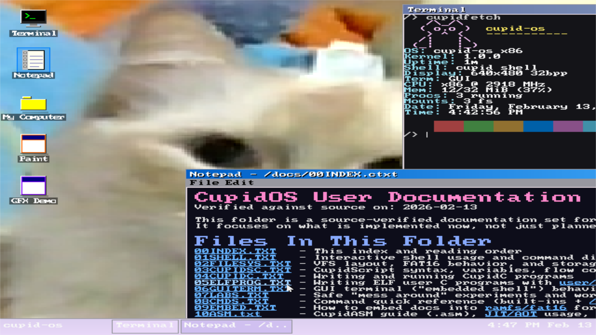
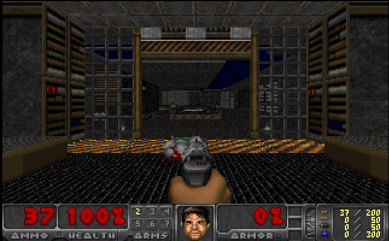
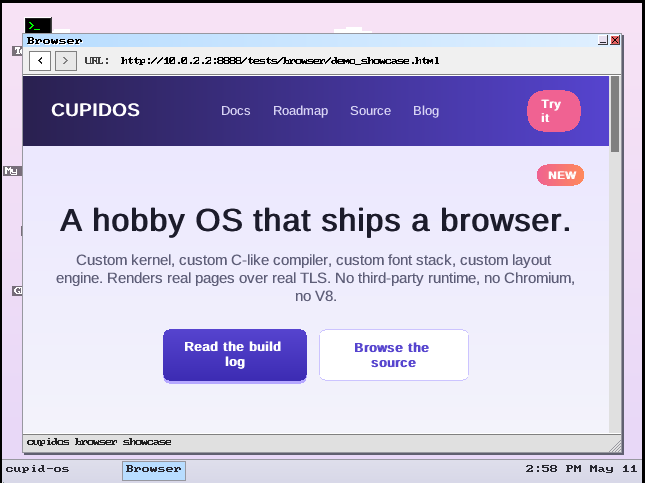
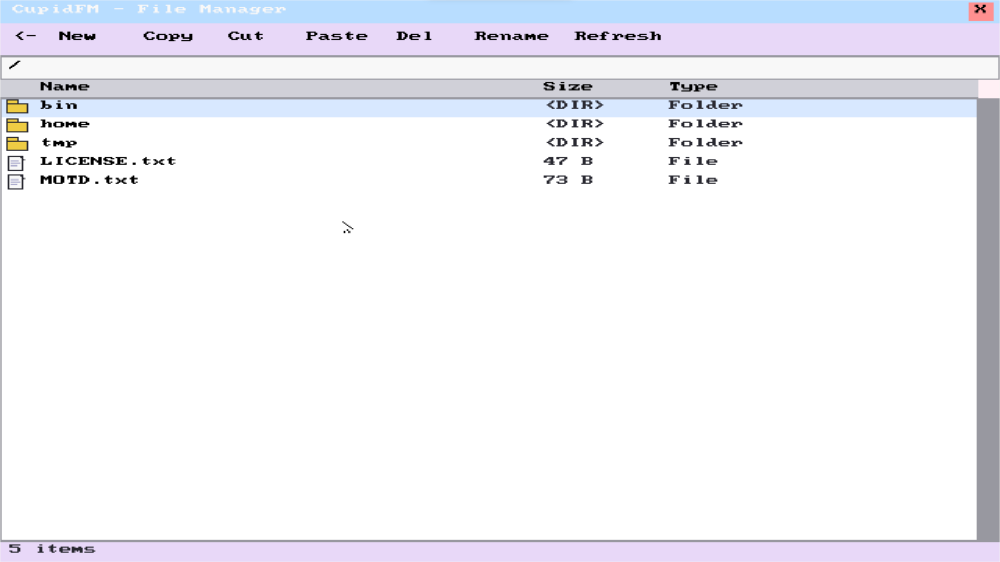
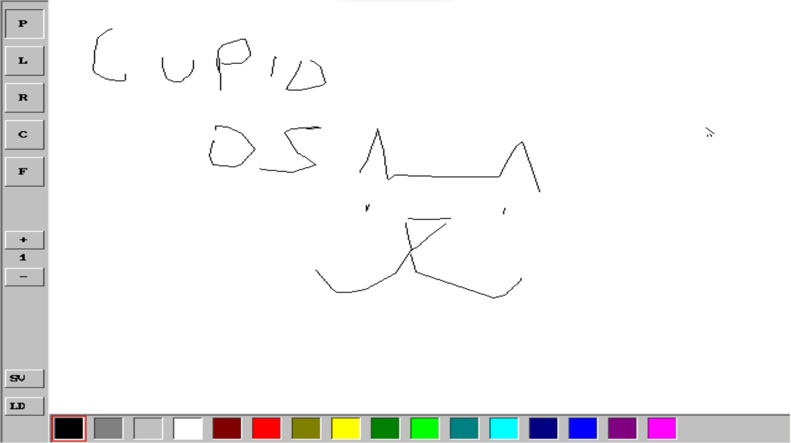

# cupid-os

Cupid OS is a 32-bit x86 hobby OS written in C and Cupid ASM. It has a graphical desktop, window manager, built-in C compiler, assembler, and scripting language. It runs on real hardware and in QEMU. The design draws from TempleOS, OsakaOS, and Unix.











## Current features

- VBE 640x480 32bpp graphics with a window manager, taskbar, and desktop icons
- CupidC, a HolyC-inspired C compiler with JIT and ELF32 AOT output
- Hardware FPU (x87) and SSE/SSE2 with eager FXSAVE context switch
- CupidC float/double scalars and float4/double2 SIMD types with SSE intrinsics
- libm: 25 operations (sqrt, sin, cos, tan, atan, atan2, exp, exp2, log, log2, pow, asin, acos, sinh, cosh, tanh, cbrt, hypot, nextafter, fabs, floor, ceil, round, trunc, fmod + f-variants)
- printf %f, %e, %g, %.Nf with x87-backed int/fractional split
- #NM/#MF/#XF FPU exception handlers with MXCSR/FSW/FCW dump
- CupidASM, an Intel-syntax x86-32 assembler with JIT and ELF32 AOT output
- CupidScript, a shell scripting language with pipes, redirects, and job control
- 100+ embedded source-backed shell programs with history, context-aware tab completion, pipes, and redirects
- VFS with RamFS (/), DevFS (/dev), FAT16 (/disk), and persistent homefs (/home)
- Opt-in swap: handle-based disk-backed memory extension with 4 size
  classes (1K/4K/16K/64K), true LRU eviction, up to 1024 handles over
  a 16 MB FAT16 swap file.
- ISO9660 readonly mount with Rock Ridge (SUSP/RRIP) long filenames,
  multi-mount (up to 4), case-insensitive lookup; mount .iso files
  from the VFS via `mount foo.iso /iso`
- Preemptive round-robin scheduler, up to 32 kernel threads
- Process domains in scheduler and `ps` output (kernel/hosted/external)
- Two-stage bootloader that loads the kernel above 1MB via unreal mode
- GUI apps: Notepad, Terminal with ANSI colors, Paint, Calendar, File Manager
- 64-entry LRU disk block cache with write-back policy
- 7 GUI themes: Windows95, Pastel Dream, Dark Mode, High Contrast, Retro Amber, Temple, and Vaporwave
- USB 1.1 and 2.0 through UHCI and EHCI host controllers, with HID keyboard and mouse support, hubs up to depth 5, and BBB/SCSI mass storage
- SMP for up to 32 CPUs, with ACPI/MP discovery, per-CPU LAPIC timers, a big kernel lock, reschedule IPIs, and cross-CPU calls
- RTL8139 and E1000 networking with ARP, IPv4 fragmentation and reassembly, ICMP, UDP, client and server TCP, DHCP with static fallback, DNS, BSD-style sockets, and the two-NIC `make test-net` harness
- TLS 1.2 and 1.3 client handshakes with public servers using ChaCha20-Poly1305 or AES-128-GCM, RSA-PKCS1v15 and RSA-PSS verification, ECDSA-P256, X25519 or P-256 ECDHE, hostname checks, and X.509 validation against an embedded Mozilla CA bundle
- HTTP and HTTPS through `curl` and `wget`; `curl` supports GET, POST, common request flags, and bounded HTTP-to-HTTP redirects, while `wget` supports `-O` and `-q`, derives output names, and reports status
- In-OS `ssh` and `telnet` clients plus an `sshd` server. SSH supports password and keyboard-interactive authentication, PTY shells, remote execution, host-key verification, Curve25519/ChaCha20-Poly1305, and terminal resizing
- A graphical shell browser with HTML5 tokenization and tree building, CSS cascade and specificity, variables and `calc`, web fonts, block and inline layout, HTTP and HTTPS, navigation history, and GET forms
- AC97 audio at 22050 Hz stereo, a 16-slot signed 16-bit mixer, the cycle-accurate LGPL-2.1 Nuked-OPL3 emulator, and an 18-voice MIDI dispatcher with percussion, two-voice patches, pan, and sustain
- DOOM with automatic Freedoom1/2 discovery under `/disk/wads/`, mixer-backed sound effects, MUS-to-MIDI OPL3 music in slot 8, keyboard controls, and persistent saves and `default.cfg` under `/home/doom/`
- Headless build (`make run-headless`): boots straight into shell over COM1/stdio, no VBE. Scriptable through the Python serial/QEMU harnesses in `tools/`.
- PS/2 keyboard and mouse, ATA/IDE disk, RTC, serial, PC speaker drivers
- System clipboard, x86-32 disassembler, BMP / PNG / JPEG image codecs, TrueType font system with bundled Liberation fonts and live `fontswitch`
- Panic backtrace decoded against a kernel symbol table (`addr  function_name+offset` per frame)

## Recent additions

Recent subsystem work is summarized below. Detailed pages live under `wiki/`, and several also have embedded `cupidos-txt/*.CTXT` manuals that Notepad renders in the running OS.

- CupidC initializes x87 and SSE state, saves it with FXSAVE/FXRSTOR during context switches, sets MXCSR defaults, and dumps registers from the `#NM`, `#MF`, and `#XF` handlers. The language supports `float`, `double`, `float4`, and `double2`, along with SSE intrinsics, a 25-operation libm, and x87-backed integer/fractional splitting for `printf` formats `%f`, `%e`, `%g`, and `%.Nf`.
- ISO9660 images mount read-only from any VFS file with `mount foo.iso /iso`. The implementation handles Rock Ridge long names, case-insensitive lookup, and up to four simultaneous mounts.
- Opt-in swap uses four allocation classes (1K, 4K, 16K, and 64K), true LRU eviction, and 1,024 handles over a 16 MB FAT-backed file. Callers use `swap_alloc`, `pin`, and `unpin` explicitly rather than relying on virtual-memory page faults.
- UHCI and EHCI share an IRQ dispatcher and provide enumeration, HID keyboard and mouse support, hubs up to depth 5, and BBB/SCSI mass storage beneath FAT16.
- SMP supports up to 32 CPUs through ACPI/MP discovery and INIT-SIPI-SIPI startup. It uses per-CPU LAPIC timers, IOAPIC routing with the 8259 fully masked, a ticket-based big kernel lock, a shared run queue, and IPIs for rescheduling, cross-CPU calls, and panic broadcasts.
- The TCP/IP stack supports RTL8139 and E1000 devices, ARP, IPv4, ICMP, UDP, a client and server subset of RFC 793 TCP, DHCP with static fallback, DNS with a 16-entry TTL cache, and a 32-slot BSD socket table shared by the shell and CupidC. TCP uses per-socket stop-and-wait retransmission with exponential backoff, advertises the actual receive-buffer space, and collects abandoned half-open connections. IPv4 fragments outgoing packets and keeps four reassembly slots for datagrams up to about 64 KB.
- The in-tree TLS 1.2 and 1.3 client implements ChaCha20-Poly1305 and AES-128-GCM records, X25519 and P-256 ECDHE, ECDSA-P256, RSA-PKCS1v15 and RSA-PSS verification, HKDF, SHA-256, HMAC, ASN.1/DER parsing, and X.509 v3 chain validation against an embedded Mozilla CA bundle. A boot self-test runs RFC vectors. `curl`, `wget`, and the shell browser use this implementation for HTTPS.
- `bin/curl.cc` and `bin/wget.cc` are CupidC clients built on the socket and TLS bindings. `curl` supports GET, POST, `-o`, `-i`, `-s`, `-X`, `-d`, and `-H`, with HTTP-to-HTTP redirects capped at five hops. `wget` supports `-O` and `-q`, derives its output filename, and reports the response status and saved byte count.
- `bin/ssh.cc` is an SSH-2 client with Curve25519 key exchange, ChaCha20-Poly1305 transport, Ed25519, RSA-SHA2, and ECDSA-P256 host-key verification, password and keyboard-interactive authentication, PTY shells, and remote execution. `bin/telnet.cc` handles IAC negotiation, TTYPE, NAWS, Ctrl-] commands, and CRLF-safe interactive sessions. `kernel/lang/ssh_io.c` connects both clients to the GUI terminal and handles hidden passwords, VT/xterm keys, resize events, and ANSI output.
- `bin/browser.cc` drives a browser assembled from `bin/browser/{css,dom,font_face,image,input,js_dom,js_interp,js_lex,js_parse,layout,main,nav,net,paint,parser,render_tree,style,url,url_hash,util,woff,woff2}.cc`. It has an HTML5 tokenizer and tree builder, a CSS lexer with user-agent and author cascades, specificity, variables, `calc`, external stylesheets, `@font-face`, WOFF1 support, WOFF2 fallback handling, a render-tree builder, block and inline formatting, clipping, rounded corners, box shadows, and a painter that walks the render tree. The UI supports HTTP and HTTPS, Ctrl-L for the address bar, Backspace history, link navigation, GET forms, checkboxes, text inputs, and `about:dump`.
- `kernel/gfx/fontsys.c` registers the bundled Liberation fonts, rasterizes UTF-8 text, stores the default in `/etc/font.conf`, exposes CupidC bindings, and supplies text to the browser and `fontswitch`.
- `kernel/audio/ac97.c` drives the PCI AC97 codec with a 32-entry BDL ring and IOC refills. `kernel/audio/mixer.c` provides 16 signed 16-bit slots for PCM and streamed sources. The repository also carries the LGPL-2.1 Nuked-OPL3 emulator, the GPL-2 chocolate-doom MUS-to-MIDI converter, and an 18-voice dispatcher in `kernel/audio/midiopl.c`. The dispatcher loads GENMIDI patches and handles the percussion bank, two-voice patches, pan, sustain, master-volume re-leveling, and single-pass resampling. `audiotest all` runs the sine, sweep, pan, OPL, and AC97-routed OPL checks.
- The vendored doomgeneric core lives under `kernel/doom/src/` with BSD and GPL-2 components. The platform shim sends `DG_DrawFrame` to the VBE back buffer, connects `DG_GetKey` to the raw-scancode subscriber ring, and implements `DG_SleepMs` and `DG_GetTicksMs` with the PIT. `dglibc` supplies the required heap, string, stdio, formatting, and setjmp routines. Sound effects go straight to the mixer, while music passes from MUS to MIDI, `midiopl`, Nuked-OPL3, and mixer slot 8. The shell command `doom` finds Freedoom WADs under `/disk/wads/`; `doom -iwad <path>` selects another IWAD. Savegames and `default.cfg` live in homefs under `/home/doom/`.
- A two-pass kernel link generates and embeds a `.ksyms` blob. `kernel_panic` uses `ksym_lookup` and a frame-pointer walk to print `function_name+offset` for each return address. It prints raw addresses if the blob is missing or corrupt.

Built-in CupidC smoke tests exercise each track: `feature12_float`, `feature13_double`, `feature14_simd`, `feature15_libm`, `feature16_asm_fpu` (float/SIMD/libm), `feature17_iso` (ISO9660), `feature18_swap` (swap), `feature19_usb` (USB), `feature20_smp` (SMP), `feature21_net` (TCP client: DNS + connect + HTTP GET), `feature22_net_server` (TCP listen + accept + echo), `feature23_full_access` (network/kernel binding sanity), `feature24_widetypes` (CupidC C-compatibility spellings and control-flow parsing), and `feature25` (nearest-loop continuation through switches and saved-selector cleanup).

## Feature demo quickstart

After `make run`, these shell commands exercise the major subsystems:

```sh
# 1) Filesystems and persistence
mount
ls /
ls /home
mkdir /home/demo
echo hello > /home/demo/hello.txt
cat /home/demo/hello.txt

# 2) Processing and scheduling
ps
time ls /

# 3) Shell features: pipes, redirects, history
ls /bin | grep gfx > /home/demo/gfx.txt
cat /home/demo/gfx.txt
history

# 4) CupidC JIT and language features
feature1_types
feature3_class
feature10_repl
feature11_ternary
feature25

# 5) CupidASM demo execution
as /demos/hello.asm
as /demos/syscall_vfs_extended_demo.asm
as /demos/simd_blur.asm        # SSE + SIMD
as /demos/fpu_kernel.asm       # x87 + SSE assembly

# 6) GUI apps and graphics
terminal
notepad
fm
paint
gfxdemo
gfxtest

# 7) Introspection and debugging tools
sysinfo
registers
memstats
stacktrace
logdump

# 8) Audio/speaker demos
godsong
godspeak

# 9) FPU + SSE float, libm, SIMD
feature12_float
feature13_double
feature14_simd
feature15_libm
feature16_asm_fpu

# 10) ISO9660 read-only mount
mount disk.iso /iso
ls /iso
feature17_iso

# 11) Opt-in handle-based swap
feature18_swap

# 12) USB (run under make run-usb for a populated stick)
feature19_usb

# 13) SMP introspection
smp
feature20_smp

# 14) Networking
ifconfig
arp
ping 10.0.2.2
resolve example.com
netstat
feature21_net           # TCP client: DNS + connect + HTTP GET
feature22_net_server    # TCP server: listen + accept + echo
feature23_full_access   # kernel binding sanity checks
cupidfetch              # one-shot HTTP GET
sshd                    # start SSH server on port 22
# host, with make run-ssh: ssh -p 2222 root@127.0.0.1
ssh user@host           # in-OS SSH client
telnet telehack.com     # in-OS Telnet client

# 15) HTTP / HTTPS clients
curl http://example.com/
curl -i https://www.iana.org/
curl -d test=42 -X POST http://httpbin.org/post
wget -O /home/page.html http://example.com/

# 16) Graphical browser (HTTP + HTTPS)
browser http://example.com/
browser https://www.iana.org/
browser about:dump

# 17) Fonts, audio + DOOM
fontswitch                 # choose system TTF/bitmap font
audiotest all              # sine + sweep + pan + OPL smoke + AC97-routed OPL
volume 50                  # mixer master volume
doom                       # auto-finds Freedoom WAD in /disk/wads/
doom -iwad /home/my.wad    # alternate IWAD
```

## Philosophy

All code runs in ring 0. There is no privilege separation or virtual-memory isolation. User programs can access hardware and memory directly and call any kernel function. The goal is transparency and learning rather than security.

The design borrows from TempleOS (single address space, built-in compiler, bare metal), Unix (VFS, shell, process model), and OsakaOS (aesthetics).

## Building

Linux image builds default to GCC for C compilation and require GCC with 32-bit
support, its native linker backend, Python 3, and GNU Make. QEMU is required
only to run the image or execute emulator tests. GNU or LLVM `nm` is optional
comparison tooling because CupidDis supplies production kernel symbols.
CupidASM assembles every active OS assembly input, while CupidLD and CupidObj
perform every OS/user ELF link and object/binary transform. CupidObj uses a
canonical text wrapper for embedded source and manuals, so CRLF and LF
checkouts produce the same objects. Its binary wrapper remains byte-exact. The
GCC driver still links the temporary hosted Cupid tools:

```bash
sudo apt-get install gcc gcc-multilib binutils python3 make qemu-system-x86
```

Native Windows image builds default to Clang for C compilation. Install GNU
Make, Python 3, and LLVM with `clang`, then build from
PowerShell or another native Windows shell. Install QEMU for runtime/tests.
`llvm-nm` is an optional comparison oracle. No standalone LLVM ELF-linker or
`objcopy` command produces an OS/user artifact.
Clang still needs its native linker backend to build the temporary hosted Cupid
tools:

```powershell
choco install make python llvm qemu
```

`mtools` is no longer required for the normal build; the Makefile uses
`tools/hostbuild.py` to create and update the FAT16 image on both platforms.
NASM is also not required; install it only to run the optional
`make nasm-assembly-oracle` comparison suite.
On Windows, QEMU defaults to no host audio so booting does not depend on a
working DirectSound device; use `make QEMU_AUDIODEV=dsound,id=speaker run` to
enable DirectSound.

```bash
make               # builds cupidos.img
make run           # boots in QEMU with SDL graphics
make run-log       # boots and writes serial output to debug.log
make run-headless  # boots straight into shell over stdio (scriptable tests)
make run-usb       # UHCI + EHCI + kbd/mouse + FAT16 USB stick
make run-net       # boots with RTL8139 user-mode networking
```

Default image size is 200MB. To change it:

```bash
make HDD_MB=100
```

### Make targets

| Target | What it does |
|--------|-------------|
| `make` | Build the full disk image |
| `make run` | Boot in QEMU with SDL graphics |
| `make run-log` | Boot in QEMU, write serial to debug.log |
| `make run-headless` | Boot headless shell over stdio (no VBE), scriptable |
| `make run-usb` | Boot with UHCI + EHCI + a 32 MB FAT16 USB stick |
| `make run-net` | Boot with RTL8139 user-mode networking and host port 8080 forwarded |
| `make run-net-e1000` | Boot with E1000 user-mode networking |
| `make test-net` | Headless networking integration tests (rtl8139 + e1000) |
| `make test-net-quick` | Same as `test-net` for one NIC only |
| `make test` | Run all deterministic host-side unit tests |
| `make bootstrap-audit` | Regenerate the checked active-source/build-feature inventory |
| `make check-bootstrap-audit` | Reject audit drift or a failing graph contract |
| `make bootstrap-baseline` | Build committed HEAD twice in isolation and record host-toolchain evidence |
| `make bootstrap-host-comparison` | Compare the checked Windows/Linux baseline evidence and write the cross-host record |
| `make check-bootstrap-host-comparison` | Reject stale, failed, or structurally incomparable checked host evidence |
| `make stage-wads` | Copy Freedoom WADs from host into FAT16 partition |
| `make sync-demos` | Copy demos/*.asm into the FAT16 partition |
| `make clean` | Remove object files, keep cupidos.img |
| `make clean-image` | Remove cupidos.img only |
| `make distclean` | Remove everything including cupidos.img |

`make bootstrap-baseline` records tool versions and hashes, runs the host tests plus explicit CupidC/CupidASM GUI smokes, and compares two clean builds artifact by artifact across the root, user, and hosted-toolchain roots. Checked revision `1e079d1` reproduces all 447 artifacts independently on Windows Clang/LLVM and Linux GCC/binutils; `make check-bootstrap-host-comparison` verifies the shared logical cohort and behavior/quality contract without requiring cross-toolchain byte equality. See `docs/bootstrap/BASELINE.md` for the evidence contract. Networking integration remains available through `make test-net-quick` and `make test-net`.

### Self-hosting compiler status

The normal image build uses the checked CupidC seed for 16 kernel crypto
objects. The refreshed seed can also compile the unchanged `asn1.c`, `x509.c`,
`x509_chain.c`, and `csprng.c`. Typed `((void *)0)` conversion, address decay
for external arrays with unspecified bounds, and typed GNU assembly operands
cover those sources without weakening them. The assembly path emits RDTSC,
CPUID, RDRAND, and SETC through Cupid's x86 model and preserves EBX. The four
sources remain host-built only because their production Make rules and
frontier have not moved yet. A disposable two-pass kernel build already
booted with the CupidC-produced `csprng.o`: RDRAND seeded the generator, all
48 TLS checks passed, the desktop opened a terminal, and the embedded CupidC
ran `ls.cc`. Clang or GCC still builds the rest of the normal C graph.
Migrated objects are validated i386 ELF32 relocatables before publication.
The regular QEMU image also executes code from all 16 migrated sources. Its
SHA-512, SHA-384, bigint, RSA, and Ed25519 checks cover expected results and
require corrupted RSA and Ed25519 signatures to be rejected.

The hosted CupidC path carries one-byte, two-byte, and four-byte integers
through target-sized locals, file objects,
members, indexed access, conditions, conversions, assignment, mutation, and
prototyped, variadic, or unprototyped direct and indirect calls. Narrow loads
produce canonical 32-bit values, while stores use the declared byte or word
width. Represented scalar cdecl arguments keep four-byte stack slots, and
callers and callees normalize narrow results. An explicit cast to `void`
evaluates its operand once and discards any represented result.

The hosted path also carries signed and unsigned eight-byte integers through constants, matching conditional arms, fixed direct and indirect call results, object access, declared parameters, and named direct or indirect call arguments. File objects, block statics, fixed automatic objects, pointer dereferences, ordinary members, and indexed elements can be loaded, initialized, assigned, mutated, chained, discarded, and returned. One Linear IR entry names an emitter-owned eight-byte snapshot, so a load is a stable C value rather than a borrowed object address. A declared wide argument occupies eight cdecl stack bytes, and later parameter addresses include its full width. On return, EAX carries the low word and EDX carries the high word. Wide values support addition, subtraction, multiplication, division, remainder, unary plus, unary minus, bitwise complement, left shift, signed or unsigned right shift, AND, OR, XOR, all six signed or unsigned comparisons, logical not, short-circuit logical operators, conditional selection, structured scalar conditions, signed or unsigned switch dispatch, all ten compound assignments, prefix and postfix update, explicit casts to or from represented byte, word, and doubleword integers, and the usual arithmetic conversion from `signed long long` to `unsigned long long`. A wide switch evaluates its condition once, duplicates the private snapshot handle, and compares both words of each case value. Wide mutation evaluates the destination once and performs one semantic load and store. Wide multiplication combines one full low-word product with both cross-word products. Division and remainder run a fixed 64-step restoring loop over unsigned magnitudes, then apply the quotient or dividend sign. Each multiplication, division, or remainder result receives a fresh snapshot. GNU wide enums promote to their compatible signed or unsigned wide type. The complete unchanged `ctool_buffer_put_le64`, `ctool_buffer_patch_le64`, `pp_if_value_truth`, `pp_if_is_negative`, `pp_if_signed_less`, `pp_if_signed_magnitude`, `cfront_constant_apply_binary`, and X25519 `fe_carry` bodies guard those operations. CupidASM's unchanged number parser and unary expression branch guard the arithmetic, while X25519's unchanged `fe_mul_u32` helper guards wide-by-narrow multiplication. Runtime cases that C leaves undefined promise neither a trap nor a result. Signed and unsigned wide integers can also pass through an ellipsis or a call without a prototype.

The hosted path carries `float` and `double` values through objects, initialization, assignment, discard, fixed calls, parameters, call results, and returns. Explicit casts and assignment conversion work in both directions between the two widths. Unary plus and minus and binary addition, subtraction, multiplication, and division accept matching or mixed floating operands. Matching floating conditional arms keep their width; mixed arithmetic and conditional arms use `double`. The four arithmetic compound assignments compute at the common width, convert the stored value back to the left type, and evaluate the lvalue once. Each changed x87 result is stored at its C width before the next Linear IR instruction, so a `float` rounds into a fresh four-byte slot and a `double` receives a fresh private eight-byte snapshot. The unchanged `libm_tanh_impl` expression `(e1 - e2) / (e1 + e2)` pins nested `double` arithmetic, while the complete following `float` helper slice pins the new width changes. The path also promotes `float` to `double` at ellipsis and unprototyped call positions. Calls use four-byte or eight-byte cdecl slots and return either kind in x87 `ST0`; `va_arg(double)` advances by eight bytes. Floating comparisons and truth, integer and floating conversions, a floating controlling expression, increment and decrement, literals, explicit static initializers, `long double`, SIMD, atomic access, and over-aligned emission remain open. The decoder-driven oracle checks conversions, operand order, immediate spills, selected IEEE patterns, call alignment, and frame state. It models the emitted subset rather than executing native x87 code.

Plain assignment, all ten compound assignments, and prefix or postfix increment and decrement now work for represented non-atomic bit fields in four-byte storage units. Linear IR keeps the selected member and evaluates the record address once. Partial fields preserve neighboring bits, and postfix updates retain the extracted old value through the store so width wrap does not change the result. Narrow unsigned fields promote to signed `int` when their values fit. A volatile 32-bit field uses one read and one direct store. An execution oracle proves that `states[(*index)++].value++` advances its side-effecting index exactly once. Partial volatile mutation, atomic access, and non-four-byte storage units remain open. The plain-assignment contracts still pin Doom's unchanged `colors[index].r = value` shape.

The hosted path also carries complete fixed-size structures with alignment up to four bytes when their inline object graph has no volatile or atomic subobject. A structure lvalue conversion copies the target bytes into private frame storage, so assignment chains, conditional values, expression initialization, casts to `void`, and returns keep value semantics instead of aliasing the source object. Direct and indirect calls pass structure arguments inline in four-byte-rounded stack areas. A structure result uses a hidden pointer at `[EBP+8]`; explicit parameters start at `[EBP+12]`, and the callee returns the pointer in EAX with `RET 4`.

The shared value path copies nested union storage inside a supported structure and reads a scalar member directly from a returned structure snapshot. A direct four-byte integer literal zero may be cast to a represented function pointer. Explicit conversions between an object pointer and a signed or unsigned eight-byte integer use the wide snapshot path: widening writes a zero high word, and narrowing keeps the low word. Function-pointer and wide-integer conversions, top-level union parameters or results, and aggregate members selected from structure rvalues remain outside this boundary. Static compatible character and void pointers also accept an ordinary string literal hidden behind parentheses or a macro. Pointer qualification accepts the safe `char **` to `char *const *` conversion. It rejects `char **` to `const char **`, which would add a qualifier at an unsafe nested level, and rejects removing the nested `const`.

The exact hosted gate parses all twelve hermetic `HOSTED_TOOLCHAIN_64` implementation files. CupidC emits deterministic i386 ELF32 objects for those files and `kernel/lang/as_elf.c`, then reads every object through the Cupid ELF32 reader and compares a second emission byte for byte. The static-tool audit also preprocesses every C source in the complete hosted i386 closure under its target profile: 19 strict C11 units and the GNU-enabled runtime. These profiles use repository headers, an explicit four-byte pointer fact, and no host system headers.

CupidC emits the repository's i386 Linux runtime and five command closures: CupidC, CupidASM, CupidDis, CupidLD, and CupidObj. CupidASM assembles `_start` and the system-call boundary, while CupidLD links each deterministic static i386 command without unresolved symbols. A sixth executable checks process arguments, heap reuse and release, allocation failures, files and seeks, formatting errors, working-directory errors, memory comparison, and the remaining checked string functions. The runtime is intentionally narrow, with unbuffered streams and single-threaded heap, stream, and `errno` state.

The native and Cupid-built `cupidc` drivers accept compile-only C11 jobs with ordered include roots, command-line definitions and undefinitions, GNU or freestanding mode, and commit-gated output. `-I` enables quoted and angle lookup, while `--include-angle` enables angle lookup only. Both options accept native paths or absolute logical paths under `--root`. Compilation failures leave an existing output untouched; a file-adapter write failure can still leave a partial file.

The five static i386 Linux tools now have a checked bootstrap seed. Its manifest binds the exact binaries, source revision, target ABI, producer lineage, 19-source build plan, and five link orders before execution. The current CupidC seed is the checked bootstrap's 1,883,836-byte stage-three image with SHA-256 `f412a39f204380de8986d6dc3c3a8d6feecf4c40990c40b31634e58d254624df`. The harness pins the build plan independently, freezes the verified manifest and binaries, and captures 40 live inputs, including `link.ld`. Seed CupidC, CupidASM, and CupidLD build stage two, then the stage-two producer trio repeats the work for stage three. The comparison covers all 19 C objects, independently assembled startup objects, and the linked CupidC, CupidASM, CupidDis, CupidLD, and CupidObj images. Every artifact matches byte for byte. Both stages also agree on each tool's help path, ten successful operations, and six useful failures. Run `make verify-bootstrap-seed` for validation or `make bootstrap-from-seed` for the complete rebuild. A host C compiler still builds the native contract executables, hosted development commands, and most normal Cupid OS C objects. Native Windows tooling and the remaining production handoff stay open.

Hosted i386 object emission places ESP on a sixteen-byte boundary immediately before every `CALL`. The emitter derives padding from the function frame, the live Linear IR stack depth, and any outgoing target-sized argument area. Direct and indirect calls use the same rule for prototyped, variadic, unprototyped, nested, structure, and wide cases, with zero, four, eight, or twelve bytes of padding as needed.

Variadic calls and callees follow that same hosted path. The frontend applies lvalue conversion, array and function decay, integer promotion, and `float` to `double` promotion to each ellipsis argument as required. Every call instruction owns a contiguous slice of post-conversion actual argument types in a packed Linear IR array. A shared validator requires one complete ordered partition and rejects gaps, overlaps, invalid types, trailing entries, and metadata on non-call instructions. Named slots use declared parameter types after compatibility checking, while unnamed slots use the packed actual types. The i386 emitter uses the validated slice and actual count for cdecl argument order, slot widths, indirect callee placement, alignment, and caller cleanup. Direct and indirect calls can pass represented four-byte integers and pointers, signed and unsigned eight-byte integers, an existing `double`, or a source `float` promoted to `double` through an ellipsis. A wide integer or `double` unnamed argument selects the outgoing-area path. Arguments occupy increasing addresses in source order, with the low word before the high word for an eight-byte value. Each argument still has one abstract IR handle, and an indirect callee remains below the argument handles while the emitter prepares the outgoing area.

In GNU C mode, `__builtin_va_list` is a target `char *` cursor. Explicit frontend and IR operations cover `__builtin_va_start`, `__builtin_va_arg`, `__builtin_va_copy`, and `__builtin_va_end`. The emitter starts the cursor after the full width of the final named cdecl argument. A four-byte pointer, integer, or enum read advances the stored cursor by four bytes. A signed or unsigned eight-byte integer, 64-bit enum, or `double` is copied into a fresh private snapshot and advances the cursor by eight bytes. Both forms keep the i386 cursor on four-byte slot alignment. The execution contracts read successive wide integer and `double` slots through the original cursor and the first slot through a copied cursor. Nested callers also check aligned calls, cleanup, and complete returned values. Atomic, `float`, and aggregate reads remain unsupported. Calling `va_arg` with `float` is invalid C because a variadic `float` must arrive as `double`.

The hosted path accepts zero-parameter definitions written with an empty identifier list and preserves their non-prototype function type. Direct and indirect calls without a prototype apply the default argument promotions to every argument. Each call keeps its actual count and post-conversion type slice in Linear IR, and the i386 emitter accepts represented four-byte integers and pointers, signed or unsigned eight-byte integers, existing `double` values, and source `float` values promoted to `double`. Block-scope `struct` and `union` tags now support forward declarations, same-scope completion, ordinary references, nested shadowing, and scope restoration. A record tag declared in a function definition's parameter list stays visible through the outer body and expires when that definition ends. Tag-only declarations accept the represented `typedef`, `extern`, `static`, `auto`, and `register` spellings, or a represented type qualifier, when they introduce a tag, and lower without runtime work. An empty declaration with storage or type qualification cannot merely repeat a visible tag. A `for` initializer may use a visible record type or an anonymous record, but it cannot introduce a named tag or omit the object. Anonymous record definitions cover Doom's block-static `packs` array. Block-scope `extern` object declarations now keep a lexical alias to one canonical linked object. Compatible repeats share identity, incomplete arrays may be completed, visible file-scope `static` objects keep internal linkage, and declarations introduced only inside a block do not leak into ordinary file-scope lookup. Their declarations reserve no frame storage and lower without runtime instructions. Block typedefs follow the same ordinary lexical scope. Each alias keeps a stable type and source-order binding, supports exact same-type repetition and nested shadowing, and lowers as a validated no-op. Record and function aliases work, and spelling a local alias does not change emitted ELF bytes. Block function declarations now keep a lexical alias to one canonical linked function. Plain and `extern` declarations share compatible identity, preserve a visible file-scope `static` function's internal linkage, stay out of file lookup when introduced only inside a block, and lower without storage or runtime instructions. A later file declaration can publish the same external entity, while calls and addresses use the normal linked-function path. Block enums publish lexical enumerator bindings with folded target values. Definitions work in declarations, record members, function-definition parameter lists, and block type names. Function-prefix and expression or initializer ownership records preserve the point where each name becomes visible, including type names in case values, loop headers, variadic reads, aggregate designators, and compound literals. Represented uses become integer IR without storage, symbols, or relocations. This covers the unchanged cursor constants in `kernel/gui/desktop.c` and REPL limits in `kernel/lang/shell.c`. The exact Doom profile still parses all of `kernel/doom/src/d_main.c`, including `forwardmove` and `sidemove` on lines 1336 and 1337. Nonempty identifier-list definitions, block declaration attributes, nested function definitions, atomic variadic access, aggregate arguments without a declared parameter type, and aggregate variadic reads remain unfinished.

The private in-kernel compiler tags loop and switch control frames. `break` selects the innermost frame. `continue` scans outward to the nearest loop and removes every crossed switch selector before it jumps. `/bin/feature25.cc` checks `do`, `while`, and `for` continuation targets, two nested switches, and sustained selector cleanup for both `continue` and switch-local `break`.

Block-static objects now reach the hosted ELF32 emitter. They use the same `.rodata`, `.data`, or `.bss` policy as file objects and receive deterministic local symbols based on their absolute block-binding indices. A runtime address uses `R_386_32` instead of an EBP-relative frame slot, and the declaration emits no runtime initialization code. This covers initialized, zero-filled, aggregate, string-backed, shadowed, unused, and unreachable block statics.

Fixed automatic arrays and complete structures with alignment up to four bytes support initializer lists. CupidC zero-initializes the full object first, then evaluates explicit integer, pointer, supported structure, or narrow character-array string leaves in source order. Scalar and structure values store through nested array and member paths. A string leaf copies the exact retained bytes with `REP MOVSB`, leaving any unused tail elements zero. Direct designators and omitted subobjects follow the frontend's existing initializer forest. The i386 emitter uses `REP STOSB` for the initial zeroing.

Block-scope compound literals use the shared initializer walker and one persistent unnamed automatic object per source site. Each evaluation reruns the initializer and yields an lvalue that supports loads, address-taking, indexing, and member access. Aggregate lists are built in a separate frame slot and copied to the persistent object only after all initializer reads finish. This preserves the previous value when an escaped pointer reads the object during reevaluation. Narrow string roots zero and copy directly into the persistent array. The active `(ctool_string_t){literal, size}` call and a focused `(char[]){"Cupid"}` case now pass through the hosted frontend, IR, and object emitter unchanged.

Runtime narrow string expressions now receive deterministic local `.rodata` symbols and `R_386_32` relocations, so pointer initialization, arguments, indexing, and returns use normal array decay. File-scope and other static-duration compound literals, variable-length literals, and the named-aggregate backward-jump alias case remain open under issue #25. Top-level union and Cupid class values, aggregate members selected from structure rvalues, explicit bit-field initializer leaves, volatile or atomic aggregate access, over-aligned structures, Boolean mutation, and broader floating computation or conversion remain open. Block-static addresses in other block-static initializers, arithmetic or explicit casts on static string addresses, wide strings, literal pooling, atomic and aggregate variadic values, and production integration also remain open. A copied structure may contain union, wide, or floating members because this path moves its complete target representation. The private in-kernel CupidC compiler continues to handle embedded runtime JIT and AOT compilation. See [the bootstrap record](docs/bootstrap/README.md), [ADR 0049](docs/adr/0049-cupidc-structure-values-and-cdecl-abi.md), [ADR 0050](docs/adr/0050-cupidc-sixteen-byte-call-alignment.md), [ADR 0051](docs/adr/0051-cupidc-block-scope-static-object-emission.md), [ADR 0052](docs/adr/0052-cupidc-block-scope-compound-literals.md), [ADR 0053](docs/adr/0053-cupidc-runtime-narrow-strings.md), [ADR 0054](docs/adr/0054-cupidc-scalar-variadic-calls.md), [ADR 0055](docs/adr/0055-cupidc-scalar-variadic-callees.md), [ADR 0056](docs/adr/0056-cupidc-empty-identifier-list-functions.md), [ADR 0057](docs/adr/0057-cupidc-block-scope-record-tags.md), [ADR 0058](docs/adr/0058-cupidc-block-scope-extern-objects.md), [ADR 0059](docs/adr/0059-cupidc-block-scope-typedefs.md), [ADR 0060](docs/adr/0060-cupidc-block-scope-function-declarations.md), [ADR 0061](docs/adr/0061-cupidc-block-scope-enums.md), [ADR 0062](docs/adr/0062-cupidc-nested-block-enum-definitions.md), [ADR 0063](docs/adr/0063-cupidc-bit-field-assignments.md), [ADR 0064](docs/adr/0064-cupidc-bit-field-mutation.md), [ADR 0065](docs/adr/0065-cupidc-wide-integer-returns.md), [ADR 0066](docs/adr/0066-cupidc-wide-integer-object-values.md), [ADR 0067](docs/adr/0067-cupidc-wide-integer-parameters-and-arguments.md), [ADR 0068](docs/adr/0068-cupidc-wide-integer-shifts-and-conversions.md), [ADR 0069](docs/adr/0069-cupidc-wide-integer-comparisons-and-conditions.md), [ADR 0070](docs/adr/0070-cupidc-wide-integer-addition-subtraction-and-unary.md), [ADR 0071](docs/adr/0071-cupidc-wide-integer-switch-dispatch.md), [ADR 0072](docs/adr/0072-cupidc-wide-integer-multiplication.md), [ADR 0073](docs/adr/0073-cupidc-wide-integer-division-and-remainder.md), [ADR 0074](docs/adr/0074-cupidc-wide-integer-mutation.md), [ADR 0075](docs/adr/0075-cupidc-wide-integer-variadics.md), [ADR 0076](docs/adr/0076-cupidc-floating-scalar-transport.md), [ADR 0077](docs/adr/0077-cupidc-float-default-argument-promotion.md), and [ADR 0078](docs/adr/0078-private-cupidc-tagged-control-frames.md).

[ADR 0079](docs/adr/0079-cupidc-same-kind-floating-arithmetic.md) records the first hosted floating arithmetic boundary. [ADR 0091](docs/adr/0091-cupidc-floating-width-conversions.md) records conversion between `float` and `double`, mixed-width arithmetic and conditional arms, and floating compound assignment.

[ADR 0081](docs/adr/0081-cupidc-self-host-source-frontier.md) records the hermetic Toolchain source and object frontier. [ADR 0082](docs/adr/0082-cupidc-i386-linux-host-abi.md) records the checked adapter declarations. [ADR 0085](docs/adr/0085-static-i386-host-adapter-link-tracer.md) records the earlier static link tracer. [ADR 0086](docs/adr/0086-cupid-built-i386-linux-tools.md) records the repository runtime and the first four static Linux commands. [ADR 0087](docs/adr/0087-cupidc-immediate-pointer-qualification.md) records the nested pointer qualification boundary. [ADR 0088](docs/adr/0088-cupid-built-cupidc-driver.md) records the compiler driver and first generation check. [ADR 0089](docs/adr/0089-cupidc-i386-compiler-fixed-point.md) records the complete i386 Linux compiler fixed point. [ADR 0090](docs/adr/0090-static-i386-toolchain-fixed-point.md) records the five-tool fixed point and its producer lineage. [ADR 0092](docs/adr/0092-checked-i386-linux-bootstrap-seed.md) records the first checked seed, verification boundary, and source-drift guard. [ADR 0097](docs/adr/0097-refresh-the-checked-i386-linux-seed.md) records the stage-three seed refresh and its poisoned-host reproof.

[ADR 0083](docs/adr/0083-shared-x86-conditional-moves.md) records the shared i686 conditional-move family and its exact operand boundary. [ADR 0084](docs/adr/0084-cupidobj-canonical-text-wrapping.md) records canonical embedded text and the byte-exact binary boundary.

### Copying files into the disk image

Cupid OS mounts FAT16 at `/disk` and persistent `homefs` at `/home`.

- `/disk` is the raw FAT16 partition in `cupidos.img`.
- `/home` is `homefs`, serialized into `HOMEFS.SYS` on FAT16.
- On first boot without `HOMEFS.SYS`, `homefs` imports existing FAT16 files.

The FAT16 partition sits at byte offset 8388608 (16384 * 512) inside `cupidos.img`. Use the portable host helper to put files in the FAT16 backend:

```bash
python3 tools/hostbuild.py stage --image cupidos.img --fat-start-lba 16384 myfile.txt:/myfile.txt
```

On Windows, use `python` instead of `python3`. If you prefer `mtools`, point it
at the same offset:

```bash
mcopy -o -i cupidos.img@@8388608 myfile.txt ::/myfile.txt
mdir  -i cupidos.img@@8388608 ::/
```

If you change `FAT_START_LBA` in the Makefile, recalculate: offset =
`FAT_START_LBA * 512`.

### Debugging

GDB remote debug:
```bash
qemu-system-i386 -s -S -boot c -hda cupidos.img &
gdb
(gdb) target remote localhost:1234
(gdb) break *0x100000
(gdb) continue
```

Press Ctrl+Alt+2 to open the QEMU monitor. `make run` sends serial output to stdout.

---

## Project layout

```
cupid-os/
  boot/                  two-stage BIOS bootloader
  kernel/                kernel source, organised by subsystem:
    audio/                 AC97 driver, mixer, OPL3 synth, MIDI/MUS
    core/                  kmain, panic, process, scheduler,
                           syscall, app_launch, types, string
    cpu/                   IDT/IRQ/PIC, FPU, libm, math, simd, ksyms
    crypto/                AES, ChaCha20, SHA, HMAC, HKDF, RSA,
                           x25519, P-256, ECDSA, ASN.1, X.509
    doom/                  vendored doomgeneric + dglibc shim
    fs/                    VFS, FAT16, ISO9660, ramfs, devfs,
                           homefs, loopdev, blockcache, blockdev
    gfx/                   gfx2d, BMP/PNG/JPEG, font, graphics
    gui/                   gui widgets, desktop, ed, notepad,
                           terminal app, ANSI
    lang/                  CupidC compiler, CupidASM, CupidScript,
                           shell, exec, godspeak, dis
    mm/                    memory, paging, swap, swap_disk
    network/               ARP, IP, ICMP, UDP, TCP, DHCP, DNS,
                           sockets, net_if
    smp/                   SMP, MP tables, LAPIC/IOAPIC, BKL,
                           per-CPU, ACPI, AP trampoline
    tls/                   TLS 1.2/1.3 record + handshake + CA
    usb/                   USB core, UHCI, EHCI, HID, hub, MSC
    util/                  calendar, generated *_programs_gen.c
  drivers/               hardware drivers: ATA, keyboard, mouse,
                         PIT, RTC, serial, speaker, timer, VGA,
                         PCI, RTL8139, E1000
  bin/                   105 runnable CupidC programs and 22 browser fragments
  demos/                 22 CupidASM demo/include programs
  user/                  example ELF user programs + cupid.h
  wiki/                  documentation (28 Markdown files)
  docs/                  architecture, agent, and bootstrap records
  cupidos-txt/           embedded rich-text docs (.CTXT format)
  img/                   screenshots
  link.ld                linker script
  Makefile
```

All `kernel/<subdir>/` and `drivers/` are on the include path, so
sources use bare `#include "foo.h"` regardless of the file's
location.

---

## Bootloader (boot/boot.asm)

The bootloader has two stages and occupies about 4 KB.

Stage 1 lives in the MBR at 0x7C00. It loads stage 2 (4 sectors from LBA 1) to 0x7E00 using INT 0x13 EDD, then jumps there.

Stage 2 does the real work:
- Enables the A20 gate
- Switches to unreal mode so it can write above 1MB while still in 16-bit real mode
- Probes VBE and sets mode 0x118 (640x480x32bpp linear framebuffer)
- Loads the kernel in 127-sector chunks from LBA 5 to physical address 0x100000
- Sets up 4KB page tables, identity-mapping 0 to 512MB
- Loads the GDT, enables protected mode, jumps to `_start`

Disk layout:
```
LBA 0       MBR / Stage 1
LBA 1-4     Stage 2
LBA 5-16383 Kernel binary area (up to ~8MB)
LBA 16384+  FAT16 partition (mounted as /disk)
           homefs persistent container (HOMEFS.SYS), mounted as /home
```

---

## Kernel (kernel/)

### Core

| File | What it does |
|------|-------------|
| `kernel.c/.h` | kmain() entry, initializes IDT/GDT/PIC/PIT/keyboard/mouse/VBE, starts desktop |
| `idt.c/.h` | IDT setup, 256 gate descriptors |
| `irq.c/.h` | IRQ dispatch, handler registration |
| `pic.c/.h` | 8259 PIC init, IRQ masking, EOI |
| `panic.c/.h` | Kernel panic with register dump and stack trace |
| `ports.h` | inb/outb/inw/outw port I/O macros |
| `assert.h` | Assert macros |

### Memory

| File | What it does |
|------|-------------|
| `memory.c/.h` | Physical memory manager, bitmap allocator over 512MB, kernel heap |
| `paging.c` | Page tables, identity-mapped address space |

The kernel heap uses a bump allocator with a free list. Everything runs at ring 0 in a flat 32-bit identity-mapped address space. The PMM manages 512MB, starts with a 256MB heap, and reserves the 2MB kernel stack at 0x00C00000-0x00E00000.

### Processes

| File | What it does |
|------|-------------|
| `process.c/.h` | PCB, process list, round-robin scheduler |
| `context_switch.asm` | Saves EBX/ESI/EDI/EBP/EFLAGS, swaps ESP/EIP |

The preemptive scheduler supports up to 32 threads. IRQ0 runs at 200 Hz and provides 5 ms time slices. Process states are READY, RUNNING, BLOCKED, and TERMINATED. Core primitives are `process_create()`, `process_yield()`, `process_exit()`, and `process_kill()`; the quiescent reaper reclaims detached terminated PCBs.

### Filesystem

| File | What it does |
|------|-------------|
| `vfs.c/.h` | VFS layer: open, read, write, close, seek, stat, readdir |
| `vfs_helpers.c/.h` | read_all(), write_all(), read_text(), write_text() |
| `ramfs.c/.h` | In-memory root filesystem, populated at boot with programs/docs/demos |
| `devfs.c/.h` | /dev entries: null, zero, console, serial, random |
| `fat16.c/.h` | FAT16: MBR parsing, cluster chains, file read/write/create |
| `fat16_vfs.c/.h` | FAT16 to VFS adapter |
| `homefs.c/.h` | Persistent logical filesystem for /home, serialized to HOMEFS.SYS |
| `blockdev.c/.h` | Block device abstraction |
| `blockcache.c/.h` | 64-entry LRU sector cache, write-back, flushes periodically |

Filesystem layout at runtime:
```
/           RamFS, ephemeral, rebuilt each boot
  bin/      built-in CupidC programs
  demos/    CupidASM demo programs
  docs/     documentation
  dev/      DevFS: null, zero, console, serial, random
  disk/     FAT16 raw partition view
  home/     homefs persistent user data (backed by HOMEFS.SYS on FAT16)
```

### Graphics

| File | What it does |
|------|-------------|
| `graphics.c/.h` | Pixel, line, rect primitives with clipping |
| `gfx2d.c/.h` | Gradients (H/V/radial), shadows, dither, alpha blending, file dialogs |
| `gfx2d_effects.c/.h` | Blur, sharpen, sepia, noise, color manipulation |
| `gfx2d_icons.c/.h` | Desktop icon registration, hit-testing, drag and drop |
| `gfx2d_assets.c/.h` | Texture loading and caching |
| `gfx2d_transform.c/.h` | Scale, rotate, skew, perspective |
| `font_8x8.c/.h` | 8x8 bitmap font data and renderer |
| `bmp.c/.h` | BMP codec: 24-bit uncompressed read/write, 32bpp output |

All rendering goes to a RAM back buffer first. `vga_flip()` copies it to the linear framebuffer, and the double buffering prevents tearing.

### GUI

| File | What it does |
|------|-------------|
| `gui.c/.h` | Window list, z-order, drag, focus, minimize, close (up to 16 windows) |
| `gui_widgets.c/.h` | Checkboxes, radio buttons, dropdowns, sliders, progress bars |
| `gui_containers.c/.h` | Panels, tabs, splitters, groups |
| `gui_menus.c/.h` | Menu bars, dropdown menus, context menus, toolbars, status bars, tooltips |
| `gui_themes.c/.h` | 7 built-in themes, .theme file load/save |
| `gui_events.c/.h` | Mouse, keyboard, and window event dispatch |
| `ui.c/.h` | Higher-level controls on top of the widget layer |

Themes include Windows95, Pastel Dream, Dark Mode, High Contrast, Retro Amber, Temple, and Vaporwave. Theme files can be saved and loaded from disk.

### Desktop

`desktop.c/.h` handles the desktop shell: animated gradient background, taskbar with clock, icon grid, and the main event loop. On mouse-move it only redraws the cursor, not the whole screen. The background color LUT is recalculated at most every 3-4 animation frames.

### Apps

| File | What it does |
|------|-------------|
| `notepad.c/.h` | Text editor with menus, scrollbars, clipboard, undo/redo, file open/save |
| `terminal_app.c/.h` | GUI terminal window: scrolling text buffer, PS/2 input, ANSI color support |
| `terminal_ansi.c/.h` | ANSI escape sequence parser: colors, cursor positioning, screen clear |
| `calendar.c/.h` | Date/time math, RTC integration, taskbar clock, calendar popup |
| `clipboard.c/.h` | System clipboard, shared across Notepad and Terminal |
| `ed.c/.h` | Original line editor in C, superseded by ed.cc |

### Compilers and languages

CupidC (`cupidc*.c`) is a compiler for a HolyC-inspired C dialect:

- Single-pass recursive descent compiler
- JIT mode: compile and run .cc files in memory immediately
- AOT mode: compile to ELF32 binaries on disk
- Inline assembly, structs/classes, floats/SIMD, constant expressions, labels/goto, and full ring-0 kernel bindings
- Limits: 1MB code, 8MB data/string storage, 1024 functions, 4096 symbols per unit

CupidASM (`as*.c`) is an Intel-syntax x86-32 assembler:

- Expanded x86-32 integer/control-flow/system/FPU/SSE/atomic coverage
- JIT and AOT (ELF32) modes
- Directives: `%include`, reserve aliases, `times`, alignment
- Forward references, up to 8192 labels
- Kernel bindings for print, malloc, VFS, graphics calls

CupidScript (`cupidscript*.c`) is a shell scripting language for `.cup` files:

- Variables, if/else, while, for loops
- Functions with parameters and return values
- Pipes (|), redirects (> and >>), background jobs (&)
- Arrays, string operations
- Calls shell commands and kernel functions directly

CupidDis is the shared x86-32 disassembler and ELF inspector used by the hosted CLI and the kernel `dis` and `exec -d` adapters. Raw input accepts one 16-bit or 32-bit mode, or an ordered mode map for a flat image that changes modes. The hosted form is `cupiddis --raw --mode 16|32 [--mode-at OFFSET:16|32]... --base ADDRESS FILE`. The caller supplies instruction-boundary offsets; CupidDis validates ordering and range bounds but does not infer transitions from bytes. The shared x86 model covers all sixteen i686 conditional moves for 16-bit and 32-bit register or memory sources. CupidASM accepts the conventional aliases, while CupidDis renders one canonical name per condition.

### Program execution

| File | What it does |
|------|-------------|
| `exec.c/.h` | Fixed-address ELF32/CUPD loader: validated segments, staged ELF loading, BSS zeroing, and image/lease lifetime transfer |
| `syscall.c/.h` | Syscall table passed to ELF programs as a struct of function pointers |

### Shell (kernel/lang/shell.c)

The shell handles command parsing, pipelines, input/output redirection, background jobs, history with arrow-key navigation, and tab completion. Typing a .cc filename runs it through CupidC JIT. Typing a .asm file runs it through CupidASM JIT. Typing a .cup file runs it through CupidScript.

### Utility libraries

| File | What it does |
|------|-------------|
| `string.c/.h` | strlen, strcmp, strcpy, strcat, strtok, strstr, sprintf and more |
| `math.c/.h` | 64-bit integer math, g2d_isqrt(), trig approximations, itoa/atoi |

---

## Drivers (drivers/)

| File | What it does |
|------|-------------|
| `vga.c/.h` | VBE 640x480x32bpp, double-buffering, vsync via Y_OFFSET page flip |
| `keyboard.c/.h` | PS/2 keyboard on IRQ1, scancode to ASCII, modifiers, key repeat, circular buffer |
| `mouse.c/.h` | PS/2 mouse on IRQ12, 3-byte packet parsing, scroll wheel, cursor |
| `pit.c/.h` | 8254 PIT channel 0 at 200Hz, channel 2 for speaker |
| `timer.c/.h` | Tick counter, sleep(), multi-channel timer callbacks |
| `speaker.c/.h` | PC speaker beep via port 0x61 |
| `ata.c/.h` | ATA/IDE PIO, 28-bit LBA, IDENTIFY, read/write on primary channel |
| `rtc.c/.h` | Real-time clock from CMOS, BCD to binary, NMI masking |
| `serial.c/.h` | COM1 at 115200 baud, used for kernel debug output |

---

## Built-in programs (bin/)

RamFS contains 105 top-level CupidC programs that the shell can run directly. It also contains 22 support modules under `bin/browser/*.cc`, which `browser.cc` includes rather than launching as separate programs.

| Category | Programs |
|----------|---------|
| Core shell/filesystem | cat, cd, cp, find, grep, head, ls, mkdir, mount, mv, pwd, rm, rmdir, sort, sync, tail, touch, wc |
| Text/console | clear, echo, ed, help, history, printc, resetcolor, setcolor |
| Process/system | date, kill, ps, reboot, spawn, sysinfo, time, yield |
| Introspection/debug | cachestats, crashtest, logdump, loglevel, registers, stacktrace |
| Memory tools | memcheck, memdump, memleak, memstats |
| GUI/graphics apps | bgstudio, bmptest, browser, ctxt, fm, fontswitch, gfxdemo, gfxgui_test, gfxtest, notepad, paint, terminal |
| Audio/speech/media | audiotest, doom, godsong, godspeak, volume |
| CupidC language tests | cupidc_test1-5, feature1_types, feature2_top_level, feature3_class, feature4_forward_calls, feature5_print_builtin, feature6_exe, feature7_new_del, feature8_reg_noreg, feature9_abs_addr, feature10_repl, feature11_ternary |
| FPU/SSE/libm tests | feature12_float, feature13_double, feature14_simd, feature15_libm, feature16_asm_fpu, fp_drill |
| Subsystem smoke tests | feature17_iso (ISO9660), feature18_swap (swap), feature19_usb (USB), feature20_smp (SMP), feature21_net (TCP client), feature22_net_server (TCP server), feature23_full_access, feature24_widetypes, feature25 |
| Networking utilities | arp, curl, cupidfetch, ifconfig, netstat, ping, resolve, ssh, telnet, wget |
| Text/documentation viewers | auto, bible, oracle |
| Test programs | dglibc_test, kbdsub_test, test, test_fpaug, test_print |

---

## Assembly demos (demos/)

RamFS contains 22 CupidASM programs. Run one from the shell with `as <name>.asm`:

hello, loop, fibonacci, factorial, bubblesort, stack, data, math, include_feature, include_helper, jcc_aliases, asm_compat_reserve, reserve_directives, fs_syscalls, syscall_table_demo, syscall_vfs_extended_demo, parity_core, parity_diag, parity_gfx2d, parity_priv, fpu_kernel, simd_blur

---

## User programs (user/)

The `user/` directory has example ELF32 programs (`hello.c`, `cat.c`, and `ls.c`). Its `cupid.h` header defines the syscall-table ABI for programs compiled to ELF and loaded by the kernel.

External executables must be linked for the current
`0x00E00000..0x01000000` arena. Binaries linked at the former `0x00D00000`
base now overlap the kernel stack and must be rebuilt.

---

## Memory layout

```
0x007C00            Stage 1 bootloader (512 bytes)
0x007E00            Stage 2 bootloader (2KB)
0x100000            Kernel start (_start)
                    .text, .rodata, .data
                    .bss
0x00C00000-0x00E00000 Kernel stack (2MB, grows down; 16-byte guard)
0x00E00000-0x01000000 External ELF arena (exclusive fixed-address lease)
0x01000000-0x01900000 CupidC JIT/AOT region (1MB code + 8MB data)
0x01A00000-0x01C00000 CupidASM JIT/AOT region (1MB code + 1MB data)
0xE0000000+         VBE linear framebuffer (address comes from BIOS)
```

---

## Interrupt handling

The IDT has 256 entries. CPU exceptions occupy entries 0 through 31, and remapped PIC IRQs start at 32.

| IRQ | Source |
|-----|--------|
| IRQ0 (32) | PIT timer at 200Hz, drives scheduler, animation, and clock |
| IRQ1 (33) | PS/2 keyboard |
| IRQ12 (44) | PS/2 mouse |

Exceptions print a register dump and stack trace before halting.

---

## Performance notes

Changes made in the 2026-02-16 optimization pass:

- Added g2d_isqrt() to replace `while(k*k<j) k++` patterns throughout graphics code
- gfx2d_gradient_v now uses g2d_fill32 for row fills instead of a per-pixel loop
- gfx2d_gradient_radial pre-clips the draw bounds and writes directly to the framebuffer pointer
- gfx2d_shadow is now single-pass instead of a blur x width x height triple loop
- vga_clear_screen uses an 8-pixel unrolled store loop
- desktop_redraw_cycle has a cursor-only path that skips full repaints on mouse moves
- Background animation LUT recalculates at most every 3-4 frames
- vga_retrace_timeout reduced from 1,000,000 to 50,000 cycles (was blocking up to 100ms)
- PIT runs at 200Hz, giving 5ms scheduler slices
- Terminal background is drawn once; characters are not rendered twice on colored backgrounds

---

## Adding to the kernel

1. Add .c/.h files to kernel/ or drivers/
2. Add the .c file to the object list in the Makefile
3. Run `make`

New CupidC programs go in bin/ and are automatically embedded in RamFS at build time. New assembly demos go in demos/. CupidObj stores these text files with LF line endings even when a checkout uses CRLF. CupidScript files use the .cup extension and can be placed anywhere on the VFS.

---

## Requirements

- Linux: GCC with 32-bit support (gcc-multilib on 64-bit hosts) and its native linker backend
- Windows: LLVM (`clang` and its native linker backend)
- Python 3
- GNU Make
- QEMU (`qemu-system-i386`, runtime/testing only)
- GNU `nm` or `llvm-nm` (optional comparison oracle)
- NASM (optional, for `make nasm-assembly-oracle` parity checks)
- mtools (`mcopy` and `mdir`) is optional for manual FAT16 image inspection and copying
- DOOM WADs (optional): the build picks up `freedoom1.wad` /
  `freedoom2.wad` from `/usr/share/games/doom/` on the build host and
  auto-copies them into `/disk/wads/` inside the image. On Ubuntu/Debian:
  ```
  sudo apt install freedoom
  ```
  Or drop any DOOM-format IWAD (`doom.wad`, `doom2.wad`, ...) into
  `/usr/share/games/doom/` manually before running `make`. If no WADs
  are present the build still succeeds, but the `doom` shell command
  will report no IWAD found.

---

## License

GNU General Public License v3.0

Built in dedication to Terry A. Davis and TempleOS.
