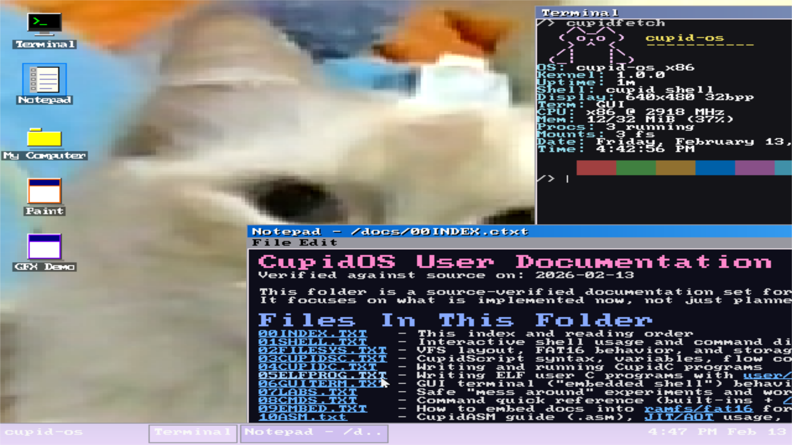
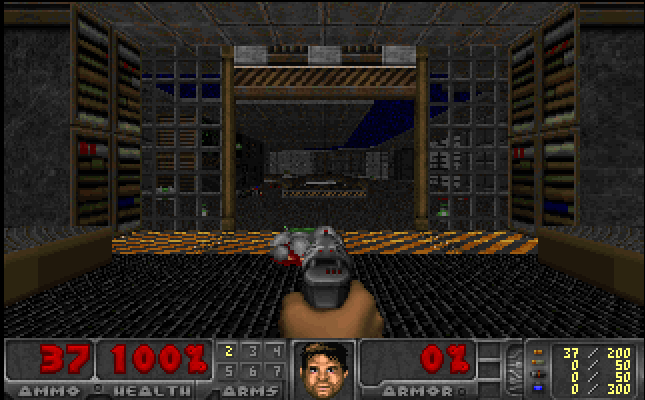
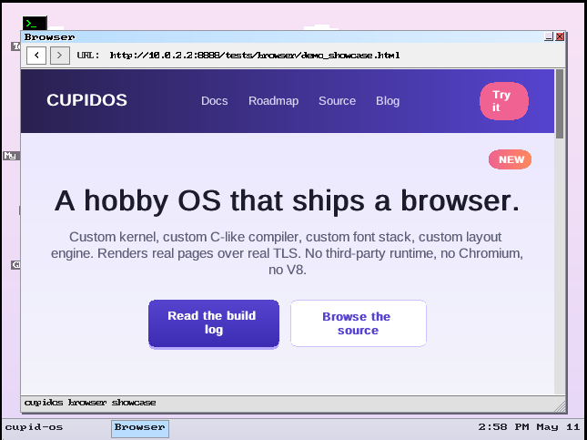
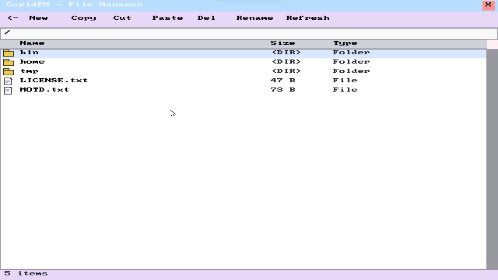
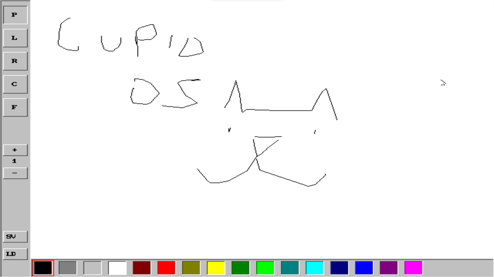

# cupid-os

Cupid OS is a 32-bit x86 hobby OS written in Cupid C and Cupid ASM. It has a graphical desktop, window manager, built-in C compiler, assembler, and scripting language. It runs on real hardware and in QEMU. The design draws from TempleOS, OsakaOS, and Unix.











## Current features

- VBE 640x480 32bpp graphics with a window manager, taskbar, and desktop icons
- CupidC, a HolyC-inspired C compiler with JIT and ELF32 AOT output
- Hardware FPU (x87) and SSE/SSE2 with eager FXSAVE context switch
- CupidC float/double scalars, typed pointers and multidimensional arrays,
  floating record fields, exact unary signs, comparisons, control-flow truth,
  scalar and whole-vector prefix/postfix updates, mixed-width scalar and fixed
  SIMD cdecl calls, typedef-backed free-function and method callback
  parameters, global callback objects, automatic callback objects, float4/double2
  arithmetic, multidimensional fixed arrays, and SSE intrinsics
- libm: 25 operations (sqrt, sin, cos, tan, atan, atan2, exp, exp2, log, log2, pow, asin, acos, sinh, cosh, tanh, cbrt, hypot, nextafter, fabs, floor, ceil, round, trunc, fmod + f-variants)
- printf %f, %e, %g, %.Nf with x87-backed int/fractional split
- #NM/#MF/#XF FPU exception handlers with MXCSR/FSW/FCW dump
- CupidASM, an Intel-syntax x86-32 assembler with JIT and ELF32 AOT output
- CupidScript, a shell scripting language with pipes, redirects, and job control
- 100+ embedded source-backed shell programs with history, context-aware tab completion, pipes, and redirects
- VFS with RamFS (/), DevFS (/dev), FAT16 (/disk), and persistent homefs (/home)
- Opt-in swap: handle-based disk-backed memory extension with 4 size
  classes (1K/4K/16K/64K), true LRU eviction, up to 1024 handles over
  a 16 MB FAT16 swap file.
- ISO9660 readonly mount with Rock Ridge (SUSP/RRIP) long filenames,
  multi-mount (up to 4), case-insensitive lookup; mount .iso files
  from the VFS via `mount foo.iso /iso`
- Preemptive round-robin scheduler, up to 32 kernel threads
- Process domains in scheduler and `ps` output (kernel/hosted/external)
- Two-stage bootloader that loads the kernel above 1MB via unreal mode
- GUI apps: Notepad, Terminal with ANSI colors, Paint, Calendar, File Manager
- 64-entry LRU disk block cache with write-back policy
- 7 GUI themes: Windows95, Pastel Dream, Dark Mode, High Contrast, Retro Amber, Temple, and Vaporwave
- USB 1.1 and 2.0 through UHCI and EHCI host controllers, with HID keyboard and mouse support, hubs up to depth 5, and BBB/SCSI mass storage
- SMP for up to 32 CPUs, with ACPI/MP discovery, per-CPU LAPIC timers, a big kernel lock, reschedule IPIs, and cross-CPU calls
- RTL8139 and E1000 networking with ARP, IPv4 fragmentation and reassembly, ICMP, UDP, client and server TCP, DHCP with static fallback, DNS, BSD-style sockets, and the two-NIC `make test-net` harness
- TLS 1.2 and 1.3 client handshakes with public servers using ChaCha20-Poly1305 or AES-128-GCM, RSA-PKCS1v15 and RSA-PSS verification, ECDSA-P256, X25519 or P-256 ECDHE, X.509 parsing, hostname and time checks, and best-effort chain checks against an embedded Mozilla CA bundle. The current chain policy remains lenient when a root or signature algorithm is unavailable.
- HTTP and HTTPS through `curl` and `wget`; `curl` supports GET, POST, common request flags, and bounded HTTP-to-HTTP redirects, while `wget` supports `-O` and `-q`, derives output names, and reports status
- In-OS `ssh` and `telnet` clients plus an `sshd` server. SSH supports password and keyboard-interactive authentication, PTY shells, remote execution, host-key verification, Curve25519/ChaCha20-Poly1305, and terminal resizing
- A graphical shell browser with HTML5 tokenization and tree building, CSS cascade and specificity, variables and `calc`, web fonts, block and inline layout, HTTP and HTTPS, navigation history, and GET forms
- AC97 audio at 22050 Hz stereo, a 16-slot signed 16-bit mixer, the cycle-accurate LGPL-2.1 Nuked-OPL3 emulator, and an 18-voice MIDI dispatcher with percussion, two-voice patches, pan, and sustain
- DOOM with automatic Freedoom1/2 discovery under `/disk/wads/`, mixer-backed sound effects, MUS-to-MIDI OPL3 music in slot 8, keyboard controls, and checked replacement of saves and `default.cfg` under `/home/doom/`
- Headless build (`make run-headless`): boots straight into shell over COM1/stdio, no VBE. Scriptable through the Python serial/QEMU harnesses in `tools/`.
- PS/2 keyboard and mouse, ATA/IDE disk, RTC, serial, PC speaker drivers
- System clipboard, x86-32 disassembler, BMP / PNG / JPEG image codecs, TrueType font system with bundled Liberation fonts and live `fontswitch`
- Panic backtrace decoded against a kernel symbol table (`addr  function_name+offset` per frame)

## 2026-08-27 source-current checkpoint

Source-head CupidBuild now has a native checked runner for ordinary CupidObj
calls. On Linux, it creates no `.cupidbuild-run` filesystem namespace. The
manifest and all six tools live in fully sealed anonymous memfds, the working
directory is pinned by descriptor, and the child calls `fchdir` before
remapping standard output and standard error. A tool descriptor in slot 0, 1,
or 2 is first duplicated above the standard descriptors, then executed through
`fexecve` or `execveat`. The `dup2`, pipe read and write, and wait loops retry
`EINTR`; `dup2` also retries `EBUSY`. Captured streams are sealed anonymous
memfds. A close-on-exec launch-status pipe distinguishes an adapter failure
from a real CupidObj exit of 125. The static i386 startup exposes
`cupid_linux_syscall5` for this path.

On Windows, the runner pins and rechecks the working-directory identity and
uses a handle-pinned private root and files. It holds the CupidObj handle
without write or delete sharing through `CreateProcessA` and forwards captured
streams in binary mode to preserve their exact bytes. Cleanup removes a
mutated file if its identity still belongs to the runner and preserves a
replacement with a different identity.

The Windows CupidBuild CLI suite completed 66 tests in 65.934 seconds with
three expected skips. The host-runner Python module completed eight tests in
0.962 seconds with four POSIX skips. The dedicated Make contract passed. All
six CupidASM source tests passed in 3.771 seconds, along with strict Windows
and freestanding i386 adapter compilation and timeout-and-seed-drift
precedence.

After the exact-size check failed closed on the changed outputs and its policy
was updated, `make -j2 all` completed successfully. All 16 exact artifacts
passed. `kernel/kernel.bin` is 9,515,260 bytes,
`kernel/kernel.elf` is 9,744,412 bytes, and
`kernel/kernel.elf.pass1` is 9,613,340 bytes. Whole-image CupidDis inspection
and disk-image staging also passed.

A private four-vCPU E1000 smoke used `--cpu max --verify-smp-runtime`, ran
`/bin/ls.cc`, and passed in about 47.5 seconds. CupidC compiled 911 code bytes
and 71 data bytes and completed JIT execution. The 33,113-byte log has SHA-256
`7b0711ce849107f838aed61f4238ce6edb79d787911edbd39194ec8868cdcf24`
and no rejected runtime marker.

A final full Windows Toolchain rerun could not start because WSL failed while
translating the Linux seed after the WSL VM and service outage. Earlier full
Windows and Linux green baselines remain pre-edge-fix evidence, not final
evidence for this revision.

The command still needs paired-seed promotion before Make can use it, so this
source checkpoint does not change the graph's four CupidBuild and 448 Python
participations. ADR 0358 records the boundary.

The normal bootloader and SMP-trampoline rules now run the promoted CupidBuild
seed directly. Each rule depends on Makefile, the production manifest, and all
six seed images; standalone CupidASM, CupidDis, and Python overrides cannot
redirect the transaction. CupidBuild freezes that trust unit, lets CupidASM
author the private image and map, asks CupidDis to enforce the artifact's
decode, target, and source-edge rules, and publishes only after every live
boundary still matches. Forced Windows and Linux rebuilds passed with Python
deliberately unavailable and reproduced the established 2,560-byte boot image
and 4,096-byte trampoline exactly. ADR 0357 records the handoff.

The graph still contains 452 transforms, including 443 under root `all`.
CupidBuild now participates in four, Python in 448, and every transform still
has a Cupid tool involved. Fixed-point coordination, packaging, and the other
checked publications remain separate work.

Source-head CupidBuild now has typed bootloader and SMP-trampoline assembly
commands. Each command keeps the raw image and `cupid.raw-map.v2` sidecar in
one private transaction, enforces the artifact's exact size and map policy,
and asks checked CupidDis to validate known instructions, local targets, and
source-resolved edges before publishing the image. The map remains private.

The fixed-point behavior gate exercises both raw commands and the existing
object command across consecutive CupidBuild generations. The refreshed
promoted seeds now carry all three commands. Their self-consumption proofs
match all six stage-two images and retain complete stage-three/stage-four
convergence. The normal OS build and a private four-vCPU boot smoke also pass.
ADR 0355 records the source capability, and ADR 0356 records its carriage in
the active seeds.

The normal ISR and context-switch recipes now invoke the promoted CupidBuild
seed directly. CupidBuild freezes the assembly source and complete six-tool
cohort, publishes a private ELF32 relocatable through CupidASM, applies the
known-decode, local-target, and code-anchor policies through CupidDis, rechecks
the transaction, and replaces the object atomically. A forced native Windows
run with `PYTHON=missing-python` produced byte-identical objects.

The Linux CupidBuild seed is stored as an executable so a fresh checkout can
enter each direct recipe. ADR 0354 records the first ownership boundary.

At the earlier raw-publication handoff, the complete normal build passed both
CupidLD links, whole-kernel CupidDis inspection, all 16 exact-size checks, and
image publication. That checkpoint produced a 9,507,804-byte raw kernel,
9,605,148-byte pass-one ELF, and 9,736,220-byte final ELF. A private four-vCPU
`max` and E1000 frontier exercised the staged image through its runtime
contract. The current post-edge-fix evidence and artifact sizes are recorded
at the start of this checkpoint.

## 2026-08-25 source-current checkpoint

The Linux and Windows fixed-point builders now run the preceding generation's
CupidDis on every generated C object after structural ELF validation and
before linking. Each object must pass known-decode, local-target, and
code-anchor checks. Startup objects use the same policy. Active assembly now
publishes 68 typed functions, including all fourteen exports in the Windows
CupidBuild startup. ADR 0347 records this boundary.

Hosted and in-OS CupidASM now retain the same raw control-edge evidence. The
kernel adapter validates and writes canonical `cupid.raw-map.v2`. The hosted
CLI stages the image and map together and can recover an interrupted pair
publication, including targets that did not exist before the command. It
writes linked v2 pending records before either target moves, then advances
both records to v3 after the replacements succeed. One matching v3 record is
the commit witness. A v2 record remains pending even beside a legacy v1 peer,
and recovery reaches the same result in either marker order. ADR 0348 records
both changes. Native Windows fixed-point CupidASM links the
publication wrapper and its exact Kernel32 imports, so reconstructed commands
retain the same recovery path. Its behavior relink is checked against that same
plan-derived import profile. Linux native Windows evidence reconstructs
CupidASM with the same closure.

Source-head hosted CupidC accepts C99 hexadecimal `float`, `double`, and `long
double` constants. It uses bounded target-only integer arithmetic and rounds
normal, subnormal, halfway, overflow, and underflow cases directly to
binary32, binary64, or x87 extended width. CupidDis now reuses the instruction
map from its summary pass for strict raw, ELF32, and PE32 inspection. ADRs 0349
and 0350 record these changes.

Private CupidC now allocates fixed-size automatic raw callback arrays in
contiguous four-byte frame slots. Each declaration clears the complete array
before optional brace initialization, and the retained signature governs
indexed stores, copies, and calls. The active feature-14 guest adds a separate
marker for declaration zeroing, a later target, assignment, copying, and four
indirect calls. Unsized automatic arrays, parameter arrays, record or class
field arrays, and multidimensional arrays remain unsupported. ADR 0351 records
the supported boundary.

CupidBuild treats the checked seed as one complete trust unit. It rejects
unlisted `.elf` or `.exe` peers before tool execution and repeats the directory
check after every attempted CupidASM and CupidDis launch, including failure
and timeout paths. The active v2 manifests now list six tools on each platform,
so the frozen cohort includes CupidBuild as a checked non-producer. Linux uses
the static i386 ELF32 profile. Windows uses the plan-derived publication
profiles for CupidASM and CupidLD and the full Kernel32 and NTDLL profile for
CupidBuild. Every rejected transaction preserves the previous object.

Fresh Linux and native Windows reconstructions pass from the same 58-input
source snapshot. Linux matches 22 C objects, startup, and six tools with a
24/6/31 behavior matrix. Windows matches 23 C objects, three assembly objects,
and six tools with a 13/6/18 matrix. Their stage-four images are the active
paired seeds. The normal ISR and context-switch object recipes still enter the
Python publisher; promotion alone does not transfer those recipes or retire
host coordination. ADRs 0344, 0345, 0352, and 0353 record the path to this
boundary.

## 2026-08-24 source-current checkpoint

The private CupidC callback work, SMP raw-map handoff, relocatable-object local
target checks, and `CUPMAN4` paired-evidence author pass their focused gates.
The poisoned OS build reaches the exact-size gate after the complete compile,
link, and strict-disassembly path. The repeated exact verifier, image
publisher, and integrated four-vCPU private guest frontier pass. An earlier
`CUPMAN4` publication and final `CUPMAN2`
verification passed in 3,952.17 seconds with the preceding linked-image seed.
At that checkpoint, the Linux and Windows seeds carried static ELF code-anchor
checks under ADR 0323. ADR 0353 records the active paired six-tool seeds.
Source-current publication evidence is recorded in the bootstrap log.

Source-head hosted CupidDis now reads the deterministic static i386 PE32
profile emitted by CupidLD. It reports PE and COFF headers, sections, and
named imports, then decodes executable sections through the shared x86 model.
Strict inspection checks the entry point and direct local targets against
decoded instruction starts. All six checked Windows seed images and an
import-free CupidLD fixture pass beside the independent Python PE validator.
This is not general PE support: images above CupidLD's 2 GiB RVA limit,
dynamic images, base relocations, ordinal imports, PE symbols, and
noncanonical section layouts remain outside the accepted profile. The five
seed reports match an independent Python reconstruction field for field. The
active paired seeds carry the reader. ADR 0338 records the original boundary,
and ADR 0356 records the current seed refresh.

Private CupidC retains a file-scope function-pointer typedef signature in direct
free-function parameters, Cupid class method parameters,
declaration-initialized automatic objects, and file objects. Every automatic
declarator gets an independent copy. A structure or class field declared with
that typedef keeps the same signature through checked plain stores, null
clearing, and copies into named callback objects, including fields reached
through indexed record arrays. A file object may start as `NULL`, a
compatible function designator, or the direct address of that function. It may
receive a compatible callback through checked plain assignment, make a typed
indirect call, and be cleared to null. Runtime initialization and assignment
accept grouped addresses such as `&(function)` and `&((function))`. Defined
targets are written into initialized data immediately; later targets use a
checked data-address patch. JIT and AOT indirect calls keep fixed argument
conversions, record-pointer identity, arity, variadic state, and supported
scalar or SIMD results. Program and REPL failures restore the typedef metadata
with the rest of the compiler transaction. Code-only AOT output still emits one
program header with code at file offset `0x80`.

The complete private callback ABI module passes all 318 tests in 60.519 seconds
at the current source head.
Named raw callback file objects and direct free-function parameters retain
their parsed signatures.
The file objects support null, defined, and later-defined initialization,
checked assignment, typed indirect calls, and null clearing. The parameters
use the same cdecl conversions and arity checks as a direct call.
Callback-valued parameters retain their signatures recursively through raw and
direct typedef forms. The existing `param_struct_indices` slot holds a nested
signature handle, while the callback argument stays one four-byte i386 word.
Structural comparison always checks result and record identity. At each
prototyped level it also checks parameters and the variadic boundary.
Compatibility keeps the existing unprototyped-call rule, while exact
declaration checks require matching prototype state. Each comparison memoizes
pairs across the 49 raw-or-typedef handles. Nesting is limited to 16 levels.
The 33-record backing pool uses one entry for the active kernel callback and
leaves 32 for source declarations. Failed program or REPL transactions restore
their records. Raw callback fields now retain the same metadata in
structures, classes, anonymous typedef records, and persistent REPL records.
Typedef-backed and raw field expressions can be called directly. They use the
existing fixed and variadic cdecl conversions, evaluate nested or indexed
designators once, and return represented scalar, floating, pointer, or SIMD
values. A real field wins over same-named class method sugar. Typedef-backed
callback arrays on structure and class fields retain the signature through
indexed stores, copies, and direct calls, with each index evaluated once.
One-dimensional raw function-pointer arrays with static storage now work at
block, file, and persistent REPL scope.
They accept positive fixed bounds or infer a nonempty bound from an initializer,
zero-fill omitted fixed elements, resolve later function targets with
`CC_PATCH_DATA_ABSOLUTE`, and keep their signature through indexed stores and
calls. Calls may use either postfix `()` directly or an explicit unary `*`.
Block-static scalar raw callbacks share the same data-backed declaration path.
Fixed-size automatic raw callback arrays use cleared local frame storage and
retain their signature through brace initialization, indexed stores, copies,
and calls. Unsized automatic arrays, raw callback array parameters, raw record
or class field arrays, multidimensional raw callback arrays, computed
conditional values, aggregate results, and raw Cupid class method parameters
remain open.
Callback-valued results, pointer-to-function-pointer `**` declarators, and
callback alias chains remain separate work. Typedef-backed fixed callback field
arrays stay on their separate retained-field path. The promoted standalone
seeds do not contain this private parser or ELF writer. ADR 0306 records global
storage, ADR 0310 records automatic objects and method parameters, ADR 0313
records initialized-data function-address patches, ADR 0315 records raw
file objects and free-function parameters, and ADR 0319 records direct explicit
function addresses. ADR 0321 records typedef-backed callback fields, ADR 0324
records grouped runtime function addresses, ADR 0325 records raw callback
fields and direct field calls, and ADR 0328 records typedef-backed callback
field arrays. ADR 0330 records data-backed raw callback arrays and block-static
raw callbacks. ADR 0331 records recursive callback-parameter signatures.

Reviewed native bindings now publish fixed or variadic parameter metadata
through the same `cc_function_pointer_signature_t` representation. Typed
kernel calls use the existing conversion, complete cdecl slot layout, cleanup,
arity, promotion, and result paths. The first reviewed set contains console,
string, port, and all 50 `libm` bindings. Unreviewed entries retain their
previous source-width arguments through a named legacy result-only path. JIT
and fixed-address AOT tests cover floating conversions, mixed-width slots,
diagnostics, descriptor limits, rollback, and same-state recovery. ADR 0332
records this boundary.

The active `set_icon_drawer(int, void (*)(int, int))` binding now retains its
inner callback through that same recursive graph and publishes the handle in
the outer native descriptor. Nested result, parameter, record-identity, and
variadic mismatches fail before the native call. Corrupt handles, excessive
depth, and capacity failures leave the state reusable. The shared backing pool
has 33 records so the built-in descriptor does not reduce the existing
32-signature source budget. Feature 14 calls the real binding with an invalid
handle and requires
`[feature14-callback-binding] PASS call=1 ignored=1 callback=0`. ADR 0333
records this boundary. The private ABI, binding contract, and GUI modules pass
456 tests. Checked-seed CupidC builds both changed compiler objects, and the
supported audit regeneration reproduces the generated records exactly. The
full target build and four-vCPU smoke are deferred to the consolidated
integration run.

The most recent completed private frontier boot predates ADR 0333. At the ADR
0331 checkpoint, the full GUI test module passed all 128 tests in 0.955 seconds
and the boot brought four of four `max` i386 CPUs online, then recorded
`[feature14-callback-raw-array] PASS modes=2 phases=3 calls=12 stored=1 persistent=1`,
`[feature14-callback-nested] PASS outer=1 inner=1 value=43`,
`PASS feature14_simd`, and clean in-OS CupidC JIT completion. The 151,289-byte
`build/bootstrap/feature14-raw-array-qemu.log` remains the ADR 0330 checkpoint.
The 157,520-byte ADR 0331 log at
`build/bootstrap/feature14-nested-callback-qemu.log` has SHA-256
`b34a68aebdfecaeeb347c1ff4764cbe609a6ed2f154557a15133a601101585c6`.
The wider frontier check changed 109,518 framebuffer pixels and captured
32,701,862 AC97 frames with peak 25,600 and 76,710 PC-speaker frames with peak
24,831.
The active nested shape is `p_icon_set_drawer` in `kernel/lang/cupidc.cc`,
which points to `gfx2d_icon_set_custom_drawer` and its callback-valued
`drawer` parameter. The Doom wipe implementation supplies the separate
six-entry block-static raw callback array. The normal image still compiles
these production sources with checked-seed hosted CupidC; this private parser
change does not move build ownership or add a host dependency.

Feature 14 also requires
`[feature14-callback-field-call] PASS typedef=1 raw=1 float4=4 once=1 calls=2`.
Host tests require that marker and reject its failure form. The current runtime
verification result is recorded in the bootstrap log.

The Toolchain publisher builds its strict C11 `CUPMAN4` author with the
converged stage-four Linux CupidC, CupidASM, and CupidLD. Linux receives a
static ELF. Windows receives a validated native PE built from the same author
source with the checked Windows startup, runtime, and exact `KERNEL32.dll`
imports. The author no longer crosses WSL when it runs on Windows. Its producer
lineage and Linux publication provenance do not change. Schema
`cupid.toolchain-contracts.v3` is unchanged. `CUPMAN4` carries the existing
artifact and source facts plus 62 raw stage pairs: 17 contract objects, 16
contract executables, 22 bootstrap C objects, one startup object, and six
tool images. The Cupid-built author requires two regular, nonempty, identical
byte streams for every pair and hashes both streams. It derives the 17
published object records from those bytes, checks each executable pair against
its artifact fact, and derives the fixed-point summary from the exact pair
inventories. The protocol has no caller `all_equal` field. Python performs the
same four comparisons only after the author accepts the request. It still pins
the filesystem, launches the author, stages privately, and swaps the complete
directory. Both checked Python contract launchers resolve `tools` from this
checkout before consulting installed packages. The direct module passes 40
tests in 54.623 seconds, the publisher passes 65 tests, and the
pinned verifier runner executes 25 tests in 32.773 seconds with three
POSIX-only skips on Windows. [ADR 0307](docs/adr/0307-author-toolchain-fixed-point-evidence-from-stage-pairs.md)
records the paired-evidence boundary, [ADR 0311](docs/adr/0311-pin-checked-contract-imports-to-the-checkout.md)
records checkout-local contract imports, and [ADR 0322](docs/adr/0322-run-the-toolchain-manifest-author-natively-on-windows.md)
records native Windows author execution. The source graph has 747 active inputs,
452 transforms, 255 feature requirements, and 26 accounted unreachable files.
Participation
is CupidC 250, CupidObj 192, CupidASM 9, CupidLD 9, CupidDis 9, CupidBuild 4,
and four Cupid-built semantic contracts. Python participates in 448 transforms,
but no transform is Python-only. Root `all` remains at 443 transforms, each
with a Cupid participant. The latest complete schema v3 `CUPMAN4`
publication passed. The Cupid author and Python oracle agreed on all 62 stage
pairs. Every stage-three object and executable matched its stage-four
counterpart, the hosted runtime passed, and live inputs stayed frozen. The
publisher wrote 22 artifacts and a 29,271-byte manifest with SHA-256
`5fab9706abe6d938e9aa4a355ebbae293fee5404475d3d20d2591d6a9e464011`.
It records 75 inputs, 58 bootstrap files, 17 object comparisons, and Linux seed
manifest SHA-256
`b6e34a2e18dd18aba91c6358116eafde39953566efeadb224575ac8c13ab2c1b`.
Its final `CUPMAN2` verifier reported 22 accepted artifacts. The first corrected attempt
reached a valid publication but failed its read-only final verifier because WSL
found an unrelated installed `tools` package. The launcher pin closed that
host-resolution gap before the complete rerun. An earlier
`make bootstrap-audit` run failed after 65.183 seconds because its
artifact-size recipe lock omitted the Windows seed verifier. The current Make
recipe has one `$(ARTIFACT_SIZE_CONTRACT)` command, and that command carries
`--checked-manifest $(BOOTSTRAP_WINDOWS_SEED_MANIFEST)`. The source-current
`make bootstrap-audit` and `make check-bootstrap-audit` both pass. The
generated fixed-point inventory records failure, help, and success counts of
24/6/31 for Linux and 13/6/18 for Windows. The audit records 747 active
sources, 452 transforms, 255 feature requirements, and 26 accounted unreachable
files.
[ADR 0304](docs/adr/0304-author-toolchain-publication-manifests-with-cupidc.md)
records this split.

This publication carries the six-tool candidate, including
`cupidc-cupidbuild.elf`. It does not promote a six-tool seed: the checked input
manifest still names five tools, and the normal OS recipes remain unchanged.
Each final-stage CupidDis now inspects the corresponding six candidate images
with known-decode, local-target, and code-anchor checks. Both generations must
also reject a private CupidBuild copy whose file-backed entry instruction was
replaced with an invalid opcode. [ADR 0346](docs/adr/0346-certify-six-tool-candidate-images-with-cupiddis.md)
records this pre-promotion gate.

At that preceding five-tool checkpoint, both promoted seeds carried the
CupidDis local-target policy for raw images
and static relocatable objects. The bootloader and SMP publishers pass
`--require-known --require-local-targets --raw` for nine and four direct
targets. Production CupidASM object publication passes
`--require-known --require-local-targets` after structural validation. The
promoted five-tool Linux proof matched 19 C objects, one startup object, and five tools
cleanly, then passed 5/22/21 behavior. The promoted Windows proof matched 20 C
objects, two assembly objects, and five tools cleanly, then passed 5/8/9
behavior. The exact artifact-size policy then covered fourteen
outputs: four OS outputs, five Linux seed images, and five Windows seed images.
Make runs one `$(ARTIFACT_SIZE_CONTRACT)` command with `--checked-manifest`.
Its Host Python wrapper captures and pins the raw policy, complete Linux policy
manifest, all fourteen observations, and complete Windows manifest with its
five PE files. Windows execution uses those captured PE bytes, and the wrapper
rereads the manifest and all five files before success. A `CUPSIZE2` request
also gives the C policy contract the Linux manifest digest, Windows manifest,
and five regular-file size and digest observations. The contract validates the
Windows target, provenance, parent link, exact tool inventory, and observed
bytes. The focused modules contain 22, 16, and 13 tests, for 51 total. They
pass with four existing platform-specific skips. The source-head artifact
contract passed against all fourteen exact artifacts. The checkpoint
kernel outputs were:

| Source-head artifact | Bytes | SHA-256 |
| --- | ---: | --- |
| `kernel/kernel.elf.pass1` | 9,596,956 | `c871658c40304bfb5e7c61f2e7cc0479bb1bb7fe1c4af7835d119544d8034206` |
| `kernel/kernel.elf` | 9,728,028 | `78bcce45f047c807aa798988606c363d0b51b6b48f6b1335cbd156a64a2ca1a0` |
| `kernel/kernel.bin` | 9,500,284 | `f7b09ca658d72d5bd7124baa93f815697dd7b91cd76f78e56903430b4d59a873` |
| `cupidos.img` | 209,715,200 | `09f50741d3d6884040c7f2009ecf449e519cfe62c09fe8f9307e1c3212127186` |

The exact verifier accepted all fourteen checkpoint policy rows. The normal build
compiled every kernel and Doom source with checked CupidC, linked both kernel
ELFs with CupidLD, and passed the strict 431-input CupidDis scan with local
targets and code anchors before publishing the image. A private four-vCPU E1000
frontier smoke booted that image and passed the SMP, terminal, framebuffer, and
audio checks without changing the source image. The framebuffer changed
101,335 pixels. AC97 produced 36,533,414 stereo 44.1 kHz frames at peak 25,600,
and the PC speaker produced 79,215 frames at peak 30,937.
The serial log contains
`[feature14-callback-raw-automatic-array] PASS zeroed=4 initialized=2 assigned=1 copied=2 later=1 calls=4`.
Its 143,084 bytes have SHA-256
`6b5c6a4ca5daf9f19ec099d45609f385e0cf983f945a40433ebc3f1921e8ffab`.
The cross-platform seed fixtures combine a relocated external call with a
resolved local branch, then corrupt the branch to land inside an instruction.
Active-source tests prove all nine bootloader and four SMP targets. [ADR 0305](docs/adr/0305-promote-and-adopt-local-relative-target-checks.md)
records raw-image promotion, and ADR 0312 records relocatable-object promotion
and production adoption.

The SMP publisher gets its mixed-mode layout from CupidASM instead of repeating
the range starts on the CupidDis command line. CupidBuild requires the private
`cupid.raw-map.v2` file to match the fixed 4 KiB trampoline policy, pins it
through strict CupidDis inspection, and publishes only the binary. A
forced checked-seed build kept the reviewed trampoline SHA-256
`b738ebb68f28b9b07e330761f4e9a7898f0424ab0a3835cd6079ae7d4a189e90`.
[ADR 0308](docs/adr/0308-bind-the-smp-trampoline-to-cupidasm-raw-layout-metadata.md)
records the handoff.

CupidDis applies the same explicit policy to executable
`PROGBITS` sections in static ELF32 relocatable objects. Each section has its
own two-pass instruction-start map. Unrelocated direct relative targets must
stay in that section and land on an instruction start, while relocated operand
fields remain link-time targets and stay under the executable-relocation rule.
The typed report adds an outside-section count, and checked-seed `ET_EXEC`
input is rejected explicitly. Both active CupidASM objects pass the source-head
check,
and a one-byte context-switch mutation fails as a mid-instruction target. The
promoted Linux and Windows seeds carry the rule. Production CupidASM object
publication selects it before replacing an existing output. [ADR 0309](docs/adr/0309-validate-local-relative-targets-in-relocatable-objects.md)
records the source boundary, and ADR 0312 records carriage and adoption.

Checked CupidDis also checks linked i386 ELF32 images. It scans every
file-backed executable load region twice and accepts a cross-region direct
target only when it lands on an instruction start. Failures distinguish an
address outside loaded memory, loaded memory without file-backed executable
code, and the middle of an instruction. A `PT_DYNAMIC` or `PT_INTERP` header
rejects the image as outside the static certification domain. Both promoted
seeds carry the rule. The normal kernel publisher keeps its broad 431-input
decode pass, then applies the linked rule to the pass-one and final ELFs before
CupidObj flattens the final image.
[ADR 0314](docs/adr/0314-validate-local-targets-in-linked-elf32-images.md)
records the source boundary. The generated six-tool audit reports failure,
help, and success counts of 24/6/31 for Linux and 13/6/18 for Windows.
Audit generation and its checked-file comparison both pass. The promoted
five-tool cohort remains a separate historical trust proof.

Checked CupidDis provides `--require-code-anchors` for static i386 ELF32
objects. Checked CupidDis checks every defined `STT_FUNC` in an `ET_REL` object
against decoded starts in executable `PROGBITS`. The assembler publishes that
intent through `global name:function` or `extern name:function` and leaves an
unannotated symbol as `STT_NOTYPE`. Missing and unsupported type names fail
without publishing an object. Undefined functions and non-function symbols do
not enter the relocatable count.

For `ET_EXEC`, CupidDis checks the ELF entry and every defined function symbol
against decoded starts in file-backed executable code. Function aliases count
separately, while undefined, absolute, and non-function symbols do not count.
Both forms distinguish an address outside executable code from one in the
middle of an instruction. The option composes with local-target validation and
reuses its instruction-start map. The fixed-point drivers cover one valid and
one invalid executable on Linux and Windows. Both promoted seeds carry the
linked and relocatable forms. The normal kernel publisher selects the linked
form for the pass-one and final ELFs. Guarded ISR and context-switch
publication selects the relocatable form. Fixed-point builders inspect every
generated C object and startup object before linking it. Active assembly
declares 68 exported functions without changing section bytes or relocations.
[ADR 0320](docs/adr/0320-validate-static-elf32-code-anchors.md)
records the linked source boundary. [ADR 0323](docs/adr/0323-promote-and-adopt-static-elf-code-anchor-checks.md)
records its carriage and production adoption. [ADR 0335](docs/adr/0335-type-assembly-functions-and-certify-relocatable-code-anchors.md)
records explicit assembly functions and relocatable anchors. [ADR 0336](docs/adr/0336-promote-and-adopt-assembly-function-anchors.md)
records the five-tool seed carriage and production adoption. [ADR 0353](docs/adr/0353-promote-paired-six-tool-seeds.md)
records the active seed carriage.

The historical ADR 0312 checked-seed bootstrap module passed all 89 tests in
3,145.502 seconds. It covered the Linux and Windows fixed-point matrices,
promoted-seed carriage, relocatable local-target fixtures, publication freezes,
and PE validation. The complete source-head bootstrap module later passed all
92 tests in 2,820.626 seconds. That result preceded the ADR 0318 promotion,
which records the candidate proofs and promoted-seed reproofs. After the
grouped-address and native Windows diagnostic cases were added, that later
source-head module passed all 99 tests in 3,377.405 seconds.

A pre-final-CTXT build at the preceding integrated checkpoint reached the
exact-size gate after 668.414 seconds. It
measured `kernel/kernel.elf.pass1` at 9,320,424 bytes and `kernel/kernel.bin` at
9,224,756 bytes. The 9,447,400-byte `kernel/kernel.elf` remained exact, so only
the pass-one and raw-kernel policy rows moved. This is historical evidence.

The preceding poisoned-host `make -j4 all` passed in 684.260 seconds with
`CC`, `CXX`, `CPP`, `HOSTCC`, `HOSTCXX`, `ASM`, `AS`, `LD`, `AR`, `RANLIB`,
`NM`, `NASM`, `OBJCOPY`, and `STRIP` set to invalid commands. It checked all
fourteen artifacts, preserved the existing FAT contents, and staged
`test_iso/hello.iso`.

| Preceding checkpoint output | Bytes | SHA-256 |
| --- | ---: | --- |
| `boot/boot.bin` | 2,560 | `46cc9778da2b5cc5e8f04d7cc4b07243c3e07d466626ad84fb813dc6fef3a0d3` |
| `kernel/smp_trampoline.bin` | 4,096 | `b738ebb68f28b9b07e330761f4e9a7898f0424ab0a3835cd6079ae7d4a189e90` |
| `kernel/kernel.elf.pass1` | 9,320,424 | `3f9a1c681fbcfb1aa453e42a9d77ed1069b9a487110c9ec22ac318d278bdd1e6` |
| `kernel/kernel.elf` | 9,447,400 | `92d4e2f890b657c9881eb2184c7f8f9f0e96b18b5b060dbabab17e7ea305b1ce` |
| `kernel/kernel.bin` | 9,224,756 | `4d53e0456d8e63e140f6dcab135765662d12df6e4a83b246409572501f3b4cbd` |
| `cupidos.img` | 209,715,200 | `43409d159d2da70feb20deccda0d79a695c6ab56d87a179fe21a66ab40c5eedd` |
| `bootstrap/artifact-size-policy.json` | 2,960 | `b23bdcb3757a7ddc2a49eeef51cad48cdbd6899f0080c75896b67ef0c665da6e` |

The private four-vCPU e1000 smoke for that checkpoint used CPU `max` and
passed in 64.601 seconds.
It printed these markers in order:

```text
[feature14-call] PASS float4=4 double2=2 nested=2 calls=6
[feature14-callback] PASS float4=4 double2=2 calls=2
[feature14-callback-typedef] PASS float4=4 calls=1
PASS feature14_simd
[cupidc] JIT execution complete (stack: 0 bytes used, peak: 0 bytes)
```

The 33,219-byte log has SHA-256
`e39a1905002c2baa483c65eb6e763f4f62907c22f8954873dbb20f4ba5a53e93`.
It contains no rejection markers. The smoke used a private copy, and the source
image stayed unchanged at the `cupidos.img` identity above.

At the preceding source checkpoint, the first post-documentation fully
poisoned `make -j4 all` completed every
compile, assemble, link, flatten, and CupidDis check before stopping only at
the expected size mismatches after 641.474 seconds. It measured
`kernel/kernel.elf.pass1` at 9,324,520 bytes and `kernel/kernel.bin` at
9,228,268 bytes while the 9,447,400-byte final ELF stayed exact. Only the
pass-one and raw-kernel policy rows changed. The final artifact group then ran
45 tests in 2.625 seconds with four expected Windows skips.

The repeated fully poisoned `make -j4 all` passed in 654.397 seconds. It
checked all fourteen artifacts, preserved the FAT contents, and staged
`test_iso/hello.iso`.

| Preceding source checkpoint output | Bytes | SHA-256 |
| --- | ---: | --- |
| `boot/boot.bin` | 2,560 | `46cc9778da2b5cc5e8f04d7cc4b07243c3e07d466626ad84fb813dc6fef3a0d3` |
| `kernel/smp_trampoline.bin` | 4,096 | `b738ebb68f28b9b07e330761f4e9a7898f0424ab0a3835cd6079ae7d4a189e90` |
| `kernel/kernel.elf.pass1` | 9,324,520 | `379437b3ad088f645e718773ae3c122d91e763e8af72fac12d14db1785cab0ef` |
| `kernel/kernel.elf` | 9,447,400 | `b282d1bbaf1e1cb2f2c254d64d32a2c4a9e18d94a2c72c806c4bb839a0a64c19` |
| `kernel/kernel.bin` | 9,228,268 | `9c3042e8a0963e904e805905b14da7aca3bb991abdbbc8a547a56b59be6e2698` |
| `cupidos.img` | 209,715,200 | `9045807b2bfffe41e2eaab92ab6fd4a4615fb7d72a26649ca2c037ae050bb15f` |
| `bootstrap/artifact-size-policy.json` | 2,960 | `63d912a9e9d9399efc03826af8b4628737b685f3180f1df74a84ce9b7306f895` |

That checkpoint's strong full private frontier used e1000, four `max` vCPUs,
SMP, a private
image, and the USB fixture. It passed in 787.369
seconds. The 640x480 framebuffer changed 52,616 pixels. AC97 produced
32,149,003 stereo 44,100 Hz frames with a peak of 25,600, and the PC speaker
produced 75,924 stereo 44,100 Hz frames with a peak of 8,415. The direct-call,
named-callback, typedef-callback, overall feature-14, and JIT markers each
appeared once and in order. The log contains no rejection markers. It is
144,309 bytes with SHA-256
`effdd6128933e99ada7b8203e16397a2d5c1ba7fcf864dc8f34fe4963e767ec2`.
The private smoke left the source image unchanged at SHA-256
`9045807b2bfffe41e2eaab92ab6fd4a4615fb7d72a26649ca2c037ae050bb15f`.

The preceding integrated checkpoint's first poisoned build reached the exact-size gate
after compiling, assembling, linking, and inspecting the complete OS through
checked Cupid tools. The gate rejected only the three rebuilt kernel outputs.
The pass-one ELF measured 9,345,464 bytes, the final ELF measured 9,472,440
bytes, and the raw kernel measured 9,251,100 bytes. The artifact contract group
then passed all 46 tests in 4.160 seconds, with four expected Windows skips.
After those three exact policy rows were updated, a repeated fully poisoned
`make -j4 all` passed in 874.531 seconds. It checked all fourteen paths,
preserved the FAT contents, and staged `test_iso/hello.iso`.

| Historical integrated output | Bytes | SHA-256 |
| --- | ---: | --- |
| `boot/boot.bin` | 2,560 | `46cc9778da2b5cc5e8f04d7cc4b07243c3e07d466626ad84fb813dc6fef3a0d3` |
| `kernel/smp_trampoline.bin` | 4,096 | `b738ebb68f28b9b07e330761f4e9a7898f0424ab0a3835cd6079ae7d4a189e90` |
| `kernel/kernel.elf.pass1` | 9,345,464 | `5dbd2c5acb7b1604cf6daf6f311e88015d0762125c60920da3737d7e10d76f06` |
| `kernel/kernel.elf` | 9,472,440 | `5810ddcb963cfadb4fea3b1343bb38c17ce3f762a48f25615b3feb653f1638e3` |
| `kernel/kernel.bin` | 9,251,100 | `4014b1b2acf34be4dd7483fb8aa9e8a8b0e76eea771c83669571cbf7b66fe0e3` |
| `cupidos.img` | 209,715,200 | `31b25b6881419b1bb8a04b2b3765323b21c5706ac114af1a07b514dcdcd07ea3` |
| `bootstrap/artifact-size-policy.json` | 2,960 | `7b12be6d0dd33f9016ecb4287f5c9414e1da79ffc61e7957aab60cea94850474` |
| `test_usb_partitioned.img` | 33,554,432 | `057e0c86874090c99095f0558e9fa604bd7f1929f4da357da2c1baca949bb2bb` |

The integrated strong private frontier passed in 883.513 seconds with e1000,
four `max` vCPUs, SMP, a private image, and the USB fixture. The 640x480
framebuffer changed 89,630 pixels. AC97 produced 36,877,878 stereo 44,100 Hz
frames with a peak of 25,600. The PC speaker produced 76,251 stereo 44,100 Hz
frames with a peak of 29,912. The direct-call, named-callback,
typedef-callback, global-callback, automatic-callback, and overall feature-14
PASS markers each appeared once and in order. The feature run then printed a
clean JIT completion. The 161,418-byte log has
SHA-256
`bc30f5083b96a36362bec5975c0a88437c4f23515de329328bb03d8f6c3e9326`.
The private run left the source image unchanged at SHA-256
`31b25b6881419b1bb8a04b2b3765323b21c5706ac114af1a07b514dcdcd07ea3`.

The active manifests bind revision
`43c747f0e683d0527984bae05bf944879e64a07b`, the 58-input snapshot
`4cd9d583933d8a9f1dbfb63425bc3665fe6c306db8ae76606f40a0ade49afe70`,
and the Linux plan
`52dd857bcb74e079e7e2eec45eaa90a0a0838ad2f4e817bebc35c9904efbecbd`.
The Windows record also binds the native plan
`f9dce66230a693de9d9d0e60127a4a6c44ea465989f381c995086bfe723cff14`
and the exact Linux manifest bytes.

| Linux seed member | Bytes | SHA-256 |
| --- | ---: | --- |
| `manifest.json` | 6,602 | `78d26d7ce3aa0393c8c27a33f2b1f2fad6fe5f6f6300267bf674b36ce51a4dd8` |
| CupidASM | 496,628 | `29b9673ca94bd4fa6c74b41f6ab31ca794665315ea0a2eff5735ffe9ad1cae44` |
| CupidBuild | 276,788 | `55fd96ed06cd451364008a79899765bd8e2796485b73fa65938b2d0f0512f7bb` |
| CupidC | 2,691,720 | `fe0ed161a586b39544bd02018b1a288927b4fb7f6663a01f653dd5e0032670c8` |
| CupidDis | 538,516 | `24e231ffb05a507a49f65977ee628a2dd53b27991ed97f7ba6acc3c0367618c8` |
| CupidLD | 312,888 | `deea83b95c4c00746cee27d50ff31ae5734e45dd0f57a328630de010c26eedd9` |
| CupidObj | 392,784 | `79c7b58aee81cdf68526c645f74b3a28d1179b0f6c0d7a4744463d26e285a3ed` |

| Windows seed member | Bytes | SHA-256 |
| --- | ---: | --- |
| `manifest.json` | 2,852 | `019d6ddd54e183752bd6c579215d4c56bf91dbbef9db9cc0854cdce5f4017288` |
| CupidASM | 479,744 | `9c50e204262a0b05b12d4fc0924670c66092d053ad12b99134ab79a254ef07ae` |
| CupidBuild | 293,888 | `508dcc5442b6fde8a2f297965cbd9303a14e7c0a3c5cbda9921d62b255424815` |
| CupidC | 2,620,416 | `73252f25a44ff0308f0a9403e942af0e582e9cac222e5738412af9c313f6d19c` |
| CupidDis | 516,608 | `588485d496209eecf437e6f6fc9d02474d5c4ac1f236af86bdaad9f3f2d705ce` |
| CupidLD | 296,960 | `aaa7b51a290646ef1d972f4904b1ed176a4dc912e53c1bc4cbdd8d1e39d8495f` |
| CupidObj | 375,808 | `b6f6a5b66f8e2bcb4b779a16428d7b77a956113c5ca301344537b35839611572` |

The Windows manifest names the Linux manifest SHA-256 above as its exact plan
seed. Both checked CupidASM images carry explicit function symbols and raw-map v2.
Both checked CupidDis images carry static ELF code-anchor and source-edge
validation. Production applies these policies to raw boot images, relocatable
assembly objects, fixed-point startup, and linked kernel images. ADR 0336
records the preceding five-tool adoption, and ADR 0353 records the active
six-tool promotion. The fresh promotion candidates match all stage-three and
stage-four objects and six images before entering the checked directories. A
fixed-point reproof from the promoted manifests also passed. All six initial
images matched stage two on both platforms, and stages three and four remained
equal.
Earlier seed, publication, build, and guest identities below remain dated
history unless a paragraph explicitly names this checkpoint.

## Recent additions

Recent subsystem work is summarized below. Detailed pages live under `wiki/`, and several also have embedded `cupidos-txt/*.CTXT` manuals that Notepad renders in the running OS.

- Hosted CupidC now probes every page of a fixed frame larger than 4 KiB.
  Smaller frames keep their existing prologue, while larger frames reserve at
  most one page per step and touch the new page before continuing. This fixes
  guarded-stack growth in the compiler rather than changing active source to
  avoid large functions. ADR 0275 records the rule.
- In-kernel CupidASM AOT now emits an ELF32 relocatable object and passes it to
  in-kernel CupidLD at the existing `0x01A00000` text address. CupidASM carries
  the caller-priority entry spelling into the object and keeps absolute
  bindings as relocations. JIT still uses a fixed image. A private guest smoke
  assembled `/demos/hello.asm` to a 15,680-byte `ET_REL` object, linked an
  8,536-byte two-segment ELF, ran it as PID 4, and observed a normal exit in
  79.661 seconds. ADR 0276 records the ownership boundary.
- Raw CupidASM output can publish a deterministic source-derived map of
  16-bit code, 32-bit code, and data. CupidDis reads the map with
  `--raw --range-map` and can apply `--require-known` without a copied offset
  table. One checked raw-image transaction serves the SMP and bootloader paths.
  It owns locking, source and seed freezing, drift checks, private candidates,
  publication-boundary checks, and atomic replacement; callers keep their
  image and map policy. The expanded eleven-test suite passed in 1.708 seconds,
  including direct mismatch and live-output drift checks for both callers.
  Parent-replacement tests exposed a POSIX candidate leak, so private roots now
  sit under the stable repository root instead of the output parent. Both
  caller modules pass all 10 tests on Windows and through WSL.
  The normal boot edge now enters that transaction through
  `tools/hostbuild.py assemble-bootloader`. Its Make closure uses the
  production manifest and `CHECKED_SEED_INPUTS`, so overriding the standalone
  CupidASM variables cannot bypass seed verification. ADR 0277 records the
  map schema, and ADR 0283 records the production cutover.
- Source-head and checked-seed raw CupidASM accept one `ORG` and one section identity.
  An `equ` preamble does not claim implicit `.text` because it emits no section
  storage. The first section-bound statement or explicit section directive
  makes the claim, and repeating that section is valid. A second `ORG` reports
  `CT6000010`, while a different section reports `CT6000011` before layout.
  Both failures preserve an existing hosted output. ELF32 and fixed-image
  requests retain their multi-section behavior. ADR 0285 records the boundary.
- Source-head and checked-seed CupidDis now check the relocation fields in executable ELF32
  object sections as part of `--require-known`. `R_386_PC32` must name a
  four-byte relative field, while `R_386_32` must name a four-byte absolute
  field. Relocations in data sections remain outside the code check. The typed
  report exposes total and unmatched executable relocations, and the CLI
  rejects a mismatch even when every byte still decodes. Both checked
  production seeds carry this rule, so the public CupidASM object transaction
  enforces it on Windows and Linux. ADR 0290 records the boundary, and ADR
  0291 records the seed promotion.
- The public bootstrap driver now has a native Windows path. It freezes the
  checked PE execution seed and the Linux plan seed, then builds through stage
  four. Stage two and stage three carry the transition from the older seed;
  stage three and stage four are the convergence pair. Source-stable Windows
  and Linux runs exposed the old comparison at `cupidobj_main` after 821.9 and
  883.3 seconds. Both stopped without publication. Uncapped reruns then passed:
  Windows matched 20 C objects, two assembly objects, and five tools in 20
  minutes 43 seconds with 5/5/5 behavior cases; Linux matched 19 C objects,
  startup, and five tools in 24 minutes 22 seconds with 5/18/16 behavior cases.
  Both reports bind the same 50-input snapshot, SHA-256
  `d8481a39e0d1c7f42779a8c9f5fc5de10d7e5b9bc4df63ce6afe9ddd9c9716da`.
  Linux reconstruction also caught a Windows CupidDis profile mismatch: its
  plan had omitted `_WIN32=1` from `cupiddis_main.cc`. Compile and link parity
  tests plus the bootstrap audit now guard all five Windows tool mains.
  These reports remain preliminary because they began from uncommitted source.
  Those proofs and promotions remain historical evidence. The later
  five-tool Linux candidate passed cleanly with CupidASM and CupidDis differing
  from the prior seed and 5/22/21 behavior. Its paired Windows candidate passed
  with the same two-tool transition and 5/8/9 behavior. ADRs
  0278 and 0279 record the driver and added generation. ADRs 0280, 0281, and
  0292 and 0318 preserve preceding promotions, ADR 0323 records the preceding
  code-anchor seed, and ADR 0336 records that five-tool seed.
- CupidC initializes x87 and SSE state, saves it with FXSAVE/FXRSTOR during context switches, sets MXCSR defaults, and dumps registers from the `#NM`, `#MF`, and `#XF` handlers. The language supports `float`, `double`, `float4`, and `double2`, along with SSE intrinsics, a 25-operation libm, and x87-backed integer/fractional splitting for `printf` formats `%f`, `%e`, `%g`, and `%.Nf`.
- ISO9660 images mount read-only from any VFS file with `mount foo.iso /iso`. The implementation handles Rock Ridge long names, case-insensitive lookup, and up to four simultaneous mounts.
- Opt-in swap uses four allocation classes (1K, 4K, 16K, and 64K), true LRU eviction, and 1,024 handles over a 16 MB FAT-backed file. Callers use `swap_alloc`, `pin`, and `unpin` explicitly rather than relying on virtual-memory page faults.
- UHCI and EHCI share an IRQ dispatcher and provide enumeration, HID keyboard and mouse support, hubs up to depth 5, and BBB/SCSI mass storage beneath FAT16.
- SMP supports up to 32 CPUs through ACPI/MP discovery and INIT-SIPI-SIPI startup. It uses per-CPU LAPIC timers, IOAPIC routing with the 8259 fully masked, a ticket-based big kernel lock, a shared run queue, and IPIs for rescheduling, cross-CPU calls, and panic broadcasts.
- The private CupidC runtime carries scalar floating lvalues through depth-one pointers, two- and three-dimensional fixed arrays, function and method array parameters, and floating fields in structures and classes. Subscripts preserve row strides, direct pointer updates use the pointee width, and unevaluated `sizeof` keeps array-row sizes without running an index. The feature-13 guest check exercises the active forms.
- Private CupidC accepts prefix and postfix floating updates through pointer, indexed, and record-member lvalues. It evaluates a derived address once, preserves the original raw payload for postfix results, and keeps direct lvalue identity through grouping parentheses. The feature-13 guest covers the JIT path, then compiles `feature13_derived_aot.cc`, loads the resulting ELF, checks its result, and waits for that process to exit. ADR 0273 records the saved-address and result rules.
- Checked-seed hosted CupidC accepts prefix and postfix `++` and `--` on modifiable non-atomic `float` and `double` lvalues. It evaluates an indirect lvalue once, stores the value after adding or subtracting exact-width `1.0`, and returns the original raw payload for postfix forms. Atomic floating and `long double` updates remain explicit gaps. ADR 0263 records the hosted boundary, and ADR 0265 records checked-seed carriage.
- Private CupidC converts decimal `float` and `double` literals with fixed-size integer arithmetic and rounds once to the requested IEEE width, with ties going to even. An `f` suffix goes straight to binary32, so it cannot acquire a binary64 double-rounding error. The converter covers subnormals, the finite limits, infinity, and signed zero. It accepts numeric tokens through 95 characters and keeps the first useful lexer diagnostic during parser recovery. Hexadecimal floating and `long double` literals remain open.
- Private CupidC joins adjacent C string tokens directly in the data section for automatic expressions, file-scope initializers, and persistent REPL declarations. Each token remains capped at 1,023 decoded bytes, while the joined string can use the remaining 8 MiB data budget. Overlong tokens and joined-data exhaustion fail with focused diagnostics instead of truncating the source.
- Private CupidC accepts both anonymous and tagged structure typedefs. The typedef table keeps the record identity through alias chains and pointer aliases, so `.` and `->` retain the correct layout in file and persistent REPL source. Address expressions now select the field itself for both `&record.field` and `&pointer->field`; the pointer form loads the pointed-to record before adding the field offset. Fixed array products, cumulative record layout, final alignment, REPL data reservations, and cumulative local frames now fail before signed overflow. Constant integer expressions check signed arithmetic and retain `uint32_t` wrap when an operand is unsigned. A failed REPL line restores complete record definitions, including an older forward tag that the rejected line tried to fill. ADR 0219 records this boundary.
- Private CupidC accepts comma-separated typedef declarators and keeps each value or pointer alias distinct. One-dimensional fixed-array aliases retain complete storage and `sizeof` through automatic, global, block-static, record, class, and persistent REPL declarations; function and method parameters use C array decay. Array members keep their complete object size and record-element identity through direct or pointer access, including indexed assignment inside an array of records. Unsupported compound array declarators fail explicitly instead of becoming scalar objects. ADR 0220 records this boundary.
- Private CupidC preserves unsigned 32-bit runtime types through objects, pointers, calls, enums, unary operations, conditionals, comparisons, division, remainder, right shift, `sizeof`, and scalar returns. `/=`, `%=`, and `>>=` use the same signedness rules while evaluating each destination once. It converts the complete `uint32_t` range exactly to `double` and correctly rounded `float`, including ordinary and method returns. Values in C's defined interval convert from `float` or `double` to an unsigned word through casts, initialization, assignment, arguments, and returns. Forty kernel bindings with `uint32_t`, `size_t`, or `swap_handle_t` results publish that unsigned type. The Browser stores array length in the same lane, accepts canonical indices through 4,294,967,294, and treats 4,294,967,295 as an ordinary property. ADR 0221 records the original type boundary, and ADR 0249 records the two completed operations. The feature-13 guest checks four conversion boundaries, signed and high-bit unsigned `%=` results, and one evaluation of a side-effecting destination. Its required boot marker is `[feature13-unsigned] PASS conversions=4 remainders=2 once=1`.
- Private `float4` and `double2` values support matching packed arithmetic and fixed arrays with one, two, or three dimensions in global, local, block-static, and persistent REPL storage. Array rank stays independent of byte stride, including when an inner extent is one. Access keeps checked row strides until the final 16-byte vector leaf, uses unaligned-safe moves, supports plain and arithmetic compound assignment, and preserves lane values. Prefix and postfix `++` and `--` work on modifiable direct vectors and fully indexed leaves. Each evaluated index runs once. Const qualification is retained through typedef aliases. Const direct vectors and fixed-array leaves remain readable. Plain and arithmetic compound assignment, plus prefix and postfix `++` and `--`, are rejected before a store. Prefix returns the stored vector, while postfix returns the exact old 128-bit payload. Indexes inside row or vector `sizeof` do not run, and incomplete rows cannot escape as untyped pointers. Fixed-prototype direct functions and methods pass either vector by value in complete 16-byte cdecl slots and return it in XMM0. Those slots are packed at four-byte granularity and use `MOVUPS`; the private boundary does not promise 16-byte call-site alignment. SIMD variadic tails, unprototyped calls, and calls through signature-erased function pointers remain rejected. SIMD pointers, fields, lane updates, and computed vector updates remain explicit gaps. Direct arithmetic uses a stable machine operand order, and minimum and maximum intrinsics retain their defined NaN and signed-zero behavior. Feature 14 now also requires `[feature14-call] PASS float4=4 double2=2 nested=2 calls=6`. ADR 0257 records multidimensional row descent, ADR 0294 records whole-vector updates, and ADR 0299 records fixed SIMD calls.
- The signature-erased function-pointer limit in the preceding SIMD summary
  applies to unsized automatic raw callback arrays, raw callback array parameters, raw
  record or class field arrays, multidimensional raw callback arrays, alias
  chains, empty `()`, and deliberate `void *` erasure. A named raw callback
  file object or direct free-function parameter now retains its parsed
  signature. A direct
  file-scope callback typedef
  retains its complete fixed signature on free-function parameters, Cupid class
  method parameters, declaration-initialized automatic objects, and direct
  global objects. The global path accepts null, a compatible function
  designator, or that function's direct address for initialization. It also
  supports checked plain assignment, indirect calls, and null clearing.
  Structure and class fields declared directly with that typedef keep the same
  signature for checked stores, null clearing, and copies into named callback
  objects. Raw field declarators retain the same metadata. Nested record and
  indexed record-array member paths retain it, and a postfix call through
  either field form uses typed cdecl conversion without reevaluating the
  designator. One-dimensional raw function-pointer arrays with static storage
  retain their signature at block, file, and persistent REPL scope. They use a
  positive fixed bound or infer a nonempty bound from the initializer. Fixed
  storage is zero-filled, and compatible defined, null, or later-defined
  targets use the shared initialized-data path. Indexed stores and direct or
  explicitly dereferenced calls retain the callback signature. Block-static
  scalar raw callbacks share this path. Typedef-backed fixed callback field
  arrays remain a separate field-layout capability. Fixed-size automatic raw
  callback arrays use contiguous cleared frame slots and retain their signature
  through brace initialization, indexed stores, copies, and calls.
  Callback-valued parameters in retained raw or direct-typedef signatures are
  parsed recursively. Each nested callback keeps its result, fixed parameters,
  record identities, prototype state, and variadic boundary. The nested handle
  uses the existing `param_struct_indices` entry while the argument remains one
  four-byte i386 slot, so cdecl layout is unchanged. Raw and typedef graphs
  compare structurally through a memoized 49-handle relation. Signature nesting
  is limited to 16 levels. The backing pool holds 33 entries, with one used by
  the active kernel callback so source keeps its 32-entry budget. Program and
  REPL rollback restore source records after a rejection. Callback-valued
  results, pointer-to-function-pointer `**` declarators, and callback alias
  chains remain separate work.
  A later target is resolved through an initialized-data address patch. ADR
  0303 records free-function parameters, ADR 0306 records global objects, ADR
  0310 records automatic objects and method parameters, and ADR 0313 records
  static callback initialization. ADR 0315 records the raw forms, ADR 0319
  records direct explicit function addresses, ADR 0321 records typedef-backed
  callback fields, ADR 0324 records grouped runtime function addresses, and ADR
  0325 records raw fields and direct field calls, and ADR 0328 records
  typedef-backed callback field arrays. ADR 0330 records data-backed raw
  callback arrays and block-static raw callbacks. ADR 0331 records recursive
  callback-parameter signatures. The active nested shape is
  `p_icon_set_drawer` in `kernel/lang/cupidc.cc`, which points to
  `gfx2d_icon_set_custom_drawer` and its callback-valued `drawer` parameter.
  The separate raw-array driver is the six-entry table in
  `kernel/doom/src/f_wipe.cc`. Checked-seed hosted CupidC still owns these
  production translations. The standalone checked seeds do not contain the
  private parser, and this capability changes no build owner or host
  dependency.
- The TCP/IP stack supports RTL8139 and E1000 devices, ARP, IPv4, ICMP, UDP, a client and server subset of RFC 793 TCP, DHCP with static fallback, DNS with a 16-entry TTL cache, and a 32-slot BSD socket table shared by the shell and CupidC. TCP uses per-socket stop-and-wait retransmission with exponential backoff, advertises the actual receive-buffer space, and collects abandoned half-open connections. IPv4 fragments outgoing packets and keeps four reassembly slots for datagrams up to about 64 KB.
- The in-tree TLS 1.2 and 1.3 client implements ChaCha20-Poly1305 and AES-128-GCM records, X25519 and P-256 ECDHE, ECDSA-P256, RSA-PKCS1v15 and RSA-PSS verification, HKDF, SHA-256, HMAC, ASN.1/DER parsing, and X.509 v3 parsing with hostname, time, and best-effort chain checks against an embedded Mozilla CA bundle. The chain checker is still lenient when it cannot find a root or implement a signature algorithm. A boot self-test runs RFC vectors. `curl`, `wget`, and the shell browser use this implementation for HTTPS.
- `bin/curl.cc` and `bin/wget.cc` are CupidC clients built on the socket and TLS bindings. `curl` supports GET, POST, `-o`, `-i`, `-s`, `-X`, `-d`, and `-H`, with HTTP-to-HTTP redirects capped at five hops. `wget` supports `-O` and `-q`, derives its output filename, and reports the response status and saved byte count.
- `bin/ssh.cc` is an SSH-2 client with Curve25519 key exchange, ChaCha20-Poly1305 transport, Ed25519, RSA-SHA2, and ECDSA-P256 host-key verification, password and keyboard-interactive authentication, PTY shells, and remote execution. `bin/telnet.cc` handles IAC negotiation, TTYPE, NAWS, Ctrl-] commands, and CRLF-safe interactive sessions. `kernel/lang/ssh_io.cc` connects both clients to the GUI terminal and handles hidden passwords, VT/xterm keys, resize events, and ANSI output.
- `bin/browser.cc` drives a browser assembled from `bin/browser/{css,dom,font_face,image,input,js_dom,js_interp,js_lex,js_parse,layout,main,nav,net,paint,parser,render_tree,style,url,url_hash,util,woff,woff2}.cc`. It has an HTML5 tokenizer and tree builder, a CSS lexer with user-agent and author cascades, specificity, variables and `calc`, external stylesheets, `@font-face`, WOFF1 support, WOFF2 fallback handling, a render-tree builder, block and inline formatting, clipping, rounded corners, box shadows, and a painter that walks the render tree. The UI supports HTTP and HTTPS, Ctrl-L for the address bar, Backspace history, link navigation, GET forms, checkboxes, text inputs, and `about:dump`. Its JavaScript number lane uses binary64 values for decimal, hexadecimal, binary, and octal literals, accepts valid numeric separators, trims the ECMAScript whitespace set during primitive string-to-number conversion, and implements primitive loose and strict equality, UTF-16 string relations, IEEE remainder, `%=` and string `+=`. Concatenation uses the remaining 64 KiB string pool instead of a fixed 511-byte result and reports pool exhaustion without changing the target. Assignment resolves a binding, member receiver, or computed key once and writes back through that saved reference. Bindings carry their owning scope, so nested right-side calls cannot expose their parameters and locals or steal a caller's later declaration. Checked value pushes unwind a failed expression, call, initializer, or return to its entry depth. String interning never publishes a partial token, binding, property, DOM value, or global, and a failed global install blocks queued scripts. Native function IDs survive user-function arguments and returns. Canonical array writes grow the unsigned `length` lane through index 4,294,967,294; direct length assignment fails explicitly, while 4,294,967,295 remains an ordinary property key. Finite formatting handles large plain and small scientific values without a signed 32-bit narrowing. The asset-free `browser --selftest` reports 26 computed checks plus ten malformed-input diagnostics and a recovery result; it covers receiver replacement, advancing keys, interleaved scopes, native round trips, array limits, full string and value stacks, failed-call non-entry, and a 1,100-write balance loop. ADR 0210 records the first binary64 boundary; ADR 0218 records the expanded primitive semantics and the private adjacent-string support needed by the active test; ADR 0221 records the unsigned length correction.
- `kernel/gfx/fontsys.cc` registers the bundled Liberation fonts, rasterizes UTF-8 text, stores the default in `/etc/font.conf`, exposes CupidC bindings, and supplies text to the browser and `fontswitch`.
- `kernel/audio/ac97.cc` drives the PCI AC97 codec with a 32-entry BDL ring and IOC refills. `kernel/audio/mixer.cc` provides 16 signed 16-bit slots for PCM and streamed sources. The repository also carries the LGPL-2.1 Nuked-OPL3 emulator, the GPL-2 chocolate-doom MUS-to-MIDI converter, and an 18-voice dispatcher in `kernel/audio/midiopl.cc`. The dispatcher loads GENMIDI patches and handles the percussion bank, two-voice patches, pan, sustain, master-volume re-leveling, and single-pass resampling. `audiotest all` runs the sine, sweep, pan, OPL, and AC97-routed OPL checks.
- The vendored doomgeneric core lives under `kernel/doom/src/` with BSD and GPL-2 components. The platform shim sends `DG_DrawFrame` to the VBE back buffer, connects `DG_GetKey` to the raw-scancode subscriber ring, and implements `DG_SleepMs` and `DG_GetTicksMs` with the PIT. `dglibc` supplies the required heap, string, stdio, formatting, checked conversion, and nonlocal-exit routines. Sound effects go straight to the mixer, while music passes from MUS to MIDI, `midiopl`, Nuked-OPL3, and mixer slot 8. The shell command `doom` finds Freedoom WADs under `/disk/wads/`; `doom -iwad <path>` selects another IWAD. Savegames and `default.cfg` use temporary files and native VFS rename beneath `/home/doom/`. HomeFS reserves its FAT container, rejects corrupt or duplicate mounts, and can batch related mutations behind one checked publish. FAT16 publishes replacement and deletion state before releasing old storage, while failed cache reads leave the victim's identity intact. The asset-free `dglibc_test` exercises repeated quit and error sessions plus VFS, cache, FAT, and HomeFS failure boundaries. A staged WAD is still required for gameplay and menu-driven save/load proof.
- A two-pass kernel link generates and embeds a `.ksyms` blob. The build freezes the pass-one kernel and checked seed, asks CupidDis for canonical symbol text, and gives that exact text to CupidObj for `.cc` generation. Python checks the result against an independent byte oracle, rejects live input drift, and publishes only a complete match. Checked-seed CupidC compiles the source. `kernel_panic` uses `ksym_lookup` and a frame-pointer walk to print `function_name+offset` for each return address. It prints raw addresses if the blob is missing or corrupt.

The fixed no-IWAD frontier runs `doom`, then
`doom -iwad /disk/missing.wad`, requires the shell-return marker, and runs a
fresh CupidC-built `ls`. It pins discovery guidance and explicit missing-file
recovery without claiming gameplay behavior. ADR 0232 records the fixed gate.

Built-in CupidC smoke tests exercise each track: `feature12_float`,
`feature13_double` (including exact decimal payloads, runtime unary signs, all
six scalar floating comparisons, signed zero, NaN behavior, a type error, and
recovery),
`feature14_simd`, `feature15_libm`, `feature16_asm_fpu`
(float/SIMD/libm), `feature17_iso` (ISO9660), `feature18_swap` (swap),
`feature19_usb` (USB), `feature20_smp` (SMP), `feature21_net` (TCP client:
DNS + connect + HTTP GET), `feature22_net_server` (TCP listen + accept +
echo), `feature23_full_access` (network/kernel binding sanity),
`feature24_widetypes` (CupidC C-compatibility spellings and control-flow
parsing), and `feature25` (nearest-loop continuation, saved-selector cleanup,
and parser-depth rejection and recovery).

[ADR 0189](docs/adr/0189-preserve-floating-values-in-private-cupidc-unary-signs.md)
records the private compiler's typed unary-sign behavior and its guest
recovery proof. The frontier permits the deliberate non-arithmetic operand
diagnostic only once and only inside the completed `feature13_double.cc`
command. Stale and repeated copies still fail the boot. A host oracle compiles
the active emitter functions, checks their instruction bytes, and interprets
those bytes against ordinary values, signed zero, and NaN payloads.

[ADR 0192](docs/adr/0192-compare-floating-scalars-in-private-cupidc.md)
records private scalar comparison behavior. Matching widths use `UCOMISS` or
`UCOMISD`, mixed widths compare as `double`, and explicit parity checks make
only `!=` true for NaN. The feature13 frontier requires ordered, mixed-width,
signed-zero, and unordered results before JIT completion.

[ADR 0198](docs/adr/0198-layout-private-cupidc-mixed-width-calls.md)
records the private compiler's scalar cdecl layout. Calls evaluate arguments
from left to right, then place four-byte scalar or pointer slots and eight-byte
`double` slots at increasing addresses in source order. Callees use the same
widths for later parameter offsets, methods place `self` first, and callers
reclaim the complete outgoing area. `feature13_double.cc` now calls one
`double, double, double, int` helper ten times instead of expanding its
tolerance calculation at every call site.

[ADR 0230](docs/adr/0230-carry-object-pointers-in-private-word-parameters.md)
adds the source-driven object-address case. A fixed private `int` or
`unsigned int` parameter can receive one represented object pointer word
without changing its bits. Narrow and floating parameter types remain
rejected, and the existing represented pointer-category rule is unchanged.
The unchanged `/bin/ctxt.cc` call reaches this coercion boundary. The file is
an include fragment, and `/bin/notepad.cc` includes it completely and passes
private AOT compilation.

[ADR 0233](docs/adr/0233-complete-the-private-gfxgui-binding-frontier.md)
records the completed embedded-program binding frontier. Forty-three bindings
call existing graphics, font, transform, and GUI implementations directly.
Three small accessors return the addresses of the existing constant themes.
All 107 runnable top-level programs pass private AOT compilation. The fixed
guest frontier runs the graphics test through both AOT and JIT, then exercises
nested fullscreen cleanup through voluntary exit and remote kill. The exit
fixture arms a generation-bound delayed request before returning; after its
PID is reused, that stale request must skip the replacement owner, whose own
foreign helper then kills it. A third AOT graphics process must reuse the same
PID and render. The gate requires theme and BMP setup, exact
custom-font and isolated blurred-surface pixels, unchanged screen state,
center and off-center
transformed-image pixels, an off-origin rotation and scale result, frame 240,
cleanup, and JIT return. The affine inverse keeps the full 32.32 determinant
and inverse translation arithmetic in checked 64-bit form.
This prevents a zero-divisor hang, retains representable sub-word determinants
and large scales, and rejects inverse words that cannot fit. The later
GodSong command waits for its settings line and the popup's post-acquisition
input marker. Its dialog keys need neither a timed settle nor an earlier
graphics diagnostic.

[ADR 0261](docs/adr/0261-serialize-shared-graphics-ownership.md) records the
cross-process graphics handoff. Desktop frames, retained windows, legacy
window drawing, and fullscreen programs serialize access to the shared back
buffer and gfx2d state. Process exit and remote kill release abandoned render
ownership before PID reuse. Delayed foreign helpers capture a process lifetime
generation, so an old request cannot kill a replacement in the same slot. Raw
modal input uses the same writer for desktop
keyboard pops and mouse-driven window mutations. Raw gfx2d drawing and
borrowed resource pointers must stay inside a fullscreen or window-paint
scope.

## Feature demo quickstart

After `make run`, these shell commands exercise the major subsystems:

```sh
# 1) Filesystems and persistence
mount
ls /
ls /home
mkdir /home/demo
echo hello > /home/demo/hello.txt
cat /home/demo/hello.txt

# 2) Processing and scheduling
ps
time ls /

# 3) Shell features: pipes, redirects, history
ls /bin | grep gfx > /home/demo/gfx.txt
cat /home/demo/gfx.txt
history

# 4) CupidC JIT and language features
feature1_types
feature3_class
feature10_repl
feature11_ternary
feature25

# 5) CupidASM demo execution
as /demos/hello.asm
as /demos/syscall_vfs_extended_demo.asm
as /demos/simd_blur.asm        # SSE + SIMD
as /demos/fpu_kernel.asm       # x87 + SSE assembly

# 6) GUI apps and graphics
terminal
notepad
fm
paint
gfxdemo
gfxtest

# 7) Introspection and debugging tools
sysinfo
registers
memstats
stacktrace
logdump

# 8) Audio/speaker demos
godsong
godspeak

# 9) FPU + SSE float, libm, SIMD
feature12_float
feature13_double
feature13_derived_aot
feature14_simd
feature15_libm
feature16_asm_fpu

# 10) ISO9660 read-only mount
mount disk.iso /iso
ls /iso
feature17_iso

# 11) Opt-in handle-based swap
feature18_swap

# 12) USB (run under make run-usb for a populated stick)
feature19_usb

# 13) SMP introspection
smp
feature20_smp

# 14) Networking
ifconfig
arp
ping 10.0.2.2
resolve example.com
netstat
feature21_net           # TCP client: DNS + connect + HTTP GET
feature22_net_server    # TCP server: listen + accept + echo
feature23_full_access   # kernel binding sanity checks
cupidfetch              # one-shot HTTP GET
sshd                    # start SSH server on port 22
# host, with make run-ssh: ssh -p 2222 root@127.0.0.1
ssh user@host           # in-OS SSH client
telnet telehack.com     # in-OS Telnet client

# 15) HTTP / HTTPS clients
curl http://example.com/
curl -i https://www.iana.org/
curl -d test=42 -X POST http://httpbin.org/post
wget -O /home/page.html http://example.com/

# 16) Graphical browser (HTTP + HTTPS)
browser http://example.com/
browser https://www.iana.org/
browser about:dump

# 17) Fonts, audio + DOOM
fontswitch                 # choose system TTF/bitmap font
audiotest all              # sine + sweep + pan + OPL smoke + AC97-routed OPL
volume 50                  # mixer master volume
doom                       # auto-finds Freedoom WAD in /disk/wads/
doom -iwad /home/my.wad    # alternate IWAD
```

## Philosophy

All code runs in ring 0. There is no privilege separation or virtual-memory isolation. User programs can access hardware and memory directly and call any kernel function. The goal is transparency and learning rather than security.

The design borrows from TempleOS (single address space, built-in compiler, bare metal), Unix (VFS, shell, process model), and OsakaOS (aesthetics).

## Building

The normal image build compiles all 239 checked-in C roots with the verified
CupidC seed. Linux runs the static i386 bootstrap seed directly. Windows runs
output-bearing commands from the checked native PE32 execution seed; WSL is
still used for Linux-contract work. Native fixed-point reconstruction runs the
PE seed with the verified Linux plan. CupidASM assembles every active OS assembly input. CupidLD,
CupidObj, and CupidDis own every OS link, object or binary transformation, and
kernel-symbol read. GCC, Clang, NASM, `objcopy`, and `nm` do not produce a
normal image artifact.

Python 3 and GNU Make orchestrate the normal image build. On Linux, install:

```bash
sudo apt-get install python3 make
```

Install QEMU separately to boot the image or run emulator tests:

```bash
sudo apt-get install qemu-system-x86
```

A host C toolchain is needed only for explicit native Toolchain commands and
comparison oracles. Install those optional tools separately:

```bash
sudo apt-get install gcc gcc-multilib binutils nasm
```

On Windows, install GNU Make and Python 3, then build from PowerShell or
another native Windows shell:

```powershell
choco install make python
```

Install QEMU to boot the image or run emulator tests:

```powershell
choco install qemu
```

Install WSL only for Linux fixed-point reconstruction and the remaining static
Linux Toolchain contract paths. The Windows `CUPMAN4` author itself runs as a
native PE:

```powershell
wsl --install
```

LLVM is needed only for the native Toolchain contracts and the optional
native user equivalence check. It is not an image or normal user-program code
generator. `llvm-nm` is an optional comparison oracle:

```powershell
choco install llvm
```

`mtools` is no longer required for the normal build. The Makefile asks
checked-seed CupidObj to author the pristine FAT16 disk prefix, while
`tools/hostbuild.py` preserves existing files, stages payloads, verifies the
template, and publishes the complete image on both platforms.
The same helper now authors the tracked ISO9660 test fixture, so `mkisofs`,
`genisoimage`, and `xorrisofs` are not build prerequisites.
NASM is also not required; install it only to run the optional
`make nasm-assembly-oracle` comparison suite.
On Windows, QEMU defaults to no host audio so booting does not depend on a
working DirectSound device; use `make QEMU_AUDIODEV=dsound,id=speaker run` to
enable DirectSound.

```bash
make               # builds cupidos.img
make run           # boots in QEMU with SDL graphics
make run-log       # boots and writes serial output to debug.log
make run-headless  # boots straight into shell over stdio (scriptable tests)
make run-usb       # UHCI + EHCI + kbd/mouse + FAT16 USB stick
make run-net       # boots with RTL8139 user-mode networking
```

Default image size is 200MB. To change it:

```bash
make HDD_MB=100
```

### Make targets

| Target | What it does |
|--------|-------------|
| `make` | Build the full disk image |
| `make run` | Boot in QEMU with SDL graphics |
| `make run-log` | Boot in QEMU, write serial to debug.log |
| `make run-headless` | Boot headless shell over stdio (no VBE), scriptable |
| `make run-usb` | Boot with UHCI + EHCI + a 32 MB FAT16 USB stick |
| `make run-net` | Boot with RTL8139 user-mode networking and host port 8080 forwarded |
| `make run-net-e1000` | Boot with E1000 user-mode networking |
| `make test-net` | Headless networking integration tests (rtl8139 + e1000) |
| `make test-net-quick` | Same as `test-net` for one NIC only |
| `make test` | Run all deterministic host-side unit tests |
| `make test-user-native-windows-equivalence` | Compare all native Windows user objects and executables with the checked seed |
| `make bootstrap-audit` | Regenerate the checked active-source/build-feature inventory |
| `make check-bootstrap-audit` | Reject audit drift or a failing graph contract |
| `make bootstrap-baseline` | Build committed HEAD twice in isolation and record host-toolchain evidence |
| `make bootstrap-host-comparison` | Compare the checked Windows/Linux baseline evidence and write the cross-host record |
| `make check-bootstrap-host-comparison` | Reject stale, failed, or structurally incomparable checked host evidence |
| `make stage-wads` | Copy Freedoom WADs from host into FAT16 partition |
| `make sync-demos` | Copy demos/*.asm into the FAT16 partition |
| `make clean` | Remove object files, keep cupidos.img |
| `make clean-image` | Remove cupidos.img only |
| `make distclean` | Remove everything including cupidos.img |

`make bootstrap-baseline` records tool versions and hashes, runs the host tests plus explicit CupidC/CupidASM GUI smokes, and compares two clean builds artifact by artifact across the root, user, and hosted-toolchain roots. Checked revision `1e079d1` reproduces all 447 artifacts independently on Windows Clang/LLVM and Linux GCC/binutils; `make check-bootstrap-host-comparison` verifies the shared logical cohort and behavior/quality contract without requiring cross-toolchain byte equality. See `docs/bootstrap/BASELINE.md` for the evidence contract. Networking integration remains available through `make test-net-quick` and `make test-net`.

The network tests use only Python's standard library. They give QEMU the
same 512 MiB that Cupid OS identity-maps, drive the headless shell over a
local TCP serial channel, retain QEMU startup diagnostics, and stop any guest
wait when a fatal kernel marker appears. Their Ethernet PCAP reader
correlates complete ARP, DHCP, ICMP, TCP handshake, and bidirectional
teardown exchanges without `pexpect` or Scapy.

### Self-hosting compiler status

The normal image build uses the checked CupidC seed for 239 checked-in
objects and the generated kernel symbol object. The strict non-Doom kernel
and driver frontier covers 156 of those checked-in roots. All normal sources
use `.cc`. The six hosted tool links share the 22-source i386 Linux
fixed-point plan. Native GCC and Clang development rules select those sources
as C explicitly with `-x c`. A source moves to `.cc` only when its checked
recipe, object, image, and runtime path pass together.

Typed null conversion, external-array address decay, GNU assembly operands,
the per-CPU GS load, port I/O, integer atomics, and the wider shared C path
cover this cohort. The checked seed builds `kernel/gfx/jpeg.cc` and
`kernel/gfx/glyph_raster.cc` from closed four-header snapshots. It also
builds `kernel/cpu/libm.cc` from its exact source, `types.h`, and `libm.h`.
Their 21,120-byte, 11,744-byte, and 16,164-byte objects repeat exactly, and
poisoned-host builds cannot fall back to GCC or Clang.

The same wrapper builds `kernel/core/kernel.cc` from its 63-header recursive
closure, `kernel/cpu/simd.cc` from seven headers, and
`kernel/core/string.cc` from `string.h` and `types.h`. Their checked objects
are 25,920, 8,768, and 14,460 bytes. Poisoning every host compiler and
assembler command leaves all three production recipes on CupidC, and
CupidDis accepts each relocatable object.

The CSPRNG emits RDTSC, CPUID, RDRAND, and SETC through Cupid's x86 model
while preserving EBX. Every object is validated as an i386 ELF32 relocatable
before publication. A valid data-only object may omit `.text`; its remaining
sections and symbols still receive the full bounds checks. The latest complete
two-pass strict-kernel proof predates the 156th source. It covers 155 checked-in
sources against a 445-file snapshot with SHA-256
`99d03de14f544f6a76d21ed147e62018873f1e2e8dfa2f4459830b69314432c2`.
Both 155-object passes are byte-identical; each totals 3,749,796 bytes. The
frontier publisher retries a short permission-style directory lock with five
bounded delays. A persistent lock or any other filesystem error leaves the
frontier unpublished. Input discovery also skips hidden paths under the active
include roots. Private compiler staging headers therefore cannot appear as
repository drift when a checked build runs at the same time. The combined
155-root graph carries a byte-fixed baseline JPEG in its ISO runtime fixture.
The current 156-source production build passes. A broader two-generation
frontier run reached generation two and timed out after 1,204 seconds, so it is
not a replacement for the earlier complete two-pass proof.
Strong four-vCPU runs pass with e1000 and RTL8139 networking in 235.259 and
232.832 seconds, respectively. They start CPUs 1 through 3, report four of
four, seed from RDRAND, pass all 62 crypto,
ASN.1, and X.509 checks, exercise USB storage and audio output, reach the
desktop and terminal, and complete in-OS CupidC execution.
The command gate now requires seven focused x87 range-reduction checks, all
29 `feature15_libm.cc` checks, both exact zero-failure summaries, and
`PASS feature15_libm`.

Checked-seed CupidObj emits the generated ramfs, homefs, and demo installation
tables as `.cc` sources, and checked-seed CupidC compiles them. The separate
`user/` build uses CupidC for `hello.cc`, `ls.cc`, and `cat.cc`, then CupidLD
places each executable in the fixed external arena. Before publication,
CupidDis requires known instructions, valid local targets, and valid static
code anchors in the private ELF. A failure or unexpected diagnostic preserves
the previous executable. Linux runs the checked i386 Linux seed directly,
while Windows runs the checked native PE32 execution seed. ADR 0326 records
this publication gate.
Windows builds and runs the user ABI contract as a private PE with checked
CupidC, CupidASM, and CupidLD. Linux runs the static ABI contract with the
checked bootstrap seed. The broader Linux fixed-point, Toolchain, and
contract paths still use that seed through WSL on Windows. Artifact-size
verification builds and runs a checked PE contract directly on Windows. The
normal user build consumes the selected seed rather than preparing a compiler
or linker. `user/Makefile` explicitly makes `all` the default, so plain
`make -C user` selects this supported path on both host branches. The optional
native-driver target must be requested by name.
An optional Windows frontier runs private snapshots of the native hosted
drivers and requires all six outputs to match the checked seed. The user build
then checks the kernel and public syscall declarations as one i386 ABI before
compiling. The checker captures all six declaration inputs and rechecks their
exact bytes before success. Version 5 has a 412-byte table with 103 fields, a
136-byte directory entry, and an 8-byte file status record. It tracks 101
reviewed function providers. Both execution paths freeze their source and
control inputs, validate the resulting ELF files, and publish only complete
artifacts. The checked user CupidC and CupidLD paths pass their existing
six-tool capture to one runner. It verifies the complete live cohort after
the private command returns. Drift detected by that check prevents
publication. Poisoned-host tests prove that the normal user build cannot fall
back to GCC, Clang, `ld`, or `cc`. The optional native drivers still need
Clang and its Windows linker, so this is not a native Windows fixed point.
`user/build/` contains local generated outputs and is ignored by Git.

An earlier promoted-seed user frontier passed with exit 0 in 3,291.317
seconds. It rebuilt the complete 21-artifact Toolchain contract cohort,
required stage-two and stage-three byte identity, and published the cohort as
one transaction. The checked ABI report confirms schema
`cupid.user-syscall-abi.v1`, version 5, 103 fields, 412 table bytes, and 101
providers. Its ABI SHA-256 is
`3e4d31320b2f56d19d37796ef679d1abbb228de9f36c9520d2dd5ec430c3c0bc`.
The repeated hello, ls, and cat builds cover 23 inputs with SHA-256
`f63919f4b4307278c825ebedf99391e3ec110646042ee397dac3a7ba330435d3`.

A fresh build in a unique output directory passed in 10.492 seconds and
reproduced the promoted frontier's six files:

| Program | Object bytes | Object SHA-256 | Executable bytes | Executable SHA-256 |
| --- | ---: | --- | ---: | --- |
| hello | 6,124 | `64e0a6ee0d7a45a0901d3db614e73481cdc6b30903345c5015601b2bf344be04` | 13,992 | `4c5622969f39ffe7c2427d65abae2d293dfbd76db2aa80c96f9e6cf01613600c` |
| ls | 7,120 | `e0627996a1d9cd6fd428642ffdfada7e07afa81d9267bc714360014af0dd3971` | 18,112 | `094b017eb6914bce6fbc1e99adeae845d5dc05280c1c1d897e68ab9d687c8d79` |
| cat | 6,292 | `ff002fc4710704c3941bf6320249e772a3448d15f99269987ab1b9b608b3acb4` | 13,992 | `b66cba4c98221f5006ad4aeee70349a82db20410e027aa863bc33fa5818b5f4c` |

Disposable staged-copy runs returned 0 for hello in 54.546 seconds, ls in
52.637 seconds, and cat in 80.043 seconds. Cat read a 62-byte marker-shaped
fixture and passed the negative serial-event boundary. The source and evidence
images both remained at SHA-256
`326844ca58c1f864a6b9a2480dfaeb5ed71ec3df22cdb46da17a6bb356e7e726`.

CupidObj also has a self-hosted `install-source` command for all three table
formats. It validates each path category, rejects duplicate and mixed lists,
limits the combined request to 512 paths without overflowing its count, keeps
caller order across mixed asset extensions, and preserves an existing output
after a failure. The checked seed, source implementation, and Python oracle
carry those corrections. The current active inventories stay below the limit
and use the same order, so their bytes do not change. Native and Cupid-built
commands reproduce the current bin, docs, and demos tables byte for byte
against the Python oracle.
The checked seed, source implementation, and Python oracle also compare
complete emitted binary symbols. Distinct paths that normalize to the same
symbol now fail before publication. An exact BMP path may still appear once
in the docs list and once in the home list because both entries refer to the
same wrapped object. The normal recipes enforce this rule before publishing
a table.
The normal Make recipes run the checked command for all three outputs and
depend on the complete CupidObj trust inputs. `tools/hostbuild.py` remains the
oracle and retains its other build roles, but it no longer generates these
production sources.
[ADR 0201](docs/adr/0201-generate-installation-source-with-cupidobj.md)
records the capability, and
[ADR 0203](docs/adr/0203-promote-toolchain-capabilities-seed.md) records its
seed promotion. [ADR 0204](docs/adr/0204-transfer-installation-table-generation-to-cupidobj.md)
records the production transfer, and
[ADR 0205](docs/adr/0205-promote-cupidobj-request-boundaries.md) records the
request-boundary seed.
[ADR 0206](docs/adr/0206-promote-cupidobj-symbol-collisions.md) records the
first seed with the linked-symbol collision checks, and
[ADR 0243](docs/adr/0243-promote-profile-manifest-toolchain-seed.md)
records an earlier checked seed. [ADR 0280](docs/adr/0280-promote-the-clean-stage-four-linux-seed.md)
and [ADR 0292](docs/adr/0292-promote-strict-relocation-production-seeds.md)
record later preceding seeds. [ADR 0305](docs/adr/0305-promote-and-adopt-local-relative-target-checks.md)
records the preceding raw local-target seeds. [ADR 0318](docs/adr/0318-promote-and-adopt-linked-local-target-checks.md)
records the preceding linked-target seeds, [ADR 0323](docs/adr/0323-promote-and-adopt-static-elf-code-anchor-checks.md)
records the later code-anchor seeds, and [ADR 0336](docs/adr/0336-promote-and-adopt-assembly-function-anchors.md)
records the final five-tool v1 seeds. [ADR 0353](docs/adr/0353-promote-paired-six-tool-seeds.md)
records the active paired six-tool seeds.

Checked-seed CupidObj now owns the normal `ksyms-source` generation step. It
turns canonical CupidDis symbol text into the exact packed kernel-symbol `.cc`
source, with stable address ordering, first-name deduplication, line-specific
errors, and transactional recovery. The build keeps Python as an independent
parity oracle and publication coordinator; a mismatch or changed input leaves
the previous source untouched. A real CupidASM object also passes through
CupidDis and CupidObj in the hosted suite. [ADR 0222](docs/adr/0222-generate-kernel-symbol-source-with-cupidobj.md)
records the capability, [ADR 0223](docs/adr/0223-promote-cupidobj-kernel-symbol-source.md)
records seed carriage, and
[ADR 0224](docs/adr/0224-transfer-kernel-symbol-source-to-cupidobj.md)
records the production transfer.

Checked-seed CupidObj provides `wrap-jpeg`. It validates one sequential
SOF0 or SOF1 frame, the scan structure, entropy stuffing and restart markers,
and a terminal EOI, then applies the byte-exact binary wrapper. Three positive
forms, the active repository image, and 21 useful rejections match the Python
validator. The production JPEG recipe now runs checked `wrap-jpeg` first on a
private source snapshot. It accepts only a regular, non-symbolic object. Python
then checks the same frozen bytes independently, requires exact byte parity,
rechecks the manifest and live input, and publishes the candidate atomically.
An oracle rejection is reported as an acceptance mismatch. A failed private
oracle copy is reported separately as an I/O error and leaves the old object
in place.
[ADR 0231](docs/adr/0231-validate-sequential-jpeg-input-with-cupidobj.md)
records the capability, and
[ADR 0234](docs/adr/0234-promote-long-double-and-jpeg-toolchain-seed.md)
records seed carriage. [ADR 0235](docs/adr/0235-transfer-jpeg-acceptance-to-cupidobj.md)
records the production transfer.

Checked-seed CupidObj also provides `disk-template`. Given the boot image,
kernel, image-sector count, and FAT partition LBA, it writes the exact MBR,
boot reserve, kernel lane, FAT16 boot sector, two empty FATs, and root
directory used for a new Cupid disk. The output stops before cluster 2. This
keeps the active result at 10,697,216 bytes and leaves persistent filesystem
updates to the image publisher. The `cupidos.img` publisher starts only after
`verify-artifact-sizes` accepts its sixteen-file contract: four OS outputs,
six Linux seed images, and six Windows seed images. Checked CupidC,
CupidASM, and CupidLD build a private policy executable, and its canonical
report must match an independent Python oracle over the same pinned request.
The normal image recipe then runs the checked command first on frozen inputs and requires byte parity
with a private Python oracle. A fresh image consumes the full template. A reused image takes
only the bytes before the FAT partition, so its files survive. Python stages
frozen payloads, checks input and output drift, and replaces the image only
after the complete candidate is ready. A per-image lock rejects overlapping
hostbuild publishers.
[ADR 0236](docs/adr/0236-build-the-pristine-disk-template-with-cupidobj.md)
records the source capability, and
[ADR 0237](docs/adr/0237-promote-disk-template-toolchain-seed.md) records seed
carriage. [ADR 0238](docs/adr/0238-publish-normal-disk-images-from-cupidobj-templates.md)
records the production handoff.
The guarded recipe built a fresh 209,715,200-byte image with SHA-256
`8ad90a91103bf48d1e8d1e20b1b3dee48122ed1e4059b3f94cce7d750c262f16`.
A private four-CPU `/bin/ls.cc` JIT boot passed from that image.
The later handoff checkpoint preserved the existing FAT data and produced
image SHA-256
`d1bfab4aed1f2116768ceed3e301fb14ffe2a36418eb4d4ebdf1108097cb2b05`.
Its private four-CPU JIT boot also passed.

Checked-seed CupidC recognizes Cupid's sized scalar spellings and `float4` or
`double2` as native type specifiers in Cupid mode. Checked-seed CupidASM and
CupidDis also share the complete i386 SHRD family. The ISO
spanning fixture is maintained as concise CupidASM source and assembled by the
checked seed, while Python verifies and publishes the candidate. ADRs
[0225](docs/adr/0225-parse-cupid-builtin-types-in-the-shared-frontend.md),
[0226](docs/adr/0226-decode-source-backed-shrd-forms.md), and
[0227](docs/adr/0227-transfer-the-iso-spanning-fixture-to-cupidasm.md) record
these boundaries.

The external-program gate boots `hello`, `ls`, and `cat` from separate
private image copies. Serial
events bind each syscall to the loaded PID and record printable content by
byte count and FNV-1a fingerprint instead of copying caller text into the log.
The checks cover numeric output and root-directory reads. The cat gate also
copies a fixed FAT fixture over `/home/readme.txt`, preserving the program's
normal path and the selected image. Every program must produce a matching
process exit.

ADRs 0115, 0123, and 0127 transferred 29 source-driven roots into the normal
CupidC build. The later transfer added IDT and PIC setup, paging, LAPIC control,
process management, panic handling, and the in-kernel CupidASM and CupidC
adapters. It emits weak ELF symbols and named sections, records `unused`
declarations, preserves typed static null pointers, recognizes known-true
loops as non-fallthrough, lowers comma expressions in source order, and keeps
all 32 bits through represented function-pointer casts. Exact output-only
assembly forms snapshot general registers, ESP, EBP, the caller return slot,
or EFLAGS into one four-byte destination. Those files were renamed to `.cc`
with their ownership transfer. ADR 0124 renames another 111 exclusively
CupidC-owned roots to `.cc`. ADR 0126 completes the 19-source fixed-point
rename and proves the updated plan from the old seed. ADR 0129 moves the
lexer. ADR 0135 moves Nuked OPL3 after the checked seed gains C11
external-inline finalization. ADR 0139 moves JPEG decoding and glyph
rasterization after the floating data and comparison paths reach the checked
seed. ADR 0167 moves the FPU, per-CPU, and SMP roots after their checked
objects and four-vCPU runtime paths pass, leaving four strict checked-in roots
on the host compiler. ADR 0176 moves libm. ADR 0180 moves the kernel entry and
SIMD roots. ADR 0181 moves `kernel/core/string.cc` through its closed
two-header recipe and completes CupidC ownership of the strict checked-in
kernel and driver cohort.

The checked seed represents the three naked IPI entries in
`kernel/smp/smp.cc`. The reschedule and call entries emit exact
`PUSHAL`, direct-call, `POPAL`, and `IRET` sequences with no C frame. The panic
entry emits `CLI`, `HLT`, and a relative jump back to the halt instruction.
Two complete kernel-profile compiles produce the same validated 8,444-byte
ELF32 object with SHA-256
`bd3189b2a1a6d15728c559172f5d6acca0889103428085cec8cc1024742a22d1`.
The production wrapper now owns this root. Its hash differs from the earlier
`.c` proof only because the existing `__FILE__` diagnostic records the new
source name.

The checked seed now finalizes C11 inline meaning across the complete
file-scope declaration set. The ordinary header declaration followed by the
inline definition of `OPL3_Generate4Ch` in
`kernel/audio/nuked_opl3.cc` emits one global function. Two kernel-profile
compiles produce the same validated 40,424-byte ELF32 object with SHA-256
`a3a04ade4029d9333902bb93376fb5eef21f349ee5a1406bd0751cc4cee9f2a1`.
Its only undefined import is `memset`. The exact production recipe freezes
the checked seed, then compiles from a private copy of the source and its
three headers. It rechecks the live four-file closure before publishing the
object. A poisoned-host test prevents fallback to GCC or Clang. An earlier
`static` declaration still keeps a later `extern inline` definition internal.
External-linkage inline declarations without a definition fail during
translation-unit finalization, while pure external inline definitions still
receive a focused unsupported diagnostic from lowering.

CupidC accepts GNU `used` and `__used__` on file-scope objects and functions.
Redeclarations merge the flag into one canonical entity, and the Linear IR
and object boundaries validate it before use. The generated
`kernel/cpu/ksyms_data.cc` source is part of the normal checked CupidC graph.
Its i386-word initializer preserves the current 114,851-byte symbol blob. The
checked wrapper produces a 115,264-byte object with SHA-256
`a5eb7e848b156754dc87203e806411ed006694167b5a67dd8233d8ef9f71a65c`.

The checked seed retains GNU `noinline` and
`target("general-regs-only")` on canonical file-scope functions.
`noinline` records the request for a future inliner and does not change
current bytes. Each IR function carries the canonical code generation mask,
and emission rejects a mismatch. The target attribute rejects
compiler-generated floating work while allowing explicit source assembly
through its separate contracts.
It also accepts the exact volatile `ldmxcsr %0` form with one
addressable, non-atomic 32-bit integer `m` input. Linear IR evaluates the
object address once, and the shared x86 model emits `0F AE 10` at `[EAX]`.
The checked compiler accepts the matching state-control form `fldcw %0` with one
addressable, non-atomic 16-bit integer `m` input. GNU semantics make this
no-output statement volatile even when the keyword is omitted. Linear IR
evaluates the address once, and the emitter produces `D9 /5` at `[EAX]`.
It also accepts the exact volatile MOVSS round trip in `fpu_boot_smoke()` and
the matching one-way load and store forms. Each form keeps a typed `float`
memory address and requires the `xmm0` clobber. The shared x86 model emits
`F3 0F 10 00` for the load and `F3 0F 11 00` for the store through EAX.
The exact volatile x87 block in `stress_sin()` is also represented. It keeps
one `double` `=m` output and one `double` `m` input, evaluates their addresses
once in output-then-input order, and permits no clobbers. The shared x86 model
emits `FLD`, `FSIN`, and `FSTP` through EAX with balanced x87 depth and no
frame temporary. Two complete builds of
`kernel/cpu/fpu.cc` produce the same validated 6,620-byte object with SHA-256
`14c3ea232b7d4455ceabd561c69293cc5849abae24d9f210aa69d64ed8c8a5cb`.
The normal Make graph now compiles this root through the checked wrapper.
A typed object policy rejects helper calls or floating work before the CR4
write. It requires one `FNINIT` followed by one 32-bit memory `LDMXCSR`.
The four-vCPU runtime gate requires `[fpu] SSE2 enabled`,
`[fpu] boot smoke ok`, and `FPU boot smoke passed`.

The checked seed also represents the two exact EFLAGS restore statements
in `simd_cpu_has_cpuid()`. Each volatile statement takes one 32-bit integer
through `r`, has no output, and requires the `cc` clobber. Linear IR keeps the
input value and clobber metadata, while the shared x86 path emits
`POP EAX`, `PUSH EAX`, and `POPF` with balanced ESP. It also
accepts the unchanged CPUID statement where the `a` input shares EAX with
the `=a` output. The public operand keeps its fixed-register spelling and
names output zero as its match; Linear IR and object emission verify that
relationship, including represented integer types and equal widths, before
loading EAX. A frozen same-width float cannot bypass those checks. The
checked seed now accepts the six remaining packed SSE2 statement shapes in
unchanged `kernel/cpu/simd.cc`. It checks the exact pointer and integer inputs
plus the memory and XMM0 through XMM7 clobbers, then emits the copy, broadcast,
blend, and saturating-add instructions through Cupid's shared x86 model. Two
checked-seed builds produce the same validated 8,768-byte object with SHA-256
`fd280c321b8eb38a90d4f0982d70b8df0364585e3da322eb2c9de722e071f8d4`.
The normal SIMD recipe now compiles through the checked wrapper from an exact
seven-header closure.

The checked seed emits the four exact descriptor-table and segment-register
statements in `kernel/smp/percpu.cc`. The LGDT forms keep their
packed six-byte memory operand and exact AX and memory clobbers. The GS form
keeps its represented 16-bit selector. Cupid's shared x86 model reloads the
data segments directly and uses a relative call-and-RETF trampoline for CS,
so no compiler-local label relocation is needed. Two complete compiles
produce the same 6,760-byte object. The checked production wrapper owns the
root and its frozen recursive header closure.

File-scope GNU basic assembly has a separate CupidC representation.
The frontend owns immutable templates outside function bodies, and Linear IR
keeps their source order. The i386 emitter handles the twelve exact x87/SSE
floating wrappers at the start of `kernel/cpu/libm.cc`. Cupid's
shared x86 encoder produces 248 text bytes, twelve global function symbols,
and no relocations. The checked seed accepts named operands on function-body GNU
assembly and resolves `%[name]` to the existing numeric operand before Linear
IR. It emits the complete `libm_pow_impl` and `libm_powf_impl` statements.
The double form has five `double` memory operands. The mixed form has a
`float` output, two `float` inputs, and two `double` inputs. Each focused
function has 116 exact text bytes, no relocations, a maximum x87 depth of
three, and balanced depth on return. The checked seed also emits the exact
`sqrtsd %1, %0` statement with one `double` `=x` output and one `double` `x`
input. Its focused function has 65 text bytes and no relocations. The exact
`libm_atan2_impl()` statement is also represented with one `double` `=m`
output, two `double` `m` inputs, and one `memory` clobber. Its focused
function has 53 text bytes and no relocations. The exact
`libm_exp_impl()` statement is represented with the same three operand
types in output, `x`, `log2e` order. Its 71-byte focused function has no
relocations, reaches x87 depth three, and returns to its incoming depth. The
active power and exponent paths use `DC E9` for the intended
`x - round(x)` remainder. The checked seed still recognizes the earlier
`DC E1` reverse-subtraction spelling so existing inputs keep their meaning.
The checked seed emits the following aligned `fabs` mask block and the
`fabs` and `fabsf` wrappers. The masks occupy the first 32 bytes of
`.rodata`, with local labels at offsets 0 and 16. The wrappers contain 15 and
14 text bytes and carry one `R_386_32` relocation each to the matching mask.
The checked seed also emits the next eight rounding wrappers. It saves and
restores the x87 control word around `FRNDINT`, selecting down, up,
nearest-even, or toward-zero mode for each double and float pair. The family
adds 384 exact text bytes, has no relocations, reaches x87 depth one, and
balances ESP and x87 depth. It also emits the following `fmod` and `fmodf`
wrappers. Each repeats `FPREM` while status-word C2 is set, using an exact
short backward branch, then discards the divisor and returns the remainder
through XMM0. Both functions contain 35 text bytes, reach x87 depth two,
balance ESP and x87 depth, and need no relocation. The complete source now
reaches the exact aligned `libm_log2e_const` and `libm_ln2_const` block and
the next eight exponent and logarithm wrappers. The data effect contributes
16 `.rodata` bytes at alignment eight and local labels at offsets 0 and 8.
`exp2` and `exp2f` contain 37 text bytes each, `exp` and `expf` contain 45
each, `log2` and `log2f` contain 23 each, and `log` and `logf` contain 27
each. The four natural forms carry one `R_386_32` relocation apiece to the
matching constant. All eight wrappers use Cupid's x86 model, balance ESP
and x87 depth, and reach no deeper than three x87 values. The unchanged
source then reaches the `pow` wrapper at line 846.

The checked seed emits that wrapper and the other 17 remaining cdecl bridges.
The binary `pow`, `hypot`, and `nextafter` pairs and the unary
`asin`, `acos`, `sinh`, `cosh`, `tanh`, and `cbrt` pairs copy their original
argument words, call the matching external implementation, reclaim the
copied words, and move the ST(0) result into XMM0. The four float or double,
unary or binary shapes occupy 558 text bytes and carry exactly 18
`R_386_PC32` relocations with addend `-4`. The decoder checks every stack
access, call, cleanup, result move, and return. Two complete compiles of the
corrected `kernel/cpu/libm.cc` produce the same 16,164-byte ELF32 relocatable
object with SHA-256
`c0911732361f2e1ea78aa778f834719ba12208cc2d9f0a312455a5e6a38a75b4`.

The normal `libm.cc` recipe runs the checked compiler wrapper against a
frozen two-header closure. Its seven range-reduction statements now use the
GNU spelling that emits `DC E9`, while the algorithm, stack order, source
size, and ABI remain unchanged. A build with every host code-generator
command poisoned produces the locked object. ADR 0176 records the production
transfer, and ADR 0209 records the numerical correction.

The checked seed emits the exact volatile
`call 1f\n1: popl %0` state read used by the stack-trace helpers in
`kernel/lang/as.cc` and `kernel/lang/cupidc.cc`. The form takes one four-byte
integer `=r` output. It becomes a zero-displacement `CALL` followed by
`POP r32` through Cupid's x86 model, with no relocation or host assembler.
Both complete roots compile reproducibly under the kernel profile and now
produce their normal objects through the checked wrapper.

The checked seed accepts the GNU `Nd` alternative used by the 8259 PIC
helpers. It selects the valid DX branch and emits the exact
`outb %0, %1` and `inb %1, %0` byte forms through Cupid's x86 model. The
complete `kernel/cpu/pic.cc` root compiles to a deterministic 2,408-byte
ELF32 object and the normal Make recipe uses that object.

The checked seed accepts the exact volatile `fnstsw %0`, `fnstcw %0`, and
`stmxcsr %0` forms with one `=m` output. The first two require a modifiable
16-bit integer, while `stmxcsr` requires a modifiable 32-bit integer. Linear
IR evaluates the destination once, and the i386 emitter writes the machine
state directly through that address without an output staging slot. The exact
call-next form above covers the later local-label statement in
`kernel/core/panic.cc` as well. Two complete kernel-profile compiles produce
the same validated 10,212-byte ELF32 object with SHA-256
`84daa51a65d6970ae7a7918b05fe64b7676c39d3309264375e349cf0ae20d428`.
The normal panic object now comes from that checked path.

Function-body GNU assembly may have no operands. Basic statements and
extended statements with an empty output list are implicitly volatile. Exact
sequences of PAUSE, NOP, STI, HLT, CLI, CLD, SFENCE, and FNINIT emit through
the shared x86 model without a temporary frame slot or EBX save. That path
builds the unchanged e1000, desktop, socket, and TCP sources in the normal
image rather than only in the earlier hybrid proof.

The checked seed accepts a modifiable four-byte object or `void` pointer as
the single `=r` output of the exact `mov %%gs:0, %0` per-CPU load. The
frontend and IR keep the pointer type and evaluate its destination once. The
shared x86 model emits `65 A1 00 00 00 00`, then the ordinary output path
stores the snapshot through that destination.

The checked seed accepts independent `r` and `c` inputs for the exact
privileged assembly used by `idt.cc`, `paging.cc`, and `lapic.cc`. The `r`
constraint carries a represented four-byte integer or data pointer, while
`c` carries a represented four-byte integer in ECX. CupidC emits CR0, CR2,
CR3, and CR4 moves plus RDMSR directly into ELF32 objects without a host
assembler. All three roots compile twice to byte-identical, validated
objects, and the normal build now owns them through CupidC.

The checked seed compiles both FXSAVE statements in
`kernel/core/process.cc`. The exact volatile `fxsave (%0)` form accepts one
four-byte object or `void` pointer `r` input and the source's `memory`
clobber. The emitter loads the pointer into EAX and emits `0F AE 00` through
the shared x86 model. Two complete `KERNEL_I386` compiles produce the same
validated 30,216-byte ELF32 object, with one decoded FXSAVE in each process
creation path. The normal process object now comes from this path.

The checked seed compiles every unchanged helper in `kernel/core/ports.h`.
The six scalar helpers retain their 8-bit, 16-bit, or 32-bit accumulator
width and their 16-bit DX port input. The two word-string helpers retain
read/write pointer and count operands, issue `CLD` before `REP INSW` or
`REP OUTSW`, write the advanced values back, and restore ESI or EDI for the
i386 cdecl caller. The frontend accepts the source's single `memory` clobber
on INSW, and each output address or input value is evaluated once. These
forms are present in the checked seed. The normal build
uses them in the production cohort.

The same compiler handles `__atomic_load_n`, `__atomic_store_n`,
`__atomic_exchange_n`, `__atomic_fetch_add`, and `__atomic_fetch_or` for
one-, two-, and four-byte integer objects. It keeps the memory order in typed
AST and IR records, emits ordinary width-correct loads and release stores,
uses memory `XCHG` for exchanges and sequentially consistent stores, and uses
`LOCK XADD` for fetch-add. Fetch-or uses a `LOCK CMPXCHG` retry loop so it can
return the old value without losing a competing update. The loop also
preserves EBX for i386 cdecl. The six `__ATOMIC_*` order macros are reserved
target predefines in every language mode; the five expressions remain
GNU-only. A decoded i386 oracle checks old values, memory updates, wraparound,
narrow signedness, cdecl state, one-time operand evaluation, and forced
contention. Runtime order arguments, pointer and eight-byte atomics, and HLE
flags remain open. The checked seed carries all five operations and compiles
the active EHCI fetch-or path.

The checked-seed C11 standalone-header sweep passes 161 of 164 active non-Doom
inputs. `scheduler.h`, `simd_intrin.h`, and the macro-driven exact-decimal test
fixture remain explicit C11-profile failures.
The checked seed parses all 29 declarations in `simd_intrin.h` under its proper
Cupid profile, while `scheduler.h` still has an undefined historical array
bound. Under the full kernel profile, unchanged `kernel/smp/acpi.cc` and
`kernel/smp/mp_tables.cc`
emit byte-identical 5,708-byte and 4,156-byte i386 ELF32 objects. The checked
wrapper also compiles the port-I/O users and EHCI's atomic fetch-or
ownership path. Each transferred Make recipe carries its exact recursive
header closure.

Poisoned-host checks cover all 239 checked-in normal CupidC recipes through
the strict and Doom gates. They fail if a CupidC-owned object reaches Clang or
GCC. They pass against the renamed graph. Across the three supported build
roots, the source graph records 452 transforms. CupidC participates in 250,
CupidObj in 192, CupidASM in nine, CupidLD in nine, and CupidDis in nine. Four
Cupid-built semantic contracts cover the user ABI, artifact-size policy,
Toolchain publication verification, and Toolchain manifest authoring. Python
participates in all 452, and no normal transform invokes a host C compiler.
Root `all` has 443 transforms, and every one has at least one Cupid
participant. The size verifier emits no OS artifact; it runs a private
CupidC-built contract while Python owns capture, launch, and oracle checks. The
checked user compiler and Toolchain contract
publisher create their own output directories. The compiler walks POSIX paths
through no-follow directory descriptors and Windows paths through
parent-relative directory handles, then checks the resolved output while the
parents remain pinned. No Python-only transform remains. ADR 0245 records the
publisher-owned directory boundary, ADR 0302 records the manifest checker, and
ADR 0304 records the author.

The seventeen tracked `.c` files outside `TempleOS/` are intentionally outside
the supported graph. Eleven are legacy, superseded, or dormant sources, and six
are host-C fixtures or oracles. A suffix-only rename is unsafe: `bin/*.c` names
would enter the wildcard build inventory, while fixture renames would silently
select C++ semantics. Cupid OS renames a source to `.cc` only after CupidC owns
its build and its behavior is proved. The audit derives that owner from a
checked compile edge, the checked Toolchain contract, or an exact
runtime-delivery policy entry backed by CupidObj. It locks all seventeen
residual `.c` paths and the three unreachable `.cc` paths, so the suffix cannot
create its own ownership proof. Every audit applies the active evidence rule,
whether or not the audited tree has a policy file. A nonproduction audit
requires an unreferenced `.cc` to have policy, a recorded source relation, or
an explicit Make exclusion. The complete production graph requires exact
policy coverage; a partial production view defers that census. The safe rename
set is currently empty.
At the ADR 0282 checkpoint, `make bootstrap-audit` passed in 63.0 seconds and
deterministic check mode passed in 62.6 seconds.
The Toolchain root builds its fifteen `.cc` contracts twice with stage-three
and stage-four CupidC, compares seventeen objects and sixteen static i386
executables, and publishes the stage-four 22-artifact candidate cohort together. The publisher accepts only
a dedicated `cupidc-contracts` directory inside the source tree. It validates the target
before work and again before promotion, and an existing destination must
already verify as a complete cohort. Arbitrary directories, source trees,
files, and symbolic links are rejected without modification. The initial,
private, and live contract inventories must match exactly, including
membership and hashes, so additions, removals, and a transient edit copied
before its live source is restored all fail. Normal build and test entry points derive
the cohort from each requested executable, require a named manifest artifact,
    and verify the complete artifact inventory, the 75 contract inputs, the
    58-file candidate source inventory, and the checked seed manifest before
execution. The contract inventory includes the Windows startup and runtime
probe, the native Windows tool runtime and startup, CupidLD publication
runtime and bridge, the direct runtime contract, `direct.h`, `windows.h`, the
    user syscall ABI contract and its six declaration inputs, CupidBuild and
    its hosted declarations and startup, the PE32 reader, the Toolchain
    Makefile, and the Python modules that build or independently verify the
    cohort. A plan with an unknown
link-object key fails validation before the first compiler process starts.
The staged `cupidasm-kernel-elf` plan names `as_elf`, CupidLD, CupidASM, x86,
and ELF32 explicitly, matching the native contract closure. An earlier checked
run reached that link after the isolated object compile and failed safely on
the omitted strong symbol without publishing a partial cohort.
Fourteen ordinary contract compiles retain the bounded worker pool and a
900-second limit. The pool drains before the heavyweight `cupidc-object`
contract compiles alone with a 1,800-second limit. The separate runtime compile
and all contract links keep their existing 360-second limits, and links remain
parallel. A timeout identifies the stage, source, and applied budget.
The published fixed-point record also names stage three and stage four as the
convergence pair. A complete private rebuild reached this final check only
after every object, executable, link, comparison, and runtime probe passed;
the stale pre-convergence verifier rejected it without publishing. Positive
and wrong-pair tests now lock the exact record.
The ADR 0282 supported gate passed in 4,589.9 seconds. It published and verified
21 stage-four artifacts from 65 inputs after proving seventeen objects and
sixteen executables byte-identical between stages three and four. It also ran
the stage-four hosted runtime, validated the syscall ABI, and matched all three
native Windows user objects and executables to the checked-seed frontier. The
22,591-byte manifest has SHA-256
`ff193cf81293553706373f5a37d0fedf3dfae0bebcbc608d892a4f40ea3d9629`.
The warmed supported path passed again in 12.2 seconds. ADR 0282 records the
full evidence.
Native contract binaries remain available only through
`make -C toolchain native-oracles`.
The shared runtime formats signed and unsigned `long long` values, padded
64-bit hexadecimal values, and precision-bounded strings. Those forms come
from the unchanged contract diagnostics and are covered by the executable
runtime probe.
The audit for that checkpoint records 443 root transforms, all with a Cupid participant. Its
442 artifact transforms have no host C or recursive Make transform. Their
CupidASM, CupidObj, CupidLD, and CupidDis commands run from the checked seed.
The artifact-size transform builds a private CupidC contract with CupidASM and
CupidLD, then compares its report with an independent Python oracle. The external-program
syscall ABI gate freezes a verified Cupid-built contract and one six-file
snapshot, then compares its report with an independent Python oracle over the
same bytes. It produces no OS code. Checked CupidASM now
assembles `big.bin` from
`test_iso/big_pattern.asm`. Python freezes the inputs, checks the exact
4,096-byte candidate, and publishes it atomically. The ISO transform freezes
the fixture tree and asks checked-seed CupidObj to build the deterministic
ISO9660/Rock Ridge bytes through `iso-fixture` from the checked manifest and
an explicit typed inventory. Python renders the same snapshot independently
and requires exact parity before publication. It also owns native-path checks,
drift detection, the per-output lock, and atomic replacement.
`test_iso/fixtures.manifest` pins every directory and file without asking Make
to recurse through an unchecked path. Make declares the same portable paths
explicitly, and a checked test prevents that prerequisite list from drifting
away from the manifest. Raw manifest text never enters Make grammar. The graph
records the manifest, fixture root, every declared member, writer, imported
bootstrap helper, and Makefile. ISO authoring does not probe for or launch an
external ISO utility.
[ADR 0239](docs/adr/0239-author-deterministic-iso-fixtures-with-cupidobj.md)
records the source capability and its exact tracked-image contract. [ADR
0240](docs/adr/0240-promote-iso-fixture-toolchain-seed.md) records carriage in
the checked five-tool seed. [ADR
0241](docs/adr/0241-publish-normal-iso-fixtures-with-cupidobj.md) records the
production handoff.
The ADR 0241 production-handoff build completed in 502.232 seconds and produced a
209,715,200-byte image with SHA-256
`3f8c84cea61e5e8bfc4e6a5fc09a030a4d6451d258a4ca2ea6486a923d1d08e3`.
A private four-vCPU e1000 frontier passed from that image in 496.479 seconds,
including the exact ISO directory, spanning-read, JPEG, mount-lifetime, final
pass, and CupidC JIT markers.
One runner owns direct Linux and native Windows execution, WSL staging for
Linux-seed work on Windows, and the post-run live six-tool check for root
commands, checked production CupidC,
and checked user CupidLD. Make passes every wildcard-discovered output list
through `$(sort ...)` before generation or link, so Windows and Linux do not
inherit different link order from host locale.
[ADR 0246](docs/adr/0246-use-one-checked-seed-runner-for-production-tool-calls.md)
records the shared invocation boundary.
Checked-seed CupidLD also accepts `-m i386pe` for one deterministic i386 PE32
layout. Under image base `0x00400000`, it places `.text` at RVA `0x1000`, then
lays out nonempty read-only, writable, and BSS sections in order on page
boundaries. Empty output categories do not get PE section headers.
The image reserves and commits a one MiB stack. Its heap reserves one MiB and
commits 4 KiB, and the independent reader checks all four fields.
It can also append a canonical writable `.idata` section from repeatable
`--import IAT_SYMBOL=LIBRARY:PROCEDURE` options. Imported slots accept only
zero-addend absolute relocations, so a direct call into the IAT fails instead
of jumping into data. Import ordering uses an in-place heap, and name imports
cannot cross the PE32 high-bit boundary. The repository Windows entry code calls
`GetStdHandle`, `WriteFile`, and `ExitProcess` through those slots. CupidASM
assembles it, freestanding CupidC compiles its `main`, CupidLD links the PE,
and Windows checks the exact marker, empty stderr, and exit status 37.

Both rebuilt stages produce identical assembly objects, C objects, and PE
bytes. The checked-seed matrix is 5/18/16. The independent validator reconstructs the fixed headers and exact `.idata` layout, and
the bootstrap report retains both object and image pairs plus the observed
Windows return code and streams. The promoted Linux seed carries this path.
At that stage the producers still ran through WSL on Windows and no PE tool
was used by a normal build, so the result was a loader proof rather than a
native Toolchain fixed point. The later checked execution-seed adoption does
not change that historical proof.
[ADR 0247](docs/adr/0247-serialize-fixed-layout-pe32-images-with-cupidld.md)
records the format boundary. [ADR
0248](docs/adr/0248-link-deterministic-pe32-imports-and-run-a-cupid-built-windows-command.md)
records the import and loader boundary.

The hosted source also builds real native Windows versions of CupidASM,
CupidBuild, CupidC, CupidDis, CupidLD, and CupidObj. The shared hosted
runtime now has a Windows edge for command-line parsing, `VirtualAlloc` heap
storage, distinct standard streams, file reads and writes, seeking, current
directory lookup, and `errno` mapping. CupidASM provides the entry and cdecl
API bridges, and CupidLD writes the imports. Its own image adds `_fullpath`,
exclusive candidate creation, durable flush, atomic replacement, and cleanup.

The earlier paired-stage proof produced byte-identical PE images. CupidASM is
433,664 bytes with
SHA-256 `02db72024a1e337e6890a310cf06532eae04732c14ec55df4f58597da27e263e`;
CupidC is 2,594,304 bytes with SHA-256
`209b493c73ff2b30ef38f0161491dacd5564f995a019876d96e8bc805b5c83e9`;
CupidDis is 378,368 bytes with SHA-256
`d7bcb02bf3c1491de3c3adc37ecb4e966501e49e9eebd2c7d7d18b65d2c3fa91`;
CupidLD is 296,448 bytes with SHA-256
`afe3c34e892a70e30774dfa2358d615f87598ea5ade74f6b15d94ef9a75e8439`;
and CupidObj is 375,808 bytes with SHA-256
`3546e71ad17ea9729a948c7144cbb08ca0991066950129ecf18919d76ba0e36d`.
Windows checks help plus useful success and failure behavior for each tool.
The direct runtime image also checks allocation, file append, directory
errors, and quote and backslash parsing. CupidLD replaces an existing output,
skips an occupied candidate, matches the reference PE exactly, and cleans up
after a forced replacement failure. That proof passed in 801.9 seconds. Its
50-input snapshot has SHA-256
`5bfbca2cbe30f2fa4b638cbf462b306cc05dc50a4604fd887f89426dbe091e63`.
All five Linux and native Windows tools match between stage two and stage
three. The 38,164-byte report has SHA-256
`3c63664f08e7bcdc639a88ca6ada6cf5143100eac966d748660b65d537b01e10`.
Those PEs formed the preceding checked Windows execution seed. The active
stage-four cohort is:

| Tool | Bytes | SHA-256 |
| --- | ---: | --- |
| CupidASM | 479,744 | `9c50e204262a0b05b12d4fc0924670c66092d053ad12b99134ab79a254ef07ae` |
| CupidBuild | 293,888 | `508dcc5442b6fde8a2f297965cbd9303a14e7c0a3c5cbda9921d62b255424815` |
| CupidC | 2,620,416 | `73252f25a44ff0308f0a9403e942af0e582e9cac222e5738412af9c313f6d19c` |
| CupidDis | 516,608 | `588485d496209eecf437e6f6fc9d02474d5c4ac1f236af86bdaad9f3f2d705ce` |
| CupidLD | 296,960 | `aaa7b51a290646ef1d972f4904b1ed176a4dc912e53c1bc4cbdd8d1e39d8495f` |
| CupidObj | 375,808 | `b6f6a5b66f8e2bcb4b779a16428d7b77a956113c5ca301344537b35839611572` |

Its 2,852-byte v2 manifest has SHA-256
`019d6ddd54e183752bd6c579215d4c56bf91dbbef9db9cc0854cdce5f4017288`.
It binds revision `43c747f0e683d0527984bae05bf944879e64a07b`, the
58-input snapshot
`4cd9d583933d8a9f1dbfb63425bc3665fe6c306db8ae76606f40a0ade49afe70`,
the native plan
`f9dce66230a693de9d9d0e60127a4a6c44ea465989f381c995086bfe723cff14`,
and Linux plan manifest
`78d26d7ce3aa0393c8c27a33f2b1f2fad6fe5f6f6300267bf674b36ce51a4dd8`.
The promotion candidate passed cleanly. Stages three and four matched 23 C
objects, three assembly objects, and all six tools, then passed the 13/6/18
failure, help, and success matrix. Its 64,516-byte candidate report has
SHA-256
`7ac7087a866af10666ff4c4356677bae886c0f3df648076b17a89ade19dac60c`.
The promoted-manifest reproof passed with all six initial images equal to stage
two. ADR 0356 records the refreshed pair and its fixed-point evidence.
CupidDis checks static ELF entry points and defined function symbols against
decoded instruction starts.

Output-bearing Windows recipes run private copies of this cohort directly.
Their PE headers reserve and commit a one MiB tool stack, which keeps large
Cupid-generated frames inside committed memory. Linux contract work still runs
through WSL, and Python still coordinates the native fixed point. ADR 0268
records the shared runtime, ADR 0269 records CupidLD publication, ADR 0272
records checked carriage, ADR 0274 records the PE stack, ADR 0275 records
compiler probes, ADR 0278 records the native driver, ADR 0323 records an
earlier promotion, and ADR 0353 records the active six-tool cohort.

The hosted CupidC driver also exposes the shared frontend's Cupid language
profile through `--cupid`. The switch selects Cupid vocabulary for both the
preprocessor and parser. It composes with `--gnu`, remains separate from Doom
compatibility, and leaves C11 as the default. ADR 0270 records the public
driver boundary.

The checked-seed CupidLD CLI publishes both ELF and PE output. It creates a
candidate beside the destination with exclusive-create semantics, writes and
closes it, then reopens the file and checks its size and contents before one
replacement call. Write, close, verification, or replacement errors preserve
an existing destination and trigger a cleanup attempt. On POSIX, CupidLD
requests mode `0777`; the process umask may remove any permission bits. The
directory must remain under the caller's control; this standalone path has no
destination lock, directory pin, or crash-durability guarantee.
The first direct host comparison matched 426 of 430 kernel artifacts and
traced all four differences to one JPEG object. Host FFmpeg had rewritten the
tracked progressive image differently on Windows and Linux. The repository
stores the accepted sequential baseline bytes. Hostbuild freezes the exact
input and gives the private snapshot to checked CupidObj `wrap-jpeg`, which
rejects progressive, unsupported, or malformed frames. Python checks accepted
input through an independent parity path and controls publication. The root
build no longer calls FFmpeg, `jpegtran`, `djpeg`, or `cjpeg`. The Linux kernel build
passed in 607.7 seconds, and the Windows root build passed in 341.6 seconds.
All 430 frozen kernel artifacts match byte for byte.

The latest root build passed in 1,482 seconds. Its 9,089,676-byte final ELF
has SHA-256
`fe3f04f89287237440136bab88ad4436e43202a36a0325dd02b5e5270d08eef0`.
CupidObj flattened it to an 8,883,276-byte raw kernel with SHA-256
`6604b7a366a83ff3f0062e434f2d64bc3726e23d7fd6f2720f9d65636a56cad1`.
The 209,715,200-byte normal image has SHA-256
`d64b4fd5b31a814c1fb3bd5c08c187bcba5cd0ac4e35bd42d5de86813853663f`.
A private four-vCPU e1000 boot ran `/bin/feature13_double.cc` from that image
in 66.7 seconds. It observed the unsigned conversion and remainder marker,
the program pass line, and clean JIT completion. Its 34,908-byte log has
SHA-256
`0aed6bf022bdb3b9a5c689b64473e2e6da7dfddfd4e7bec9956c03a7189da596`.
This boot checks the existing ELF path; it does not execute a PE image.

The earlier [ADR 0235](docs/adr/0235-transfer-jpeg-acceptance-to-cupidobj.md)
checkpoint used a 209,715,200-byte image with SHA-256
`c71fd7f5a03a4e55f4de45e6b93d4284375fb5600f4df3cda62b7f4043c33b33`.
It remains the complete private four-vCPU dual-NIC frontier: e1000 passed in
545.151 seconds and RTL8139 passed in 536.668 seconds. Both historical logs
contain no panic, fatal error, assertion failure, exception, or triple-fault
marker.
The CupidC transforms are 239 checked-in normal roots, the generated kernel
symbol table, three generated installation tables, and three example
programs. The renamed graph passes both CupidLD links and CupidObj flattening.
That historical clean-image runtime checkpoint
included the transferred lexer, Nuked OPL3, FPU, per-CPU, and SMP roots in the
complete checked frontier. Four-vCPU GUI runs passed with both supported
NICs and reached SMP
startup, RDRAND, all 62 crypto checks, USB storage, the desktop, terminal,
audio playback, the glyph path, a checked 8-by-8 JPEG decode, and in-OS CupidC
execution at `0x01100000`. A separate smoke
loaded the same external ELF program twice at `0x01C00000`; process cleanup
released the first arena lease before the second load. ADR 0124 records
the first renamed graph's exact hashes, byte counts, timing, and runtime log.
ADR 0126 records the fixed-point naming proof.

The hosted CupidC path carries one-byte, two-byte, and four-byte integers
through target-sized locals, file objects,
members, indexed access, conditions, conversions, assignment, mutation, and
prototyped, variadic, or unprototyped direct and indirect calls. Narrow loads
produce canonical 32-bit values, while stores use the declared byte or word
width. Represented scalar cdecl arguments keep four-byte stack slots, and
callers and callees normalize narrow results. An explicit cast to `void`
evaluates its operand once and discards any represented result.

The hosted path also carries signed and unsigned eight-byte integers through constants, matching conditional arms, fixed direct and indirect call results, object access, declared parameters, and named direct or indirect call arguments. File objects, block statics, fixed automatic objects, pointer dereferences, ordinary members, and indexed elements can be loaded, initialized, assigned, mutated, chained, discarded, and returned. One Linear IR entry names an emitter-owned eight-byte snapshot, so a load is a stable C value rather than a borrowed object address. A declared wide argument occupies eight cdecl stack bytes, and later parameter addresses include its full width. On return, EAX carries the low word and EDX carries the high word. Wide values support addition, subtraction, multiplication, division, remainder, unary plus, unary minus, bitwise complement, left shift, signed or unsigned right shift, AND, OR, XOR, all six signed or unsigned comparisons, logical not, short-circuit logical operators, conditional selection, structured scalar conditions, signed or unsigned switch dispatch, all ten compound assignments, prefix and postfix update, explicit casts to or from represented byte, word, and doubleword integers, and the usual arithmetic conversion from `signed long long` to `unsigned long long`. A wide switch evaluates its condition once, duplicates the private snapshot handle, and compares both words of each case value. Wide mutation evaluates the destination once and performs one semantic load and store. Wide multiplication combines one full low-word product with both cross-word products. Division and remainder run a fixed 64-step restoring loop over unsigned magnitudes, then apply the quotient or dividend sign. Each multiplication, division, or remainder result receives a fresh snapshot. GNU wide enums promote to their compatible signed or unsigned wide type. The complete unchanged `ctool_buffer_put_le64`, `ctool_buffer_patch_le64`, `pp_if_value_truth`, `pp_if_is_negative`, `pp_if_signed_less`, `pp_if_signed_magnitude`, `cfront_constant_apply_binary`, and X25519 `fe_carry` bodies guard those operations. CupidASM's unchanged number parser and unary expression branch guard the arithmetic, while X25519's unchanged `fe_mul_u32` helper guards wide-by-narrow multiplication. Runtime cases that C leaves undefined promise neither a trap nor a result. Signed and unsigned wide integers can also pass through an ellipsis or a call without a prototype.

The checked seed also accepts an explicit non-atomic `double` to
`unsigned long long` cast. The i386 emitter derives an unsigned high word
from `value / 2^32`, subtracts that exact multiple from the original value,
and derives the low word from the remainder. Each 32-bit step splits at
2^31 so the signed SSE truncation instruction stays in range. Decoder-driven
cases cover zero, positive and negative fractions, both sides of 2^32, 2^53
minus one, 2^63, the active `1.8e19` guard, and the largest binary64 value
below 2^64. This lets the seed emit complete unchanged
`kernel/core/string.cc` as a deterministic 14,460-byte object. The normal
recipe freezes the source and its two-header closure, validates the emitted
ELF32 object, and publishes it without a host compiler.

The hosted path carries `float` and `double` values through objects,
initialization, assignment, discard, calls, parameters, results, and returns.
It supports conversion between the two widths, arithmetic at matching or
mixed widths, conditional values, compound arithmetic assignment, default
argument promotion, `va_arg(double)`, and all six comparisons. Matching
`float` and `double` operands compare at their own width, while a mixed pair
compares as `double`. Decimal constants are published as exact IEEE bits.
Static-duration scalar and aggregate leaves accept decimal
floating constants with parentheses and unary signs. Assignment conversion
between `float` and `double` is rounded with integer-only target arithmetic,
and exact binary32 or binary64 bytes reach `.rodata`, `.data`, or `.bss`.
Every represented signed or unsigned integer through 64 bits converts to
`float` or `double` through casts, initialization, assignment, returns, and
fixed arguments. The same integer set participates in runtime `+`, `-`, `*`,
`/`, all six comparisons, and conditional selection with either floating
width. Inputs through four bytes use the SSE object path. A wide input uses
x87 `FILD`, with a 2^64 correction for an unsigned value whose high bit is
set, then stores at the requested binary32 or binary64 width. Conditional
lowering converts only the selected arm. Floating-to-signed conversions,
floating-to-unsigned conversions through four-byte targets, and the explicit
`double` to unsigned-wide cast keep their existing target paths. Unsigned
four-byte input and output use exact splits across the sign boundary. ADR 0250
records runtime `float` and `double` conversion to represented unsigned
four-byte targets.
The x87 transport model, SSE conversion oracle, and `UCOMISS` or `UCOMISD`
comparison oracle check rounding, operand order, ordered values, signed zero,
infinities, quiet and signaling NaNs, call alignment, and frame state.
Non-atomic `long double` values use twelve-byte i386 objects and x87 80-bit
memory operations. Bounded finite normal decimal `L` tokens round an exact
integer ratio to a 64-bit explicit significand with ties to even. The emitter
writes that significand and the 16-bit sign and exponent as three exact
words; the last two object bytes stay zero. Automatic values use frame
snapshots. Static-duration scalars, fixed arrays, and complete records may
contain long-double leaves. A leaf accepts implicit zero, a represented
integer constant expression, or a bounded decimal `L` literal with
parentheses and unary signs. An all-zero payload uses `.bss`; mutable nonzero
values use `.data`, and const nonzero values use `.rodata`. Atomic leaves fail
recursively without following pointers. Static initializer conversion works
between these values and `_Bool`, plain `char`, each signed or unsigned i386
integer width, and an enum whose compatible integer type has the represented
target layout. A nonzero integer is packed exactly into the 64-bit x87
significand. For integer destinations other than `_Bool`, long-double input is
truncated toward zero before its range is checked. `_Bool` instead tests the
original floating value: both signed zeros become false, and every represented
finite nonzero value becomes true. The fixture makes that ordering visible:
`-0.5L` becomes true for `_Bool` but zero for an unsigned integer.
Integer-valued zero keeps its existing `ZERO` initializer record.

The same target-only evaluator folds static long-double truth, all six
comparisons, short-circuit logic, and the selected arm of a conditional.
Mixed operands use the frontend's ordinary conversions, including represented
integers and enums. `float` and `double` values widen to canonical x87
payloads. Finite values remain exact, including a binary32 subnormal produced
by constant arithmetic. Infinity keeps its sign, and NaN becomes one quiet
x87 payload. Represented long-double values narrow to binary32 or binary64
with round-to-nearest, ties-to-even packing for finite values and canonical
target encodings for infinity and NaN. The shared decoder also accepts
canonical x87 subnormals and rejects pseudo encodings. The folded expression
leaves no runtime IR and uses the existing static-data writer.

Static long-double `+`, `-`, `*`, and `/` use that same closed target
representation. A separate unsigned 128-bit packer rounds exact intermediate
values once to the 64-bit explicit significand, using nearest-even for normal
and gradual-underflow results. Addition handles the spacing change below an
exact power of two, multiplication keeps the full 64-by-64-bit product, and
division carries guard and sticky information from an integer remainder loop.
Overflow, division by zero, and invalid operations produce canonical x87
infinity or quiet NaN as required. The complete static forest becomes
initializer data and emits no runtime instruction. All twelve object bytes are
checked, including the two zero padding bytes.

Linear IR also checks the integer type's target representation. A primitive
base must use its canonical target size, signedness, and alignment. An enum,
its unwrapped base, and its compatible integer type must agree on size,
signedness, integer, object, and completeness flags, as well as alignment.
A `QUALIFIED` wrapper copies the referenced alignment
unless it introduces `_Atomic`. An atomic introduction at any layer raises
alignment to at least the target atomic alignment. An `ALIGNED` wrapper
requires an explicit, nonzero power-of-two alignment and may lower the
referenced alignment. This represented slice covers floating-width conversion,
unary plus and minus, all four arithmetic operators, function returns, and
direct or indirect call results. Fixed, ellipsis, and unprototyped arguments
occupy twelve cdecl bytes. `va_arg(long double)` copies the same width and
advances the cursor by twelve bytes. The static i386 runtime checks both
zero-initialization forms, a following four-byte argument, both old-style call
forms, and result transport through x87 `ST0`. All six comparisons accept
matching long-double values and mixed `float` or `double` inputs. The emitter
uses `FUCOMIP`, balances the x87 stack, treats signed zeros as equal, and makes
only `!=` true for an unordered input. Runtime `float`, `double`, and
automatic `long double` values also work with unary `!`, `&&`, `||`, the
controlling operand of `?:`, the conditions of `if`, `while`, `do`, and
`for`, and conversion to `_Bool`. Both signed zeros are false; finite nonzero
values, subnormals, infinities, and NaNs are true. Runtime casts, assignments,
arguments, and returns convert between `long double` and signed or unsigned
integers at 8, 16, 32, and 64 bits. The emitter uses `FILD` for input and
temporarily selects 64-bit x87 precision for the exact unsigned 64-bit
correction. It retains the caller's rounding mode and restores its saved
control word before the final store. Floating-to-integer conversion saves the
caller's control word
separately, selects truncate mode for `FISTP`, and restores that copy.
Runtime arithmetic, all six comparisons, and conditional selection now use
the same conversion for every represented value integer and enum. The
frontend records a usual-arithmetic conversion to `long double`; Linear IR
keeps it on the selected value, and the emitter reuses its checked x87 path.
Conditional evaluation remains lazy, so an unselected arm is not converted.
The four arithmetic compound operators now accept mixed integer and floating
operands in either lvalue direction. Usual arithmetic conversion selects
`float`, `double`, or `long double` for the computation. Assignment conversion
then restores the declared left type, including signed and unsigned integer
widths through 64 bits and represented integer bit fields. The destination is
evaluated once, and the expression returns the stored value. Atomic mixed
compound assignment remains unsupported.
Source-head hosted CupidC now converts decimal `float` and `double` tokens
with a fixed 1536-bit integer workspace. It rounds the exact ratio once at the
written width, including nearest-even halfway cases, subnormals, finite limits,
overflow to infinity, underflow, and signed zero. Tokens through 95 characters
retain exact bits across the frontend, Linear IR, and ELF32 constant data.
It also accepts C99 hexadecimal constants at binary32, binary64, and x87
extended width through bounded target-only integer arithmetic. Decimal
long-double subnormals, long-double decimal ratios beyond the bounded parser, other
floating-to-wide conversions, atomic floating compound assignment, atomic and
long-double increment or decrement, SIMD values, and over-aligned emission
remain open.
ADR 0202 records the runtime truth
boundary, and
[ADR 0229](docs/adr/0229-emit-exact-decimal-long-double-literals.md) records
the decimal literal representation. ADR 0251 records exact static
long-double data, and ADR 0253 records runtime conversions between
`long double` and integers.
[ADR 0254](docs/adr/0254-convert-static-integers-and-long-double.md) records
static initializer conversion.
[ADR 0255](docs/adr/0255-fold-static-long-double-controls.md) records static
control expressions and finite floating-width conversion.
[ADR 0256](docs/adr/0256-accept-canonical-static-x87-payloads.md) records
canonical x87 classes and special floating-width conversion.
[ADR 0260](docs/adr/0260-fold-static-long-double-arithmetic.md) records the
integer-only x87 arithmetic and rounding model.
[ADR 0287](docs/adr/0287-convert-runtime-integer-and-floating-conditional-arms.md)
records runtime integer conditionals with `float` and `double`.
[ADR 0288](docs/adr/0288-apply-runtime-integer-and-long-double-usual-conversions.md)
records runtime integer and long-double arithmetic, comparisons, and
conditional selection.
[ADR 0289](docs/adr/0289-convert-wide-integers-to-float-and-double.md) records
runtime wide-integer conversion and usual arithmetic with `float` and
`double`.
[ADR 0293](docs/adr/0293-round-hosted-decimal-literals-exactly.md) records
exact hosted decimal binary32 and binary64 conversion.
[ADR 0296](docs/adr/0296-support-mixed-floating-compound-assignments.md)
records mixed arithmetic compound assignment.

Plain assignment, all ten compound assignments, and prefix or postfix increment and decrement now work for represented non-atomic bit fields in four-byte storage units. Linear IR keeps the selected member and evaluates the record address once. Partial fields preserve neighboring bits, and postfix updates retain the extracted old value through the store so width wrap does not change the result. Narrow unsigned fields promote to signed `int` when their values fit. A volatile 32-bit field uses one read and one direct store. An execution oracle proves that `states[(*index)++].value++` advances its side-effecting index exactly once. Partial volatile mutation, atomic bit-field access, and non-four-byte storage units remain open. The plain-assignment contracts still pin Doom's unchanged `colors[index].r = value` shape.

The hosted path also carries complete fixed-size structures with alignment up to four bytes when their inline object graph has no volatile or atomic subobject. A structure lvalue conversion copies the target bytes into private frame storage, so assignment chains, conditional values, expression initialization, casts to `void`, and returns keep value semantics instead of aliasing the source object. Direct and indirect calls pass structure arguments inline in four-byte-rounded stack areas. A structure result uses a hidden pointer at `[EBP+8]`; explicit parameters start at `[EBP+12]`, and the callee returns the pointer in EAX with `RET 4`.

The shared value path copies nested union storage inside a supported structure and reads a scalar member directly from a returned structure snapshot. A direct four-byte integer literal zero may be cast to a represented function pointer. Represented function pointers may also cast to another function-pointer type or to and from a represented 32-bit integer without changing target bits. Explicit conversions between an object pointer and a signed or unsigned eight-byte integer use the wide snapshot path: widening writes a zero high word, and narrowing keeps the low word. Outside the explicit Doom compatibility profile, object-pointer and function-pointer interchange remains outside this boundary. Function-pointer and wide-integer conversions, top-level union parameters or results, and aggregate members selected from structure rvalues also remain open. Static compatible character and void pointers accept an ordinary string literal hidden behind parentheses or a macro. Pointer qualification accepts the safe `char **` to `char *const *` conversion. It rejects `char **` to `const char **`, which would add a qualifier at an unsafe nested level, and rejects removing the nested `const`.

The exact hosted gate checks every source at its real i386 ABI. It contains 42
strict C11 roots and three GNU-enabled runtime roots: the 22-source static
Linux tool union, `kernel/lang/as_elf.cc`, the runtime implementation and
probes, fifteen Linux Toolchain contracts, the Windows command contract,
and the Windows runtime wrapper. Thirty-eight strict Linux roots use only the
Toolchain and hosted declaration roots. Nine Windows roots use the same
declarations with `_WIN32=1`, including the three CupidBuild roots and the
publication runtime. The headerless Windows command contract uses the separate
`FREESTANDING_I386` profile. The assembler ELF adapter and its
contract form a two-root bridge that can also include `/kernel/lang`; no other
hosted source gets that wider search path. The GNU profile is limited to the
Linux runtime, its behavior probe, and the Windows runtime wrapper. The former
64-bit hosted profiles are empty.
CupidC emits deterministic ELF32 objects, CupidLD links static executables,
and the checked cohort compares every contract across compiler stages. These
profiles use repository headers, an explicit four-byte pointer fact, and no
host system headers.

CupidC emits the repository's i386 Linux runtime and five command closures: CupidC, CupidASM, CupidDis, CupidLD, and CupidObj. CupidASM assembles `_start` and the system-call boundary, while CupidLD links each deterministic static i386 command without unresolved symbols. A sixth executable checks process arguments, heap reuse and release, allocation failures, files and seeks, 32-bit and 64-bit integer formatting, bounded string formatting, formatting errors, working-directory errors, memory comparison, and the remaining checked string functions. The runtime is intentionally narrow, with unbuffered streams and single-threaded heap, stream, and `errno` state.

The native and Cupid-built `cupidc` drivers accept compile-only C11 or Cupid
jobs with ordered include roots, command-line definitions and undefinitions,
forced inputs, GNU or freestanding mode, and commit-gated output. C11 remains
the default. `--cupid` selects Cupid vocabulary for preprocessing and parsing,
composes with `--gnu`, and cannot be combined with `--doom-compat`. `-I` enables quoted
and angle lookup, while `--include-angle` enables angle lookup only.
Repeatable `-include` options run in caller order before the primary source.
These path options accept native paths or absolute logical paths under
`--root`. Compilation failures leave an existing output untouched; a
file-adapter write failure can still leave a partial file.

The normal build uses the checked seed's exact Doom-tree preprocessing profile
for 80 source objects. Its explicit `--doom-compat` switch gives the five
audited calls in `i_system.cc` old-style external declarations and
permits eleven audited, bit-preserving conversions between unqualified
function pointers and unqualified four-byte data or `void` pointers in
`m_menu.cc`, `p_saveg.cc`, `p_ceilng.cc`, and `p_plats.cc`. Strict C and plain GNU
mode still reject those implicit conversions, and explicit function/data
casts remain outside Linear IR. An integer-only IEEE evaluator compiles the
unchanged automap table, the sound driver's empty volatile memory barrier
emits no target bytes, one-active-member union initialization compiles
unchanged `info.cc`, and ordinary narrow bit-field promotion compiles unchanged
`i_video.cc`.

The same checked production path owns the three compatibility roots. It
preserves the explicit static string cast in `doom_libc_stubs.cc` and emits the exact
`dg_setjmp` and `dg_longjmp` file-scope block through Cupid's x86 model.
Two checked-seed compiles turn the 67,155-byte dglibc source into the same
93,332-byte object and reproduce the 17,084-byte libc-stub and 10,352-byte
platform objects. The dglibc object has SHA-256
`e2496b01c93a7858a0c035b53aea0ad834d95d2be3f7ae49574d1759ebec34d6`.
All 83 sources use `.cc`.

Checked-seed CupidC represents GNU `returns_twice` on file-scope function
declarations and merges the attribute across compatible redeclarations. A
marked function must be called directly; conversion to a function pointer is
rejected. Supported calls use four-byte cdecl arguments and may return void or
any nonaggregate type. The emitter saves each live four-byte Linear IR operand
below the arguments in call-owned frame slots, then restores those words after
caller cleanup. A live-prefix call is rejected if any returns-twice
continuation can reach it again, while a call with no live prefix may repeat.
Aggregate, wide-integer, and wider-than-four-byte floating arguments and
aggregate results fail with specific diagnostics.

Active dglibc uses the corrected assembly form. Its 31-byte `dg_setjmp` saves
the caller's post-return `ESP + 4` and is marked `returns_twice`;
`dg_longjmp`, `dg_exit`, and `dg_abort` are `noreturn`. A decoder-driven i386
oracle models first and second returns with values zero and seven. The guest
self-test adds two real quit cycles and two real error cycles, checking LIFO
callbacks, error-only filtering, and cleanup between shell sessions. ADR 0214
records the active boundary.

The wrapper freezes each selected source and the complete 291-file header and
include space for both profiles. Its content-addressed manifest fixes the
three-source and 80-source memberships. The current 69,366-byte manifest has
SHA-256
`47ba35158cac0a7df253a0056235223e62fee24df74701800f88763e588611c2`.
Checked-seed CupidObj produces that file through `profile-manifest`. It
consumes one bounded `CUPROF1` snapshot, sorts the two profile inventories by
unsigned ASCII order, and hashes all 291 captured headers with its own SHA-256
implementation. The 796,337-byte active snapshot contains 665 memberships
and 956 encoded path records. The normal Make target passes the checked seed
manifest. The wrapper derives both the snapshot and an independent Python JSON
oracle from one stable capture, then runs CupidObj from the exact frozen seed.
It requires byte parity and rechecks the seed, profile inputs, candidate,
output directory, and existing output under an adjacent no-follow lock.
Identical bytes retain their timestamp; changed bytes publish atomically.
CupidObj authors the production bytes, while Python retains discovery,
native-path checks, freezing, parity, drift detection, locking, and
publication. [ADR 0242](docs/adr/0242-author-deterministic-profile-manifests-with-cupidobj.md)
records the format, [ADR 0243](docs/adr/0243-promote-profile-manifest-toolchain-seed.md)
records seed carriage, and [ADR 0244](docs/adr/0244-publish-the-doom-profile-manifest-with-checked-cupidobj.md)
records production ownership.
It scans the visible Doom tree before
and after every compile. A legacy `.c` file, an unlisted `.cc` file, a missing
root, header membership or byte drift, a symbolic link, or an NTFS junction
fails before publication. The `g_game.cc` object keeps the two
`&array[1]` initializers as
`R_386_32` relocations with addend 4; direct calls still require
`R_386_PC32` addend -4. The root Make graph contains no host C transform.
ADR 0184 records the production transfer.

The active config and game-save code writes a checked temporary stream and
uses native same-mount rename; it never removes the previous file first.
HomeFS and RamFS reject replacement of busy nodes and directory iterators.
HomeFS rejects corrupt containers and a second live mount, reserves
`HOMEFS.SYS` against raw FAT writes while mounted, and can batch related
mutations behind one final checked container publish. FAT16 syncs new data and
directory state before it releases an old chain, applies the same rule to
delete and directory creation, distinguishes missing files from handle
exhaustion and I/O errors, and keeps live readers from being replaced. Failed
block-cache reads stage into scratch storage, so a device that changes the
read buffer before returning an error cannot relabel dirty victim bytes. These
rules have source contracts and live guest checks. No injected power-cut test
has been run.

Earlier private four-CPU boots returned from two missing-IWAD launches on
e1000 and RTL8139 before the expanded dglibc and storage test completed. The
current fixed frontier runs Doom once with normal WAD discovery, once with an
explicit missing path, checks the shell-return marker, and then runs a fresh
CupidC-built `ls`. Both adapters passed that sequence with framebuffer, AC97,
and PC-speaker evidence. Separate stateful frontier boots also passed after
the swap program kept one raw FAT handle open. This checkout contains no WAD,
so gameplay, game input or audio, menu-driven save/load, and persistence
across reboot remain open.

The six static i386 Linux tools form one checked bootstrap seed. Its v2
manifest binds their exact bytes, target ABI, stage-three producer lineage,
22-source build plan, and six link orders before execution. The active
generation-four cohort comes from revision
`43c747f0e683d0527984bae05bf944879e64a07b` and source snapshot
`4cd9d583933d8a9f1dbfb63425bc3665fe6c306db8ae76606f40a0ade49afe70`.
CupidC is 2,691,720 bytes with SHA-256
`fe0ed161a586b39544bd02018b1a288927b4fb7f6663a01f653dd5e0032670c8`.
It carries canonical static x87 payloads, runtime and static integer
conversions, static long-double arithmetic, ordinary `float` and `double`
updates, and the earlier Doom, kernel, floating, ABI, and Cupid type
capabilities. CupidASM is 496,628 bytes with SHA-256
`29b9673ca94bd4fa6c74b41f6ab31ca794665315ea0a2eff5735ffe9ad1cae44`.
CupidDis is 538,516 bytes with SHA-256
`24e231ffb05a507a49f65977ee628a2dd53b27991ed97f7ba6acc3c0367618c8`.
Both carry the 604-row, 249-mnemonic shared x86 catalogue with `SETP` and
`SETNP`. CupidASM also carries the corrected raw `EQU` rule, while CupidDis
carries indexed typed strict inspection, executable relocation ownership,
local-target validation, static ELF code-anchor validation, and raw source-edge
validation.
CupidLD is 312,888
bytes with SHA-256
`deea83b95c4c00746cee27d50ff31ae5734e45dd0f57a328630de010c26eedd9`
and retains deterministic PE32 output and imports.
CupidObj is 392,784
bytes with SHA-256
`79c7b58aee81cdf68526c645f74b3a28d1179b0f6c0d7a4744463d26e285a3ed`
and carries `profile-manifest` authoring, transactional sequential-JPEG
validation, and pristine disk and ISO fixture construction. CupidBuild is
276,788 bytes with SHA-256
`55fd96ed06cd451364008a79899765bd8e2796485b73fa65938b2d0f0512f7bb`.
It is a checked non-producer and carries the guarded CupidASM object
transaction plus the typed bootloader and SMP trampoline transactions. The
6,602-byte manifest has SHA-256
`78d26d7ce3aa0393c8c27a33f2b1f2fad6fe5f6f6300267bf674b36ce51a4dd8`.
[ADR 0353](docs/adr/0353-promote-paired-six-tool-seeds.md) records the v2
promotion, and [ADR 0356](docs/adr/0356-refresh-paired-seeds-for-guarded-raw-assembly.md)
records the active refresh. [ADR 0336](docs/adr/0336-promote-and-adopt-assembly-function-anchors.md),
[ADR 0312](docs/adr/0312-promote-and-adopt-relocatable-local-target-checks.md),
[ADR 0292](docs/adr/0292-promote-strict-relocation-production-seeds.md),
[ADR 0280](docs/adr/0280-promote-the-clean-stage-four-linux-seed.md),
and [ADR 0265](docs/adr/0265-promote-parity-floating-and-strict-inspection-seed.md)
record the preceding seeds.

The harness pins the build plan independently and freezes the verified
manifest and binaries. It copies all 58 source inputs into a private compiler
root. Seed CupidC, CupidASM, and CupidLD build stage two below that root. Stage
two builds stage three, and stage three builds stage four. The harness rehashes
both source closures and revalidates the live seed at every generation
boundary and before publication. A live edit that is made and restored during
a compile cannot change the frozen bytes consumed by any stage.

The promotion proof compares all 22 C objects, the independently assembled
startup object, and the six linked images between stages three and four. It
passes six help paths, 31 successful operations, and 24 useful failures. The
51,390-byte candidate report has SHA-256
`912d8c43f8c7129985f819b58ee19d8ae92aa9e16e0aae2e9db57ce8cb261d2c`.
The paired Windows candidate passes the 13/6/18 behavior matrix. Reproof from
the promoted manifests also passed: all six initial images matched stage two
on Linux and Windows. ADR 0356 records both candidate reports and the refreshed
seed identities.
With every host code-generation variable pointed at an invalid command, normal
`make -j2` passed in 1,057.969 seconds. That historical build ran the separate
strict CupidDis gate before CupidObj flattened the kernel. It produced these
outputs:

| Output | Bytes | SHA-256 |
| --- | ---: | --- |
| `boot/boot.bin` | 2,560 | `46cc9778da2b5cc5e8f04d7cc4b07243c3e07d466626ad84fb813dc6fef3a0d3` |
| `kernel/kernel.elf.pass1` | 9,039,936 | `b21fa8954499a7857ee4b12fa3950fcc08ff3c6a6234c8ae72effc38c51fdc6d` |
| `kernel/kernel.elf` | 9,162,816 | `a0b57cd886369762b65d657bb3f2915ada8f30b52102535add89466eaf4f5976` |
| `kernel/kernel.bin` | 8,946,332 | `4f5f2591d01bcc4007773844e9bfb8112a16dd17fbd178014cc2056fefaab67d` |
| `cupidos.img` | 209,715,200 | `4548005bd0aa1a3cffb74620c2309d53c6b291ea2505ed187034bf6b13f1bb37` |

The current kernel path combines strict validation and flattening in one
hostbuild transaction. Hostbuild freezes the selected seed manifest and all
six artifacts, the 431-entry input manifest and cohort, and the existing
`kernel.bin` boundary. Checked CupidDis validates the private cohort. Checked
CupidObj then flattens the frozen final ELF into a private candidate. Hostbuild
rechecks the live trust inputs and output before parent-relative atomic
publication. Every failure preserves the prior raw kernel. This transaction
first passed at an earlier checkpoint, with exit 0 in 187.054 seconds. It
published the same 8,946,332-byte
`kernel.bin` with SHA-256
`4f5f2591d01bcc4007773844e9bfb8112a16dd17fbd178014cc2056fefaab67d`.
The focused hostbuild suites each passed 31 tests on Windows and in WSL;
platform-specific cases were skipped on the opposite host. Moving private
flatten extraction onto the shared pinned-path helper remains deferred
maintenance.

On 2026-08-13, a preceding poisoned-host `make -j2 all` build completed
through the checked native Windows execution seed. The command harness stopped
the first invocation after 602.5 seconds; the resumed build finished in another
968.5 seconds, for 1,571.0 seconds of cumulative build work. These artifacts
superseded the earlier identities in the table above when this checkpoint was
recorded:

| Output | Bytes | SHA-256 |
| --- | ---: | --- |
| `boot/boot.bin` | 2,560 | `46cc9778da2b5cc5e8f04d7cc4b07243c3e07d466626ad84fb813dc6fef3a0d3` |
| `kernel/kernel.elf.pass1` | 9,056,612 | `e2f63b5cd9c4e2769b9d6bc893ab5cf778951b97aec954ece6cbac0cc429e92a` |
| `kernel/kernel.elf` | 9,179,492 | `1bc06263dbf9849e6d2c594b6fb4be2a3f3b673c91f69d23a2d2e639b1f64776` |
| `kernel/kernel.bin` | 8,962,776 | `3170aa71eafa656b1f6e23c918f1f472860f513c9c5cd0376d7d4f5f8a7d891c` |
| `cupidos.img` | 209,715,200 | `3b5dd6523a90d6ed0543a6ab2464892f3289b876654f9869f88db0901940b91e` |

The exact-size prerequisite accepted all nine artifacts before the image
publisher ran. A four-vCPU RTL8139 frontier passed from this image in 820.7
seconds. All four CPUs came online. Private CupidC emitted
`[feature13-indirect-update] PASS score=41 once=3 zero=0x80000000`, compiled
`/bin/feature13_derived_aot.cc`, loaded the resulting ELF as PID 4, emitted
`[feature13-derived-aot] PASS score=41 once=2 zero=0x80000000`, and reported
that same PID exiting. The 640 by 480 framebuffer changed 96,101 pixels. AC97
produced 33,452,396 frames at peak 25,600, and the PC speaker produced 76,614
frames at peak 31,877. USB detach/replug and the post-replug survival window
also passed. The private run left `cupidos.img` unchanged.

### Previous production checkpoint

This preceding checkpoint added a CupidC-built artifact-size contract to the
guarded normal boot edge. All 443 root transforms now have a Cupid
participant. The first poisoned-host build reached the new gate in 695.8
seconds and rejected the embedded-manual change that made `kernel.bin` 436
bytes larger. After that one policy row moved, a complete poisoned-host rebuild
passed in 693.5 seconds. Checked CupidC, CupidASM, and CupidLD built the private
contract, its report matched the independent Python oracle, and all nine exact
artifacts passed:

The fixed SIMD call boundary then changed the private compiler, feature-14
guest, and embedded manuals. Its first poisoned-host build reached the
exact-size gate in 659.6 seconds and measured both ELFs 8,228 bytes larger and
`kernel.bin` 8,252 bytes larger. A 600-second replay allowance expired during
strict inspection and is not counted as a result. The direct contract passed
in 12.4 seconds, and an uninterrupted poisoned-host build passed in 668.5
seconds and published the image below.

| Output | Bytes | SHA-256 |
| --- | ---: | --- |
| `boot/boot.bin` | 2,560 | `46cc9778da2b5cc5e8f04d7cc4b07243c3e07d466626ad84fb813dc6fef3a0d3` |
| `kernel/kernel.elf.pass1` | 9,244,564 | `8aedcd004a22ed58d0aaca2552db1342adda911732c43d3414a97481951297ed` |
| `kernel/kernel.elf` | 9,367,444 | `fb2449be0e094751b245657fe7f5e2bff850ac4e1e07639c47cde11b562a84f2` |
| `kernel/kernel.bin` | 9,148,256 | `104a4e6ede53d7afe24df05c5774753550af14180e6a2b4e26a01fee5f37e275` |
| `cupidos.img` | 209,715,200 | `deb59e1957f6f58f7e40cefa4c5febefed18ebdb4ee9c5a24e9a716b80554ed8` |

A private four-vCPU e1000 boot compiled `/bin/feature14_simd.cc` through in-OS
CupidC and passed the SMP runtime contract in 63.1 seconds. The guest printed
`[feature14-call] PASS float4=4 double2=2 nested=2 calls=6`, overall PASS, and
clean JIT completion. Its 33,293-byte log has SHA-256
`91ff376016bb3444c88e8689c69a8d2bec47bc2abb39093c593c2039878ccc2c`.
The private run left the source image unchanged.

The preceding dual-NIC checkpoint used image SHA-256
`326844ca58c1f864a6b9a2480dfaeb5ed71ec3df22cdb46da17a6bb356e7e726`.
Both runs used the partitioned USB fixture, `--smp 4`, `--cpu max`, SMP and
frontier runtime verification, a private image, and a 300-second phase
timeout:

| NIC | Result | Framebuffer | AC97 | PC speaker |
| --- | --- | --- | --- | --- |
| E1000 | PASS, exit 0 in 725.058 seconds | 640 by 480, 103,673 changed pixels | 29,608,822 frames, peak 25,600 | 76,784 frames, peak 30,710 |
| RTL8139 | PASS, exit 0 in 725.406 seconds | 640 by 480, 106,151 changed pixels | 29,601,879 frames, peak 25,600 | 76,719 frames, peak 31,501 |

Those private-image runs left their source image unchanged.

The definitive four-vCPU boot frontiers remain evidence for the pre-freeze
image with SHA-256
`4548005bd0aa1a3cffb74620c2309d53c6b291ea2505ed187034bf6b13f1bb37`.
E1000 exited 0
in 794.034 seconds, and RTL8139 exited 0 in 758.667 seconds. Both runs used the
partitioned USB fixture, `--cpu max`, SMP and frontier runtime verification,
and a private image copy. The framebuffer, AC97, and PC speaker checks passed,
and the source image hash stayed unchanged.
All built stages, the behavior evidence, and `bootstrap-report.json` appear
together only after complete success. Run `make verify-bootstrap-seed` for
validation or `make bootstrap-from-seed` for the complete rebuild. The normal
Toolchain build then uses those two compiler stages for fifteen contract
programs and the runtime probe. It compares all seventeen new objects and
sixteen linked executables. Its private contract tree must reproduce the
current 75-file inventory exactly. That inventory includes the native Windows
tool runtime and startup, publication bridges, direct runtime contract, hosted
Windows declarations, the user ABI contract and its six declarations,
CupidBuild and its hosted declarations and startup, the PE32 reader, the
Toolchain Makefile, the publisher, and the independent Python oracle. Each live
check discovers the set again before comparing hashes. The public manifest also
records the checked build plan, seed manifest, and complete 58-file candidate
source inventory.
Seed-manifest hashing, decoding, and validation use one captured byte
sequence. A replacement during verification cannot pair one digest with
another read's build plan. Every run recomputes both source inventories before
execution. A host compiler is used only by the explicit native oracle and
development targets.

Host Python still coordinates the checked fixed point. Native Windows
reconstruction runs the checked PE execution seed with the verified Linux plan,
while Linux-contract work still uses WSL. The drivers build through stage four
and compare stage three with stage four. Earlier five-tool cohorts have clean
proof, promotion, and reproof evidence. The active six-tool cohorts have clean
convergence, paired v2 promotion, and promoted-manifest self-consumption on
both platforms. Python-free coordination remains open.
The native operator runs `make verify-windows-bootstrap-seed`, followed by
`make bootstrap-windows-from-seed`. A successful proof publishes under
`build/bootstrap/checked-windows-seed`. The Make dry run and two contract tests
pass. The promoted Windows seed carries the raw-map options used by the
guarded normal bootloader publisher.
`make verify-artifact-sizes` invokes one `ARTIFACT_SIZE_CONTRACT` wrapper with
`--checked-manifest`. The wrapper pins the raw policy, both v2 manifests, all
sixteen file observations, and the exact Windows seed directory containing its
manifest and six PE tools. Checked CupidC compiles the policy
contract, CupidASM supplies startup, and CupidLD links a static ELF on Linux or
a native PE on Windows. On Windows, the wrapper verifies and materializes the
PE tools from the captured bytes before execution. The `CUPSIZE2` request gives
the C contract the policy, Linux manifest digest, raw Windows manifest, and six
regular-file size and digest observations. The contract validates the Windows
target, exact Linux plan-manifest pairing, parent lineage, producer roles,
inventory, and observed bytes. Its canonical report must match an independent
Python oracle.
Before success, Python rereads every captured Windows byte sequence and walks
each logical path again from the pinned repository root. This catches
membership, leaf, parent, and byte replacement. The source-current semantic
contract, checked runner, and independent policy modules contain 54 tests. They
pass with four expected platform-specific skips. The source-head artifact
contract checks all sixteen exact artifacts.
An earlier artifact group ran 46 tests in 4.160 seconds, with four expected
Windows skips, and its POSIX runner passed all 15 tests in 0.146 seconds. That
checkpoint reached the exact-size gate with changed pass-one ELF, final ELF,
and raw-kernel outputs. After those three policy rows were updated, its repeat
passed in 874.531 seconds and checked all fourteen artifacts.
The verifier is a direct prerequisite of `cupidos.img`; a failure prevents the
image recipe from publishing and preserves any existing image. An intentional
byte-count change updates `bootstrap/artifact-size-policy.json` in the same
review, while unexplained growth or shrinkage stops the build. ADR 0267 records
the policy, and ADR 0297 records the CupidC contract transfer.

The proposed 20 percent Cupid-to-oracle quality comparison remains open
because no approved same-revision oracle exists. Older Windows and Linux host
`.text` measurements differ by 22.73 percent for the same revision, so
neither is a trustworthy default. Linker capacity checks remain separate
safety gates.

Hosted i386 object emission places ESP on a sixteen-byte boundary immediately before every `CALL`. The emitter derives padding from the function frame, the live Linear IR stack depth, and any outgoing target-sized argument area. Direct and indirect calls use the same rule for prototyped, variadic, unprototyped, nested, structure, and wide cases, with zero, four, eight, or twelve bytes of padding as needed.

A direct call marked `returns_twice` also uses that depth record to count its
live operand prefix. Checked-seed CupidC spills the prefix before argument
reversal and call padding, restores it after cleanup, and then publishes the
call result. Each supported live-prefix call owns its spill region. The emitter
rejects a live-prefix site that any returns-twice continuation can reach again;
a call with no live prefix may repeat in a loop. Arguments use four-byte cdecl
transport, while the result may be void or any nonaggregate type. Unmarked
calls retain their existing paths. CupidC rejects conversion of a marked
function to a function pointer.

Variadic calls and callees follow that same hosted path. The frontend applies lvalue conversion, array and function decay, integer promotion, and `float` to `double` promotion to each ellipsis argument as required. Every call instruction owns a contiguous slice of post-conversion actual argument types in a packed Linear IR array. A shared validator requires one complete ordered partition and rejects gaps, overlaps, invalid types, trailing entries, and metadata on non-call instructions. Named slots use declared parameter types after compatibility checking, while unnamed slots use the packed actual types. The i386 emitter uses the validated slice and actual count for cdecl argument order, slot widths, indirect callee placement, alignment, and caller cleanup. Direct and indirect calls can pass represented four-byte integers and pointers, signed and unsigned eight-byte integers, an existing `double` or `long double`, or a source `float` promoted to `double`. The `long double` path works for fixed, ellipsis, and unprototyped calls. A wide integer or `double` unnamed argument uses two adjacent cdecl words; a `long double` uses three. Arguments occupy increasing addresses in source order, with lower words first. Each argument still has one abstract IR handle, and an indirect callee remains below the argument handles while the emitter prepares the outgoing area.

In GNU C mode, `__builtin_va_list` is a target `char *` cursor. Explicit frontend and IR operations cover `__builtin_va_start`, `__builtin_va_arg`, `__builtin_va_copy`, and `__builtin_va_end`. The emitter starts the cursor after the full width of the final named cdecl argument. A four-byte pointer, integer, or enum read advances the stored cursor by four bytes. A signed or unsigned eight-byte integer, 64-bit enum, or `double` is copied into a fresh private snapshot and advances the cursor by eight bytes. A `long double` read copies twelve bytes and advances the cursor by twelve. Every represented width keeps the i386 cursor on four-byte slot alignment. The execution contract reads a four-byte value immediately after a `long double`, so it checks the twelve-byte cursor movement as well as the copied value. Nested callers also check aligned calls, cleanup, and complete returned values. Atomic, `float`, and aggregate reads remain unsupported. Calling `va_arg` with `float` is invalid C because a variadic `float` must arrive as `double`.

The hosted path accepts zero-parameter definitions written with an empty identifier list and preserves their non-prototype function type. Direct and indirect calls without a prototype apply the default argument promotions to every argument. Each call keeps its actual count and post-conversion type slice in Linear IR, and the i386 emitter accepts represented four-byte integers and pointers, signed or unsigned eight-byte integers, existing `double` or `long double` values, and source `float` values promoted to `double`. Block-scope `struct` and `union` tags now support forward declarations, same-scope completion, ordinary references, nested shadowing, and scope restoration. A record tag declared in a function definition's parameter list stays visible through the outer body and expires when that definition ends. Tag-only declarations accept the represented `typedef`, `extern`, `static`, `auto`, and `register` spellings, or a represented type qualifier, when they introduce a tag, and lower without runtime work. An empty declaration with storage or type qualification cannot merely repeat a visible tag. A `for` initializer may use a visible record type or an anonymous record, but it cannot introduce a named tag or omit the object. Anonymous record definitions cover Doom's block-static `packs` array. Block-scope `extern` object declarations now keep a lexical alias to one canonical linked object. Compatible repeats share identity, incomplete arrays may be completed, visible file-scope `static` objects keep internal linkage, and declarations introduced only inside a block do not leak into ordinary file-scope lookup. Their declarations reserve no frame storage and lower without runtime instructions. Block typedefs follow the same ordinary lexical scope. Each alias keeps a stable type and source-order binding, supports exact same-type repetition and nested shadowing, and lowers as a validated no-op. Record and function aliases work, and spelling a local alias does not change emitted ELF bytes. Block function declarations now keep a lexical alias to one canonical linked function. Plain and `extern` declarations share compatible identity, preserve a visible file-scope `static` function's internal linkage, stay out of file lookup when introduced only inside a block, and lower without storage or runtime instructions. A later file declaration can publish the same external entity, while calls and addresses use the normal linked-function path. Block enums publish lexical enumerator bindings with folded target values. Definitions work in declarations, record members, function-definition parameter lists, and block type names. Function-prefix and expression or initializer ownership records preserve the point where each name becomes visible, including type names in case values, loop headers, variadic reads, aggregate designators, and compound literals. Represented uses become integer IR without storage, symbols, or relocations. This covers the unchanged cursor constants in `kernel/gui/desktop.cc` and REPL limits in `kernel/lang/shell.cc`. The exact Doom profile still parses all of `kernel/doom/src/d_main.cc`, including `forwardmove` and `sidemove` on lines 1336 and 1337. Nonempty identifier-list definitions, block declaration attributes, nested function definitions, atomic variadic access, aggregate arguments without a declared parameter type, and aggregate variadic reads remain unfinished.

The private in-kernel compiler tags loop and switch control frames. `break` selects the innermost frame. `continue` scans outward to the nearest loop and removes every crossed switch selector before it jumps. The parser accepts 128 active control frames and 1,024 active statement calls. It rejects the next entry with `control nesting too deep` or `statement nesting too deep`, then restores the counters during REPL rollback. `/bin/feature25.cc` checks the three loop targets, nested switches, sustained selector cleanup, both accepted limits, the two overflow diagnostics, and a successful evaluation after each failure.

Block-static objects now reach the hosted ELF32 emitter. They use the same `.rodata`, `.data`, or `.bss` policy as file objects and receive deterministic local symbols based on their absolute block-binding indices. A runtime address uses `R_386_32` instead of an EBP-relative frame slot, and the declaration emits no runtime initialization code. This covers initialized, zero-filled, aggregate, string-backed, shadowed, unused, and unreachable block statics.

Fixed automatic arrays and complete structures with alignment up to four bytes support initializer lists. CupidC zero-initializes the full object first, then evaluates explicit integer, pointer, supported structure, or narrow character-array string leaves in source order. Scalar and structure values store through nested array and member paths. A string leaf copies the exact retained bytes with `REP MOVSB`, leaving any unused tail elements zero. Direct designators and omitted subobjects follow the frontend's existing initializer forest. The i386 emitter uses `REP STOSB` for the initial zeroing.

A complete C union may select one active member in an initializer list. A positional clause selects the first eligible named member, while a direct member designator selects that member. The same form works inside arrays, structures, automatic objects, static objects, and block-scope compound literals. Runtime lowering zeros the complete union before storing the selected member; static emission writes that member over zero-filled storage. A second clause is still rejected until CupidC can replace an earlier initializer subtree with C's override semantics.

Block-scope compound literals use the shared initializer walker and one persistent unnamed automatic object per source site. Each evaluation reruns the initializer and yields an lvalue that supports loads, address-taking, indexing, and member access. Aggregate lists are built in a separate frame slot and copied to the persistent object only after all initializer reads finish. This preserves the previous value when an escaped pointer reads the object during reevaluation. Narrow string roots zero and copy directly into the persistent array. The active `(ctool_string_t){literal, size}` call and a focused `(char[]){"Cupid"}` case now pass through the hosted frontend, IR, and object emitter unchanged.

Runtime narrow string expressions now receive deterministic local `.rodata` symbols and `R_386_32` relocations, so pointer initialization, arguments, indexing, and returns use normal array decay. Block-static pointers may also use another block-static object's address in a constant initializer; the local ELF symbol and relocation remain intact. File-scope and other static-duration compound literals, variable-length literals, and the named-aggregate backward-jump alias case remain open under issue #25. Top-level union and Cupid class values, aggregate members selected from structure rvalues, explicit bit-field initializer leaves, volatile or atomic aggregate access, over-aligned structures, Boolean mutation, and broader floating computation or conversion remain open. Static string address arithmetic, integer-routed or otherwise unrepresented address casts, wide strings, literal pooling, atomic and aggregate variadic values, and production integration also remain open. A copied structure may contain union, wide, or floating members because this path moves its complete target representation. The private in-kernel CupidC compiler continues to handle embedded runtime JIT and AOT compilation. See [the bootstrap record](docs/bootstrap/README.md), [ADR 0049](docs/adr/0049-cupidc-structure-values-and-cdecl-abi.md), [ADR 0050](docs/adr/0050-cupidc-sixteen-byte-call-alignment.md), [ADR 0051](docs/adr/0051-cupidc-block-scope-static-object-emission.md), [ADR 0052](docs/adr/0052-cupidc-block-scope-compound-literals.md), [ADR 0053](docs/adr/0053-cupidc-runtime-narrow-strings.md), [ADR 0054](docs/adr/0054-cupidc-scalar-variadic-calls.md), [ADR 0055](docs/adr/0055-cupidc-scalar-variadic-callees.md), [ADR 0056](docs/adr/0056-cupidc-empty-identifier-list-functions.md), [ADR 0057](docs/adr/0057-cupidc-block-scope-record-tags.md), [ADR 0058](docs/adr/0058-cupidc-block-scope-extern-objects.md), [ADR 0059](docs/adr/0059-cupidc-block-scope-typedefs.md), [ADR 0060](docs/adr/0060-cupidc-block-scope-function-declarations.md), [ADR 0061](docs/adr/0061-cupidc-block-scope-enums.md), [ADR 0062](docs/adr/0062-cupidc-nested-block-enum-definitions.md), [ADR 0063](docs/adr/0063-cupidc-bit-field-assignments.md), [ADR 0064](docs/adr/0064-cupidc-bit-field-mutation.md), [ADR 0065](docs/adr/0065-cupidc-wide-integer-returns.md), [ADR 0066](docs/adr/0066-cupidc-wide-integer-object-values.md), [ADR 0067](docs/adr/0067-cupidc-wide-integer-parameters-and-arguments.md), [ADR 0068](docs/adr/0068-cupidc-wide-integer-shifts-and-conversions.md), [ADR 0069](docs/adr/0069-cupidc-wide-integer-comparisons-and-conditions.md), [ADR 0070](docs/adr/0070-cupidc-wide-integer-addition-subtraction-and-unary.md), [ADR 0071](docs/adr/0071-cupidc-wide-integer-switch-dispatch.md), [ADR 0072](docs/adr/0072-cupidc-wide-integer-multiplication.md), [ADR 0073](docs/adr/0073-cupidc-wide-integer-division-and-remainder.md), [ADR 0074](docs/adr/0074-cupidc-wide-integer-mutation.md), [ADR 0075](docs/adr/0075-cupidc-wide-integer-variadics.md), [ADR 0076](docs/adr/0076-cupidc-floating-scalar-transport.md), [ADR 0077](docs/adr/0077-cupidc-float-default-argument-promotion.md), [ADR 0078](docs/adr/0078-private-cupidc-tagged-control-frames.md), and [ADR 0196](docs/adr/0196-transfer-toolchain-contracts-to-cupidc.md).

Here, remaining production integration means replacing Host Python and the WSL
bridge still used by Linux-seed contracts. It does not mean recovering a
host-C object graph.
The checked-seed path owns all 239 checked-in normal roots and the
generated kernel symbol translation described above. No supported transform
invokes a host C compiler.

[ADR 0079](docs/adr/0079-cupidc-same-kind-floating-arithmetic.md) records the first hosted floating arithmetic boundary. [ADR 0091](docs/adr/0091-cupidc-floating-width-conversions.md) records conversion between `float` and `double`, mixed-width arithmetic and conditional arms, and floating compound assignment.

[ADR 0081](docs/adr/0081-cupidc-self-host-source-frontier.md) records the hermetic Toolchain source and object frontier. [ADR 0082](docs/adr/0082-cupidc-i386-linux-host-abi.md) records the checked adapter declarations. [ADR 0085](docs/adr/0085-static-i386-host-adapter-link-tracer.md) records the earlier static link tracer. [ADR 0086](docs/adr/0086-cupid-built-i386-linux-tools.md) records the repository runtime and the first four static Linux commands. [ADR 0087](docs/adr/0087-cupidc-immediate-pointer-qualification.md) records the nested pointer qualification boundary. [ADR 0088](docs/adr/0088-cupid-built-cupidc-driver.md) records the compiler driver and first generation check. [ADR 0089](docs/adr/0089-cupidc-i386-compiler-fixed-point.md) records the complete i386 Linux compiler fixed point. [ADR 0090](docs/adr/0090-static-i386-toolchain-fixed-point.md) records the five-tool fixed point and its producer lineage. [ADR 0092](docs/adr/0092-checked-i386-linux-bootstrap-seed.md) records the first checked seed, verification boundary, and source-drift guard. [ADR 0097](docs/adr/0097-refresh-the-checked-i386-linux-seed.md) records the first stage-three seed refresh. [ADR 0102](docs/adr/0102-refresh-seed-for-smp-compiler-support.md) records the SMP compiler seed, [ADR 0106](docs/adr/0106-refresh-seed-for-port-io-compiler-support.md) records the port-I/O compiler seed and poisoned-host reproof, [ADR 0107](docs/adr/0107-cupidc-gnu-atomic-fetch-or.md) records compiler-head fetch-or, [ADR 0108](docs/adr/0108-refresh-seed-for-atomic-fetch-or.md) records its checked-seed promotion, [ADR 0110](docs/adr/0110-cupidc-production-cutover.md) records the 40-source production cutover, [ADR 0111](docs/adr/0111-expand-cupidc-production-ownership.md) records the 116-source expansion and memory map, [ADR 0112](docs/adr/0112-check-generated-and-user-cupidc-builds.md) records the generated and external-program handoff, [ADR 0113](docs/adr/0113-expand-the-source-driven-cupidc-frontier.md) records the source-driven compiler frontier, and [ADR 0114](docs/adr/0114-refresh-seed-for-the-source-driven-frontier.md) records its checked-seed promotion.

[ADR 0115](docs/adr/0115-transfer-the-source-driven-roots-to-cupidc.md) records the 20-root `.cc` ownership transfer. [ADR 0116](docs/adr/0116-retain-gnu-used-entities-in-cupidc.md) records compiler-head `used` metadata. [ADR 0117](docs/adr/0117-emit-privileged-register-assembly-in-cupidc.md) records control-register and RDMSR assembly. [ADR 0118](docs/adr/0118-cupidc-call-next-gnu-assembly.md) records the stack-trace call-next boundary. [ADR 0119](docs/adr/0119-cupidc-fxsave-pointer-input-assembly.md) records the FXSAVE pointer-input boundary.

[ADR 0120](docs/adr/0120-use-dx-for-gnu-nd-port-operands.md) records the GNU `Nd` DX fallback and the compiler-head PIC proof. [ADR 0121](docs/adr/0121-cupidc-machine-state-memory-outputs.md) records the exact machine-state memory-output boundary. [ADR 0122](docs/adr/0122-refresh-seed-for-gnu-assembly-frontier.md) records the five-tool seed refresh and poisoned-host reproof.

[ADR 0123](docs/adr/0123-transfer-gnu-assembly-frontier-to-cupidc.md) records the eight-root and generated-symbol production transfer.

[ADR 0124](docs/adr/0124-name-production-cupidc-sources-consistently.md) records the 111-root `.cc` naming transfer. ADR 0126 completes the five shared Toolchain roots. [ADR 0127](docs/adr/0127-lock-the-external-program-syscall-abi.md) records the external syscall contract, [ADR 0130](docs/adr/0130-run-user-cupid-tools-natively-on-windows.md) records the optional native Windows user-tool path, [ADR 0133](docs/adr/0133-freeze-user-abi-inputs-and-isolate-runtime-boots.md) records the ABI snapshot and private guest checks, [ADR 0188](docs/adr/0188-run-the-windows-user-build-from-the-checked-seed.md) makes the checked seed the normal Windows user path, [ADR 0190](docs/adr/0190-run-root-cupid-tools-from-the-checked-seed.md) moves the root assembler, object, linker, and disassembler commands to the same checked trust unit, [ADR 0246](docs/adr/0246-use-one-checked-seed-runner-for-production-tool-calls.md) applies that invocation contract to checked production CupidC and checked user CupidLD.

[ADR 0264](docs/adr/0264-run-the-user-abi-check-with-cupidc.md) moves the ABI rules into a staged CupidC contract while retaining Python as an independent oracle. [ADR 0270](docs/adr/0270-expose-cupid-language-mode-in-the-hosted-driver.md) exposes Cupid mode through the hosted driver. [ADR 0271](docs/adr/0271-validate-the-smp-trampoline-with-cupiddis.md) makes strict mixed-mode inspection part of trampoline publication. [ADR 0272](docs/adr/0272-adopt-a-checked-native-windows-execution-seed.md) carries the native PE cohort and selects it for Windows production execution.

[ADR 0275](docs/adr/0275-probe-large-hosted-cupidc-frames.md) records guarded-stack page probes. [ADR 0276](docs/adr/0276-link-kernel-cupidasm-aot-with-cupidld.md) gives in-kernel AOT placement to CupidLD. [ADR 0277](docs/adr/0277-publish-source-derived-raw-layout-maps.md) records source-derived raw maps and the staged boot path. [ADR 0278](docs/adr/0278-add-a-native-windows-fixed-point-driver.md) records the two-manifest native driver. [ADR 0279](docs/adr/0279-prove-post-change-fixed-points-through-convergence.md) adds the convergence generation after the stack-probe transition. [ADR 0280](docs/adr/0280-promote-the-clean-stage-four-linux-seed.md) records the clean Linux proof and stage-four promotion. [ADR 0281](docs/adr/0281-promote-the-clean-stage-four-windows-seed.md) records the clean Windows proof and PE32 promotion. [ADR 0282](docs/adr/0282-budget-and-isolate-the-heavyweight-cupidc-object-contract.md) records the heavyweight contract schedule and stage-four publication proof. [ADR 0283](docs/adr/0283-run-the-normal-boot-edge-through-the-guarded-raw-image-transaction.md) records guarded normal bootloader publication. [ADR 0284](docs/adr/0284-enforce-cupidc-source-suffix-ownership-in-the-build-audit.md) records the first source-suffix ownership gate. [ADR 0285](docs/adr/0285-reject-ambiguous-raw-cupidasm-source-controls.md) records raw origin and section validation. [ADR 0287](docs/adr/0287-convert-runtime-integer-and-floating-conditional-arms.md) records runtime integer conditionals with `float` and `double`. [ADR 0288](docs/adr/0288-apply-runtime-integer-and-long-double-usual-conversions.md) records runtime integer and long-double usual conversions. [ADR 0291](docs/adr/0291-require-independent-cupidc-source-suffix-provenance.md) records independent `.cc` ownership provenance.

[ADR 0125](docs/adr/0125-represent-decimal-floating-scalars.md) records decimal binary32 and binary64 constants, represented integer conversions, and mixed scalar arithmetic. [ADR 0126](docs/adr/0126-name-fixed-point-sources-consistently.md) records the complete 19-source fixed-point rename and old-seed proof. [ADR 0129](docs/adr/0129-refresh-seed-and-transfer-cupidc-lexer.md) records the promoted seed and the lexer handoff.

[ADR 0128](docs/adr/0128-bound-private-cupidc-statement-depth.md) records the private parser's fail-closed control and statement depth.

[ADR 0131](docs/adr/0131-finalize-c11-external-inline-definitions.md) records C11 external-inline finalization and the unchanged Nuked OPL3 compiler-head proof.

[ADR 0134](docs/adr/0134-refresh-seed-for-shared-x86-and-external-inline.md) records the checked-seed promotion that carries C11 external-inline finalization and shared immediate multiply support.

[ADR 0135](docs/adr/0135-transfer-nuked-opl3-to-cupidc.md) records the Nuked OPL3 production ownership transfer and its image and runtime proof.

[ADR 0136](docs/adr/0136-represent-static-floating-constant-data.md) records exact static `float` and `double` data, signed-zero placement, and direct width conversion.

[ADR 0137](docs/adr/0137-emit-c-floating-comparisons.md) records all six floating comparisons, mixed-width conversion, and IEEE unordered behavior.

[ADR 0138](docs/adr/0138-refresh-seed-for-floating-data-and-comparisons.md) records the checked-seed promotion that carries both floating capabilities.

[ADR 0139](docs/adr/0139-transfer-jpeg-and-glyph-rasterization-to-cupidc.md) records the JPEG and glyph-raster production transfer, closed inputs, deterministic objects, and guest decode proof.

[ADR 0140](docs/adr/0140-expose-ordered-forced-includes.md) records the ordered forced-input driver seam and exact Doom-tree frontier. [ADR 0145](docs/adr/0145-retain-empty-memory-assembly-barriers.md) records the empty compiler memory barrier and the resulting sound-driver object. [ADR 0146](docs/adr/0146-represent-ldmxcsr-memory-inputs.md) records the exact LDMXCSR memory-input boundary. [ADR 0147](docs/adr/0147-evaluate-static-floating-arithmetic.md) records deterministic static floating arithmetic and the resulting automap object. [ADR 0148](docs/adr/0148-represent-movss-float-memory-assembly.md) records the exact MOVSS float-memory boundary. [ADR 0149](docs/adr/0149-gate-doom-implicit-function-declarations.md) records the explicit Doom implicit-call profile. [ADR 0150](docs/adr/0150-represent-x87-sine-memory-assembly.md) records the exact x87 sine memory boundary and completed compiler-head FPU root. [ADR 0151](docs/adr/0151-gate-doom-function-data-pointer-conversions.md) records the profile's function/data pointer rule. [ADR 0152](docs/adr/0152-retain-narrow-bit-field-promotion-provenance.md) records ordinary narrow bit-field promotion. [ADR 0153](docs/adr/0153-represent-union-initializer-lists.md) records one-active-member union initialization. [ADR 0154](docs/adr/0154-represent-x87-round-down-memory-assembly.md) records the exact x87 round-down and control-word boundary. [ADR 0155](docs/adr/0155-represent-task23-file-scope-assembly.md) records the file-scope GNU basic assembly boundary and the Task 23 wrapper proof. [ADR 0156](docs/adr/0156-represent-naked-ipi-wrappers.md) records the exact naked IPI wrapper boundary. [ADR 0157](docs/adr/0157-represent-descriptor-table-segment-assembly.md) records the descriptor-table and segment-register boundary. [ADR 0158](docs/adr/0158-promote-current-toolchain-seed.md) records the clean fixed-point promotion and its post-promotion reproof. [ADR 0160](docs/adr/0160-represent-flags-restore-assembly.md) records the exact EFLAGS restore and `cc` clobber boundary.

[ADR 0159](docs/adr/0159-normalize-gnu-named-assembly-operands.md) records parser-private named GNU assembly operands and canonical numeric validation.

[ADR 0161](docs/adr/0161-represent-x87-double-pow-memory-assembly.md) records the exact double-precision `pow` assembly boundary and the then-named `libm.c` frontier.

[ADR 0162](docs/adr/0162-represent-x87-mixed-width-powf-memory-assembly.md) records the mixed-width `powf` assembly boundary and the following `sqrtsd` frontier.

[ADR 0163](docs/adr/0163-represent-sqrtsd-register-assembly.md) records the exact `sqrtsd` statement and the following `atan2` frontier.

[ADR 0164](docs/adr/0164-represent-x87-atan2-memory-assembly.md) records the exact x87 `atan2` statement and the following `exp` frontier.

[ADR 0165](docs/adr/0165-represent-x87-exp-memory-assembly.md) records the exact x87 exponent statement and the following file-scope mask frontier.

[ADR 0166](docs/adr/0166-represent-fabs-file-scope-assembly.md) records the exact `fabs` mask and wrapper effects and the following `floor` frontier.

[ADR 0167](docs/adr/0167-transfer-fpu-percpu-smp-to-cupidc.md) records the production transfer of the FPU, per-CPU, and SMP roots.

[ADR 0168](docs/adr/0168-represent-fixed-register-input-overlap.md) records compatible fixed-register input and output sharing.

[ADR 0169](docs/adr/0169-represent-libm-rounding-file-scope-assembly.md) records the exact eight-wrapper libm rounding family and the following `fmod` frontier.

[ADR 0170](docs/adr/0170-represent-double-to-unsigned-wide-conversion.md) records the explicit `double` to `unsigned long long` conversion and the resulting complete compiler-head object for the then-named `string.c`.

[ADR 0171](docs/adr/0171-represent-libm-fmod-file-scope-assembly.md) records the exact `fmod` and `fmodf` loops and the following read-only constant frontier.

[ADR 0172](docs/adr/0172-represent-libm-exp-log-file-scope-assembly.md) records the exact exponent/logarithm constants and wrappers and the following `pow` frontier.

[ADR 0173](docs/adr/0173-represent-libm-cdecl-bridges.md) records the final 18 libm cdecl bridges and complete compiler-head object emission for the then-named `libm.c`.

[ADR 0174](docs/adr/0174-promote-libm-capable-toolchain-seed.md) records the poisoned-host seed transition, promoted five-tool set, and post-promotion reproof.

[ADR 0175](docs/adr/0175-represent-kernel-entry-bss-clear-assembly.md) records the exact kernel stack and BSS-clear statement, its entry-only stack contract, and the private compiler-head boot proof.

[ADR 0176](docs/adr/0176-transfer-libm-to-cupidc.md) records the checked production recipe, byte-preserving `.cc` rename, complete frontier, image, and guest libm proof.

[ADR 0207](docs/adr/0207-represent-forward-x87-stack-subtraction.md) records the corrected exponent range subtraction, its shared x86 form, and the legacy compatibility boundary before seed promotion.

[ADR 0212](docs/adr/0212-preserve-returns-twice-call-operands.md) records the GNU `returns_twice` declaration and direct-call contract, call-owned live-operand spills, the reentry guard, the modeled second-return proof, and the corrected post-return dglibc stack frame.

[ADR 0213](docs/adr/0213-promote-returns-twice-capable-toolchain-seed.md) records the five-tool seed promotion, focused checked-seed carriage proof, and poisoned-host fixed-point reproof.

[ADR 0178](docs/adr/0178-represent-active-packed-sse2-assembly.md) records the six exact packed SSE2 statement shapes and complete compiler-head SIMD object.

[ADR 0179](docs/adr/0179-promote-bss-and-simd-capable-toolchain-seed.md) records the five-tool seed promotion, direct kernel-entry and SIMD compile proofs, and poisoned-host fixed-point reproof.

[ADR 0180](docs/adr/0180-transfer-kernel-entry-and-simd-to-cupidc.md) records the checked production recipes, byte-preserving `.cc` renames, complete frontier, image, and dual-NIC guest proof.
[ADR 0181](docs/adr/0181-transfer-string-to-cupidc.md) records the final strict-root recipe, byte-preserving `.cc` rename, complete frontier, image, and dual-NIC guest proof.

[ADR 0182](docs/adr/0182-complete-doom-compatibility-object-frontier.md) records pointer-preserving static address casts, exact dglibc jump assembly, and the complete 83-root current-compiler Doom object frontier.

[ADR 0183](docs/adr/0183-promote-doom-capable-toolchain-seed.md) records the five-tool seed promotion, exact checked-seed Doom compatibility objects, and poisoned-host fixed-point reproof.

[ADR 0184](docs/adr/0184-transfer-doom-to-cupidc.md) records the 83-source `.cc` transfer, closed Doom profile inputs, host-free root object graph, image build, and runtime checks.

[ADR 0185](docs/adr/0185-accept-page-aligned-kernel-stack-tops.md) records compiler-head support for a nonzero, page-aligned kernel stack top in the otherwise fixed BSS-clear entry statement.

[ADR 0186](docs/adr/0186-promote-stack-top-capable-toolchain-seed.md) records the five-tool seed promotion, the exact `0x01100000` checked-seed regression, and both poisoned-host fixed-point proofs.

[ADR 0187](docs/adr/0187-expand-kernel-and-relocate-external-elf.md) records the expanded kernel reservation, the stack move to `0x00F00000..0x01100000`, the external ELF move to `0x01C00000`, and the FAT16 move to LBA 20480.

[ADR 0143](docs/adr/0143-share-ordinary-padding-nops.md) records the shared ordinary compiler padding family and its measured disassembly improvement.

[ADR 0144](docs/adr/0144-recognize-exact-clang-prefix-padding.md) records the exact decode-only exception for Clang repeated-prefix padding.

[ADR 0142](docs/adr/0142-freeze-fixed-point-source-closure.md) records the private fixed-point source root, dual closure checks, and complete output publication.

[ADR 0083](docs/adr/0083-shared-x86-conditional-moves.md) records the shared i686 conditional-move family and its exact operand boundary. [ADR 0084](docs/adr/0084-cupidobj-canonical-text-wrapping.md) records canonical embedded text and the byte-exact binary boundary.

### Copying files into the disk image

Cupid OS mounts FAT16 at `/disk` and persistent `homefs` at `/home`.

- `/disk` is the raw FAT16 partition in `cupidos.img`.
- `/home` is `homefs`, serialized into `HOMEFS.SYS` on FAT16.
- On first boot without `HOMEFS.SYS`, `homefs` imports existing FAT16 files.

The FAT16 partition sits at byte offset 10485760 (20480 * 512) inside `cupidos.img`. Use the portable host helper to put files in the FAT16 backend:

```bash
python3 tools/hostbuild.py stage --image cupidos.img --fat-start-lba 20480 myfile.txt:/myfile.txt
```

On Windows, use `python` instead of `python3`. If you prefer `mtools`, point it
at the same offset:

```bash
mcopy -o -i cupidos.img@@10485760 myfile.txt ::/myfile.txt
mdir  -i cupidos.img@@10485760 ::/
```

If you change `FAT_START_LBA` in the Makefile, recalculate: offset =
`FAT_START_LBA * 512`. The Make recipes pass the sector address directly to
`hostbuild.py`; only tools such as `mtools` need the byte form.

### Debugging

GDB remote debug:
```bash
qemu-system-i386 -s -S -boot c -hda cupidos.img &
gdb
(gdb) target remote localhost:1234
(gdb) break *0x100000
(gdb) continue
```

Press Ctrl+Alt+2 to open the QEMU monitor. `make run` sends serial output to stdout.

---

## Project layout

```
cupid-os/
  boot/                  two-stage BIOS bootloader
  kernel/                kernel source, organised by subsystem:
    audio/                 AC97 driver, mixer, OPL3 synth, MIDI/MUS
    core/                  kmain, panic, process, scheduler,
                           syscall, app_launch, types, string
    cpu/                   IDT/IRQ/PIC, FPU, libm, math, simd, ksyms
    crypto/                AES, ChaCha20, SHA, HMAC, HKDF, RSA,
                           x25519, P-256, ECDSA, ASN.1, X.509
    doom/                  vendored doomgeneric + dglibc shim
    fs/                    VFS, FAT16, ISO9660, ramfs, devfs,
                           homefs, loopdev, blockcache, blockdev
    gfx/                   gfx2d, BMP/PNG/JPEG, font, graphics
    gui/                   gui widgets, desktop, ed, notepad,
                           terminal app, ANSI
    lang/                  CupidC compiler, CupidASM, CupidScript,
                           shell, exec, godspeak, dis
    mm/                    memory, paging, swap, swap_disk
    network/               ARP, IP, ICMP, UDP, TCP, DHCP, DNS,
                           sockets, net_if
    smp/                   SMP, MP tables, LAPIC/IOAPIC, BKL,
                           per-CPU, ACPI, AP trampoline
    tls/                   TLS 1.2/1.3 record + handshake + CA
    usb/                   USB core, UHCI, EHCI, HID, hub, MSC
    util/                  calendar, generated *_programs_gen.cc
  drivers/               hardware drivers: ATA, keyboard, mouse,
                         PIT, RTC, serial, speaker, timer, VGA,
                         PCI, RTL8139, E1000
  bin/                   107 runnable CupidC programs, one shared include,
                         and 22 browser fragments
  demos/                 22 CupidASM demo/include programs
  user/                  example ELF user programs + cupid.h
  wiki/                  documentation (28 Markdown files)
  docs/                  architecture, agent, and bootstrap records
  cupidos-txt/           embedded rich-text docs (.CTXT format)
  img/                   screenshots
  link.ld                linker script
  Makefile
```

All `kernel/<subdir>/` and `drivers/` are on the include path, so
sources use bare `#include "foo.h"` regardless of the file's
location.

---

## Bootloader (boot/boot.asm)

The bootloader has two stages and occupies five 512-byte sectors. The normal
Make rule runs the promoted CupidBuild seed with the production manifest and
complete six-image seed closure. CupidBuild freezes the source and trust unit,
asks CupidASM for private image and source-map candidates, requires the exact
2,560-byte result, and sends the map to CupidDis for strict decode,
local-target, and source-edge checks. It rechecks the live inputs and output
boundary before atomic publication. Failures preserve the previous boot image
and leave no public map file. ADR 0283 records the original checked transaction,
and ADR 0357 records direct publication ownership.

Stage 1 lives in the MBR at 0x7C00. It loads stage 2 (4 sectors from LBA 1) to 0x7E00 using INT 0x13 EDD, then jumps there.

Stage 2 does the real work:
- Enables the A20 gate
- Switches to unreal mode so it can write above 1MB while still in 16-bit real mode
- Probes VBE and sets mode 0x118 (640x480x32bpp linear framebuffer)
- Loads the kernel in 127-sector chunks from LBA 5 to physical address 0x100000
- Sets up 4KB page tables, identity-mapping 0 to 512MB
- Loads the GDT, enables protected mode, jumps to `_start`

Disk layout:
```
LBA 0       MBR / Stage 1
LBA 1-4     Stage 2
LBA 5-20479 Kernel binary area
LBA 20480+  FAT16 partition (mounted as /disk)
           homefs persistent container (HOMEFS.SYS), mounted as /home
```

---

## Kernel (kernel/)

### Core

| File | What it does |
|------|-------------|
| `kernel.cc/.h` | kmain() entry, initializes IDT/GDT/PIC/PIT/keyboard/mouse/VBE, starts desktop |
| `idt.cc/.h` | IDT setup, 256 gate descriptors |
| `irq.cc/.h` | IRQ dispatch, handler registration |
| `pic.cc/.h` | 8259 PIC init, IRQ masking, EOI |
| `panic.cc/.h` | Kernel panic with register dump and stack trace |
| `ports.h` | inb/outb/inw/outw port I/O macros |
| `assert.h` | Assert macros |

### Memory

| File | What it does |
|------|-------------|
| `memory.cc/.h` | Physical memory manager, bitmap allocator over 512MB, kernel heap |
| `paging.cc` | Page tables, identity-mapped address space |

The kernel heap uses a bump allocator with a free list. Everything runs at ring 0 in a flat 32-bit identity-mapped address space. The PMM manages 512MB, starts with a 256MB heap, and reserves the 2MB kernel stack at `0x00F00000..0x01100000`.

### Processes

| File | What it does |
|------|-------------|
| `process.cc/.h` | PCB, process list, round-robin scheduler |
| `context_switch.asm` | Saves EBX/ESI/EDI/EBP/EFLAGS, swaps ESP/EIP |

The preemptive scheduler supports up to 32 threads. IRQ0 runs at 200 Hz and provides 5 ms time slices. Process states are READY, RUNNING, BLOCKED, and TERMINATED. Core primitives are `process_create()`, `process_yield()`, `process_exit()`, and `process_kill()`; the quiescent reaper reclaims detached terminated PCBs.

### Filesystem

| File | What it does |
|------|-------------|
| `vfs.cc/.h` | VFS layer: open, read, write, close, seek, stat, readdir |
| `vfs_helpers.cc/.h` | read_all(), write_all(), read_text(), write_text() |
| `ramfs.cc/.h` | In-memory root filesystem, populated at boot with programs/docs/demos |
| `devfs.cc/.h` | /dev entries: null, zero, console, serial, random |
| `fat16.cc/.h` | FAT16: MBR parsing, cluster chains, file read/write/create |
| `fat16_vfs.cc/.h` | FAT16 to VFS adapter |
| `homefs.cc/.h` | Persistent logical filesystem for /home, serialized to HOMEFS.SYS |
| `blockdev.cc/.h` | Block device abstraction |
| `blockcache.cc/.h` | 64-entry LRU sector cache, write-back, flushes periodically |

Filesystem layout at runtime:
```
/           RamFS, ephemeral, rebuilt each boot
  bin/      built-in CupidC programs
  demos/    CupidASM demo programs
  docs/     documentation
  dev/      DevFS: null, zero, console, serial, random
  disk/     FAT16 raw partition view
  home/     homefs persistent user data (backed by HOMEFS.SYS on FAT16)
```

### Graphics

| File | What it does |
|------|-------------|
| `graphics.cc/.h` | Pixel, line, rect primitives with clipping |
| `gfx2d.cc/.h` | Gradients (H/V/radial), shadows, dither, alpha blending, file dialogs |
| `gfx2d_effects.cc/.h` | Blur, sharpen, sepia, noise, color manipulation |
| `gfx2d_icons.cc/.h` | Desktop icon registration, hit-testing, drag and drop |
| `gfx2d_assets.cc/.h` | Texture loading and caching |
| `gfx2d_transform.cc/.h` | 2D affine translate, rotate, scale, matrix stack, and inverse sampling |
| `font_8x8.cc/.h` | 8x8 bitmap font data and renderer |
| `bmp.cc/.h` | BMP codec: 24-bit uncompressed read/write, 32bpp output |

All rendering goes to a RAM back buffer first. `vga_flip()` copies it to the linear framebuffer, and the double buffering prevents tearing.

### GUI

| File | What it does |
|------|-------------|
| `gui.cc/.h` | Window list, z-order, drag, focus, minimize, close (up to 16 windows) |
| `gui_widgets.cc/.h` | Checkboxes, radio buttons, dropdowns, sliders, progress bars |
| `gui_containers.cc/.h` | Panels, tabs, splitters, groups |
| `gui_menus.cc/.h` | Menu bars, dropdown menus, context menus, toolbars, status bars, tooltips |
| `gui_themes.cc/.h` | 7 built-in themes, .theme file load/save |
| `gui_events.cc/.h` | Mouse, keyboard, and window event dispatch |
| `ui.cc/.h` | Higher-level controls on top of the widget layer |

Themes include Windows95, Pastel Dream, Dark Mode, High Contrast, Retro Amber, Temple, and Vaporwave. Theme files can be saved and loaded from disk.

### Desktop

`desktop.cc/.h` handles the desktop shell: animated gradient background, taskbar with clock, icon grid, and the main event loop. On mouse-move it only redraws the cursor, not the whole screen. The background color LUT is recalculated at most every 3-4 animation frames.

### Apps

| File | What it does |
|------|-------------|
| `bin/notepad.cc` | Text editor with menus, scrollbars, clipboard, undo/redo, file open/save |
| `terminal_app.cc/.h` | GUI terminal window: scrolling text buffer, PS/2 input, ANSI color support |
| `ansi.cc/.h` | ANSI escape sequence parser: colors, cursor positioning, screen clear |
| `calendar.cc/.h` | Date/time math, RTC integration, taskbar clock, calendar popup |
| `clipboard.cc/.h` | System clipboard, shared across Notepad and Terminal |
| `ed.cc/.h` | Kernel line editor, separate from the `bin/ed.cc` program |

### Compilers and languages

CupidC (`kernel/lang/cupidc*`) is a compiler for a HolyC-inspired C dialect:

- Single-pass recursive descent compiler
- JIT mode: compile and run .cc files in memory immediately
- AOT mode: compile to ELF32 binaries on disk
- Inline assembly, structs/classes, floats/SIMD, constant expressions, labels/goto, and full ring-0 kernel bindings
- Limits: 1MB code, 8MB data/string storage, 1024 functions, 4096 symbols per unit

CupidASM (`as*.cc`) is an Intel-syntax x86-32 assembler:

- Expanded x86-32 integer/control-flow/system/FPU/SSE/atomic coverage
- JIT and AOT (ELF32) modes
- Directives: `%include`, reserve aliases, `times`, and
  `align POWER_OF_TWO[, FILL_BYTE]`
- Forward references, up to 8192 labels
- Kernel bindings for print, malloc, VFS, graphics calls

`align` uses the absolute `ORG` address for raw binaries, records the required
section alignment in ELF32 objects, and honors absolute region bases in fixed
images. Its fill byte defaults to zero. NOBITS padding grows memory without
adding file bytes.

CupidScript (`cupidscript*.cc`) is a shell scripting language for `.cup` files:

- Variables, if/else, while, for loops
- Functions with parameters and return values
- Pipes (|), redirects (> and >>), background jobs (&)
- Arrays, string operations
- Calls shell commands and kernel functions directly

The public in-kernel raw CupidDis adapter accepts fixed 16-bit code, fixed
32-bit code, or the same borrowed code16, code32, and data range records as the
shared inspector. A strict request returns before rendering if selected code
contains an unknown, invalid, or truncated instruction. The existing CupidC
JIT call remains permissive fixed-32. ADR 0334 records this boundary.

CupidDis is the shared x86-32 disassembler and ELF inspector used by the hosted CLI and the kernel `dis` and `exec -d` adapters. Raw input accepts one 16-bit or 32-bit mode, or an ordered range map that classifies a flat image as 16-bit code, 32-bit code, or literal data. The hosted form is `cupiddis --raw --mode 16|32 [--range-at OFFSET:16|32|data]... --base ADDRESS FILE`; `--mode-at OFFSET:16|32` remains a code-only alias. CupidDis validates the ordered starts and source bounds. It sends code ranges to the shared x86 decoder and writes data ranges as `db` rows without decoding them. In the active 4,096-byte SMP trampoline map, code occupies `[0x000, 0x01f)` and `[0x210, 0x254)`; data occupies `[0x01f, 0x210)` and `[0x254, 0x1000)`. The production recipe now assembles a private candidate with CupidASM and applies that exact map with CupidDis `--require-known --require-local-targets` before atomic publication. The shared x86 model covers all sixteen i686 conditional moves for 16-bit and 32-bit register or memory sources. It also covers three-operand `IMUL` with same-width register or memory sources, using `69 /r` for a full immediate and `6B /r` when the value fits a sign-extended byte. Ordinary compiler padding includes plain `90`, `66 90`, and word or doubleword `0F 1F /0` register and memory forms. A private 32-bit decoder exception recognizes the five exact Clang forms with two through six leading `66` bytes and the fixed `2E 0F 1F 84 00 00 00 00 00` tail. Other repeated prefixes remain invalid, and CupidASM cannot emit the redundant forms. CupidASM accepts the conditional-move aliases, chooses the shortest valid multiply encoding, and applies the current mode's default width to a memory NOP. The checked seed and source head have 604 forms, 249 canonical mnemonics, and fingerprint `55A8970F`. A fingerprint-bound every-form contract reaches 1,202 encodable legal-mode cases through the real encoder, both real decoders, and exact-form replay. It also checks aliases, invalid rows, illegal modes, every proper byte prefix, and all declared row flags under witness digest `8C570035`. A native CupidASM-to-CupidDis selector test pins exact bytes, strict known inspection, repeatable output, and canonical aliases. The catalogue includes signed x87 `FILD` and `FISTP` memory operands at 16, 32, and 64 bits and canonical `SETP` and `SETNP` for byte registers or memory in both modes. CupidDis can therefore follow the private CupidC floating comparison and truth sequences without misreading the parity opcode as data, `FWAIT`, or `RET`. The live guest disassembles and executes the bounded `test_fpaug.cc` parity cases before running the full feature-13 behavior. CupidASM accepts only the canonical parity spellings in this slice. The four SHRD rows cover canonical SHRD at both widths with immediate or fixed CL counts. The forward x87 form encodes canonical `FSUB ST(1), ST(0)` as `DC E9`, which lets CupidC represent the corrected GNU `fsubr %st, %st(1)` exponent range subtraction. The catalogue also includes `FUCOMIP ST0, ST(i)` for long-double comparisons and operand-free `FLDZ` for floating truth tests. ADR 0200 records the typed raw-range contract, ADR 0202 records `FLDZ` ownership, ADR 0203 records its first seed carriage, and ADR 0207 records forward x87 stack subtraction. ADR 0208 records that form's seed carriage, ADR 0226 records SHRD, ADR 0228 records SHRD's first seed carriage, ADR 0243 records an earlier seed, ADR 0252 records the x87 integer forms, ADR 0258 records the preceding promotion, ADR 0259 records the parity predicates, ADR 0265 records their checked-seed carriage, ADR 0271 records production trampoline validation, and ADR 0298 records the every-form proof.

Checked-seed CupidDis reports typed known, unknown, invalid, and truncated instruction counts for selected code regions. `cupiddis --require-known FILE [FILE...]` checks several ELF inputs in one run, writes no listing, and fails with path-specific counts if any code fallback remains. The same policy works for explicitly mapped raw input. Declared data and non-executable ELF regions are excluded. Ordinary single-file rendering is unchanged. An immutable first-opcode index preserves exhaustive selection while the checked 128 KiB throughput contract passes within 30 seconds. The normal kernel path validates all 429 audited root object outputs plus the pass-one and final kernel ELFs. Its 9,076-byte graph-ordered manifest has SHA-256 `4f1936423ae06418fc2f75603c29a91997608fe82f48c323321523aed25a2ab0`. The first production gate covered the preceding 429-path cohort and passed separately in 185.526 seconds with exit 0 and empty streams. At the next handoff checkpoint, hostbuild froze the selected five-tool seed, the 431-input manifest and cohort, and the `kernel.bin` boundary. Checked CupidDis validated the private cohort before checked CupidObj flattened the frozen final ELF. Hostbuild rechecked live inputs and the output before parent-relative atomic publication. Every failure preserved the previous raw kernel. The transaction passed in 187.054 seconds with exit 0 and retained the reviewed 8,946,332-byte kernel hash. ADR 0262 records the capability, ADR 0266 records indexed decoding, and ADR 0265 records seed carriage and production adoption.

Promoted checked-seed CupidDis extends that typed summary with total and
unmatched relocation counts for executable sections in ELF32 relocatable
objects. A strict match requires the relocation site, four-byte width, and
relative or absolute kind to agree with one decoded field. Ordinary rendering
and strict inspection share that rule. Data-section relocations do not enter
the count. The same promoted inspector checks direct relative targets in the
raw bootloader, SMP trampoline, and static relocatable objects before
publication. For objects, it checks
unrelocated targets against instruction starts in their own executable
section, ignores operands with relocation fields, and reports
outside-section and mid-instruction failures. Production CupidASM object
publication selects the object rule after structural validation. ADR 0290
records the relocation boundary, ADR 0300 records the raw local-target
capability, ADR 0305 records its first checked-seed carriage, ADR 0309 records
the relocatable rule, and ADR 0312 records first seed carriage and relocatable production
adoption.

Checked CupidDis extends the same explicit policy to linked i386 ELF32
images. It treats nonoverlapping file-backed executable load regions as one
linked address space and reports targets outside loaded memory, inside loaded
memory without file-backed executable code, or inside an instruction. Far and
indirect transfers remain outside the count. A `PT_DYNAMIC` or `PT_INTERP`
header rejects the image as outside the static certification domain. The
normal kernel transaction applies this rule to its pass-one and final ELFs
after the broad production scan and before flattening. ADR 0314 records the
decoder boundary, and ADR 0318 records seed carriage and production adoption.

The 187.054-second transaction result above is an earlier checkpoint. The next
2026-08-13 poisoned-host checkpoint produced an 8,962,776-byte raw kernel with
SHA-256
`3170aa71eafa656b1f6e23c918f1f472860f513c9c5cd0376d7d4f5f8a7d891c`.
A later 431-input production build produced a 9,114,084-byte raw kernel
with SHA-256
`8b5d73e74538ce11c1fb074f88b3852d690038aa5cb3a8de3ce222e9df88cade`.

GUI-mode disassembly stays visible in the terminal and is also mirrored to
serial after the shell's normal sink and redirection checks. This lets the
runtime gate inspect production CupidDis output without changing text mode.

### Program execution

| File | What it does |
|------|-------------|
| `exec.cc/.h` | Fixed-address ELF32/CUPD loader: validated segments, staged ELF loading, BSS zeroing, and image/lease lifetime transfer |
| `syscall.cc/.h` | Syscall table passed to ELF programs as a struct of function pointers |

### Shell (kernel/lang/shell.cc)

The shell handles command parsing, pipelines, input/output redirection, background jobs, history with arrow-key navigation, and tab completion. Typing a .cc filename runs it through CupidC JIT. Typing a .asm file runs it through CupidASM JIT. Typing a .cup file runs it through CupidScript.

### Utility libraries

| File | What it does |
|------|-------------|
| `string.cc/.h` | strlen, strcmp, strcpy, strcat, strtok, strstr, sprintf and more |
| `math.cc/.h` | 64-bit integer math, g2d_isqrt(), trig approximations, itoa/atoi |

---

## Drivers (drivers/)

| File | What it does |
|------|-------------|
| `vga.cc/.h` | VBE 640x480x32bpp, double-buffering, vsync via Y_OFFSET page flip |
| `keyboard.cc/.h` | PS/2 keyboard on IRQ1, scancode to ASCII, modifiers, key repeat, circular buffer |
| `mouse.cc/.h` | PS/2 mouse on IRQ12, 3-byte packet parsing, scroll wheel, cursor |
| `pit.cc/.h` | 8254 PIT channel 0 at 200Hz, channel 2 for speaker |
| `timer.cc/.h` | Tick counter, sleep(), multi-channel timer callbacks |
| `speaker.cc/.h` | PC speaker beep via port 0x61 |
| `ata.cc/.h` | ATA/IDE PIO, 28-bit LBA, IDENTIFY, read/write on primary channel |
| `rtc.cc/.h` | Real-time clock from CMOS, BCD to binary, NMI masking |
| `serial.cc/.h` | COM1 at 115200 baud, used for kernel debug output |

---

## Built-in programs (bin/)

RamFS contains 108 top-level CupidC inputs. Of those, 107 are runnable
programs. `ctxt.cc` is the shared include used by Notepad and does not define
an entry point. RamFS also contains 22 support modules under
`bin/browser/*.cc`, which `browser.cc` includes rather than launching as
separate programs.

| Category | Programs |
|----------|---------|
| Core shell/filesystem | cat, cd, cp, find, grep, head, ls, mkdir, mount, mv, pwd, rm, rmdir, sort, sync, tail, touch, wc |
| Text/console | clear, echo, ed, help, history, printc, resetcolor, setcolor |
| Process/system | date, kill, ps, reboot, spawn, sysinfo, time, yield |
| Introspection/debug | cachestats, crashtest, logdump, loglevel, registers, stacktrace |
| Memory tools | memcheck, memdump, memleak, memstats |
| GUI/graphics apps | bgstudio, bmptest, browser, fm, fontswitch, gfxdemo, gfxgui_test, gfxhandoff_exit, gfxhandoff_kill, gfxtest, notepad, paint, terminal |
| Audio/speech/media | audiotest, doom, godsong, godspeak, volume |
| CupidC language tests | cupidc_test1-5, feature1_types, feature2_top_level, feature3_class, feature4_forward_calls, feature5_print_builtin, feature6_exe, feature7_new_del, feature8_reg_noreg, feature9_abs_addr, feature10_repl, feature11_ternary |
| FPU/SSE/libm tests | feature12_float, feature13_double, feature13_derived_aot, feature14_simd, feature15_libm, feature16_asm_fpu, fp_drill |
| Subsystem smoke tests | feature17_iso (ISO9660), feature18_swap (swap), feature19_usb (USB), feature20_smp (SMP), feature21_net (TCP client), feature22_net_server (TCP server), feature23_full_access, feature24_widetypes, feature25 |
| Networking utilities | arp, curl, cupidfetch, ifconfig, netstat, ping, resolve, ssh, telnet, wget |
| Text/documentation viewers | auto, bible, oracle |
| Test programs | dglibc_test, kbdsub_test, test, test_fpaug, test_print |

---

## Assembly demos (demos/)

RamFS contains 22 CupidASM programs. Run one from the shell with `as <name>.asm`:

hello, loop, fibonacci, factorial, bubblesort, stack, data, math, include_feature, include_helper, jcc_aliases, asm_compat_reserve, reserve_directives, fs_syscalls, syscall_table_demo, syscall_vfs_extended_demo, parity_core, parity_diag, parity_gfx2d, parity_priv, fpu_kernel, simd_blur

---

## User programs (user/)

The `user/` directory has three example ELF32 programs: `hello.cc`, `cat.cc`,
and `ls.cc`. Its `cupid.h` header defines the syscall-table ABI. The Makefile
sets `all` as the default goal, so `make -C user` follows the supported build
on Windows as well as Linux. It first compares that header with the kernel
types, syscall table and initializer, VFS declarations, and socket constants.
It then compiles the
sources with CupidC and links them with CupidLD. Linux runs the checked
bootstrap seed directly. Windows builds and runs the ABI contract as a private
PE with checked CupidC, CupidASM, and CupidLD, then uses native checked CupidC
and CupidLD for the three output-bearing programs. The complete Toolchain
contract and Linux fixed-point paths still use WSL on Windows. Artifact-size
verification uses a checked native PE contract.
`make test-user-native-windows-equivalence` builds the optional native hosted
drivers and checks every object and executable against the seed. The host
compiler is needed only for that comparison and the hosted Toolchain. The
current ABI is version 5 with 103 fields and a 412-byte i386 table.
The generated `user/build/` directory is ignored by Git, so rebuild the
programs before staging them into an image.

External executables must be linked for the current
`0x01C00000..0x01E00000` arena. Binaries linked at an earlier fixed base must
be rebuilt.

---

## Memory layout

```
0x007C00            Stage 1 bootloader (512 bytes)
0x007E00            Stage 2 bootloader (2KB)
0x100000            Kernel start (_start)
                    .text, .rodata, .data
                    .bss
0x00F00000-0x01100000 Kernel stack (2MB, grows down; 16-byte guard)
0x01100000-0x01A00000 CupidC JIT/AOT region (1MB code + 8MB data)
0x01A00000-0x01C00000 CupidASM JIT/AOT region (1MB code + 1MB data)
0x01C00000-0x01E00000 External ELF arena (exclusive fixed-address lease)
0xE0000000+         VBE linear framebuffer (address comes from BIOS)
```

---

## Interrupt handling

The IDT has 256 entries. CPU exceptions occupy entries 0 through 31, and remapped PIC IRQs start at 32.

| IRQ | Source |
|-----|--------|
| IRQ0 (32) | PIT timer at 200Hz, drives scheduler, animation, and clock |
| IRQ1 (33) | PS/2 keyboard |
| IRQ12 (44) | PS/2 mouse |

Exceptions print a register dump and stack trace before halting.

---

## Performance notes

Changes made in the 2026-02-16 optimization pass:

- Added g2d_isqrt() to replace `while(k*k<j) k++` patterns throughout graphics code
- gfx2d_gradient_v now uses g2d_fill32 for row fills instead of a per-pixel loop
- gfx2d_gradient_radial pre-clips the draw bounds and writes directly to the framebuffer pointer
- gfx2d_shadow is now single-pass instead of a blur x width x height triple loop
- vga_clear_screen uses an 8-pixel unrolled store loop
- desktop_redraw_cycle has a cursor-only path that skips full repaints on mouse moves
- Background animation LUT recalculates at most every 3-4 frames
- vga_retrace_timeout reduced from 1,000,000 to 50,000 cycles (was blocking up to 100ms)
- PIT runs at 200Hz, giving 5ms scheduler slices
- Terminal background is drawn once; characters are not rendered twice on colored backgrounds

---

## Adding to the kernel

1. Add the source and header files to `kernel/` or `drivers/`
2. Add the source file to the object list in the Makefile
3. Run `make`

New CupidC programs go in bin/ and are automatically embedded in RamFS at build time. New assembly demos go in demos/. CupidObj stores these text files with LF line endings even when a checkout uses CRLF. CupidScript files use the .cup extension and can be placed anywhere on the VFS.

---

## Requirements

- Python 3
- GNU Make
- WSL on Windows, used by Linux fixed-point and contract paths and by the
  stage-two Windows CupidC bridge; later native fixed-point stages and
  output-bearing production tools run from checked PE tools
- QEMU (`qemu-system-i386`, runtime/testing only)
- GCC with 32-bit support and its linker on Linux, optional for native
  Toolchain oracles and baseline capture
- LLVM (`clang` and its linker) on Windows, optional for native Toolchain and
  user-program equivalence oracles
- GNU `nm` or `llvm-nm` (optional comparison oracle)
- NASM (optional, for `make nasm-assembly-oracle` parity checks)
- mtools (`mcopy` and `mdir`) is optional for manual FAT16 image inspection and copying
- DOOM WADs (optional): the repository pins the official Freedoom 0.13.0
  Phase 1 IWAD, license, credits, upstream checksum, and signature under
  `third_party/freedoom/0.13.0/`. Build an IWAD-backed image with:
  ```
  make WAD_SRCS=third_party/freedoom/0.13.0/freedoom1.wad all
  ```
  The build copies it into `/disk/wads/` inside the image. The default build
  also picks up `freedoom1.wad` / `freedoom2.wad` from
  `/usr/share/games/doom/` on the build host. On Ubuntu/Debian:
  ```
  sudo apt install freedoom
  ```
  Or drop any DOOM-format IWAD (`doom.wad`, `doom2.wad`, ...) into
  `/usr/share/games/doom/` manually before running `make`. If no WADs
  are present the build still succeeds, but the `doom` shell command
  will report no IWAD found.

## 2026-08-14 self-hosting checkpoint

The [source-current checkpoint](#2026-08-21-source-current-checkpoint) records
the completed source slices, schema v3 Toolchain publication, final post-CTXT
audit, fully poisoned build, and strong private guest frontier. Earlier build,
artifact, and guest identities remain historical. The
source graph contains 747 language
inputs, 452 transforms, and 255 feature requirements.
At that checkpoint, the checked Linux and Windows seeds bound revision
`a17c9465911da41d59b7ada71733d36c39faa5ea` and carried strict executable
relocation checks, corrected raw `EQU` handling, local-target policies for all
three supported layouts, static ELF code-anchor checks, and raw source-edge
checks. ADR 0336 records that promotion and production adoption.

### Windows checked-tool cleanup

Each native checked tool runs from a private copy. Windows can keep that image
mapped briefly after the process exits, so deletion retries sharing violation
32 for up to two seconds. Other cleanup failures remain immediate, and a lock
that outlives the bound still fails the build. This does not relax manifest,
output, timeout, or publication checks.

### Active six-tool seeds

The checked Linux and Windows directories now use the v2 contracts. Each
contains six images, including CupidBuild, and keeps
the exact source, plan, provenance, target, artifact, and execution-profile
checks defined by ADR 0352. The Windows record carries the SHA-256 of the exact
Linux v2 manifest bytes, which prevents a valid execution seed from being
paired with another valid plan seed.

The validators still accept v1 manifests in compatibility and transition
tests. Production closures, artifact-size verification, and Toolchain
publication freeze and recheck all six active images. CupidBuild directly owns
the two guarded relocatable objects and both guarded raw images. Python
participates in the remaining 448 transforms. ADR 0353 records the promotion,
ADR 0354 records the first normal recipe transfer, and ADR 0357 records the raw
publication handoff.

---

## License

GNU General Public License v3.0

Built in dedication to Terry A. Davis and TempleOS.
