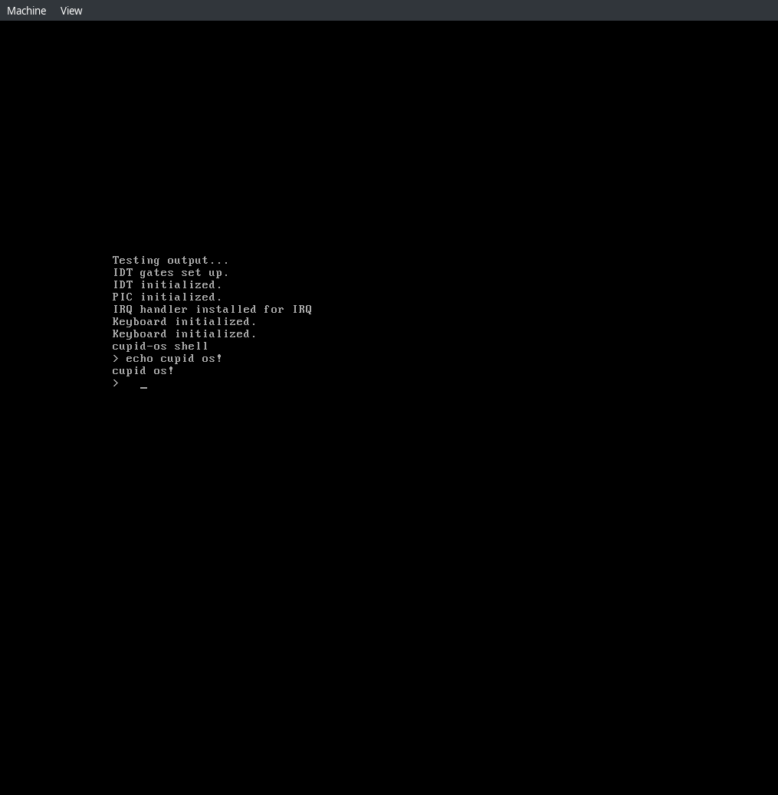

# cupid-os
A modern, 32-bit operating system written in C and x86 Assembly that combines clean design with nostalgic aesthetics. The project implements core OS functionality while serving as both a learning platform and a foundation for experimental OS concepts. Inspired by systems like TempleOS and OsakaOS, cupid-os aims to provide a transparent, hands-on environment where users can directly interact with hardware.

## Example of cupid-os


- Custom bootloader with protected mode transition
- Comprehensive interrupt handling system
- Advanced PS/2 keyboard driver with full US layout support
- High-precision programmable timer system
- VGA text mode graphics with custom character rendering

The goal of cupid-os is to create an accessible, well-documented operating system that serves as both a learning platform and a foundation for experimental OS concepts. Drawing inspiration from TempleOS, OsakaOS, and classic game systems, it focuses on combining technical excellence with an engaging user experience.

## Philosophy
cupid-os embraces a philosophy of complete user empowerment and transparency, inspired by TempleOS. Like TempleOS, cupid-os gives users full, unrestricted access to the entire system:

- No security boundaries or privilege levels - all code runs in ring 0
- Direct hardware access from user programs
- Full memory access with no virtual memory restrictions
- Complete visibility into and control over all system internals
- No artificial limitations or "protections" getting in the way

The goal is to create a pure, simple environment where users have complete freedom to explore, experiment, and truly understand how their computer works at the lowest level. While this approach sacrifices security and isolation, it maximizes learning potential and enables direct hardware manipulation that modern OSes restrict.

This design choice reflects our belief that users should be trusted and empowered rather than constrained. For educational and experimental purposes, having full access to bare metal is invaluable.

With that being said cupid-os also will have a mix of influence from mostly Linux and UNIX-like systems, with some visual and other inspiration coming from both templeOS, and OsakaOS. 

## Project Structure

- **boot/**  
  - `boot.asm` – Bootloader that sets up the environment, loads the kernel, and switches to protected mode.

- **kernel/**  
  - `kernel.c` – Main kernel file handling VGA initialization, timer calibration, and overall system startup.
  - `idt.c/h` – IDT setup and gate configuration.
  - `isr.asm` – Assembly routines for common ISR/IRQ stubs.
  - `irq.c/h` – IRQ dispatch and handler installation.
  - `pic.c/h` – PIC (Programmable Interrupt Controller) initialization and masking functions.
  - `math.c/h` – Math utilities including 64-bit division, itoa, and hex printing.
  - `shell.c/h` – A basic shell interface that handles user input and simple commands.
  - `string.c/h` – Basic string manipulation functions.
  - `cpu.h` – CPU utility functions (including `rdtsc` and CPU frequency detection).
  - `kernel.h` – Core kernel definitions and shared globals (e.g., VGA parameters).

- **drivers/**  
  - `keyboard.c/h` – PS/2 keyboard driver with enhanced key support (arrow keys, delete, and modifiers).
  - `timer.c/h` – Timer functions including sleep/delay, tick counting, and multi-channel support.
  - `pit.c/h` – PIT configuration and frequency setup.
  - `speaker.c/h` – PC speaker driver with tone and beep functionality.

- **link.ld** – Linker script defining the kernel image layout.
- **Makefile** – Build configuration that compiles the bootloader, kernel, and drivers into a bootable image.
- **LICENSE** – GNU General Public License v3.

# Features

- **Custom Bootloader & Protected Mode Transition**  
  - Loads at `0x7C00` and sets up a simple boot message.
  - Loads the kernel from disk and switches from 16-bit real mode to 32-bit protected mode.
  - Sets up a Global Descriptor Table (GDT) for proper memory segmentation.

- **Interrupt & Exception Handling**  
  - Comprehensive Interrupt Descriptor Table (IDT) configuration.
  - Exception handlers with detailed error messages.
  - IRQ management with PIC remapping and custom handler registration.
  - A common ISR/IRQ stub that saves processor state before dispatch.

- **PS/2 Keyboard Driver**  
  - Full US keyboard layout support.
  - Interrupt-driven input processing (IRQ1) with scancode-to-ASCII conversion.
  - **Enhanced Key Handling:**  
    - Support for modifier keys (Shift, Ctrl, Alt, Caps Lock) with proper state tracking.
    - Extended key support including arrow keys and the delete key.
    - Circular buffer implementation for key event storage.
    - Configurable key repeat and debouncing via timestamping.

- **Timer & CPU Calibration**  
  - Uses the Intel 8253/8254 Programmable Interval Timer (PIT) for system timing.
  - Provides system tick counters, sleep/delay functions, and multi-channel timer callbacks.
  - **High-Precision Timing:**  
    - Calibrates using the CPU’s Time Stamp Counter (TSC) to measure the CPU frequency.
    - Exposes `get_cpu_freq()` and `get_pit_ticks_per_ms()` for accurate timing calculations.
    
- **VGA Text Mode Graphics**  
  - Basic VGA driver for an 80×25 text display.
  - Functions for printing characters, strings, and integers.
  - Automatic screen scrolling and hardware cursor updates.

- **PC Speaker Driver**  
  - Implements basic tone and beep functionality.
  - Supports configuring PIT channel 2 to generate square waves for sound output.

- **Memory Management Foundations**  
  - Bitmap-backed physical page frame allocator (currently targeting the first 32MB).
  - Identity-mapped paging setup with 4KB pages to keep addresses stable in ring 0.
  - Kernel heap with a bump allocator + free list for small dynamic allocations.

- **ATA Disk I/O System** ✨ **NEW**
  - **ATA/IDE Driver:** PIO mode support for reading/writing disk sectors (28-bit LBA addressing)
  - **Block Device Abstraction:** Generic interface for block storage devices
  - **Block Cache:** 64-entry LRU cache with write-back policy (32KB total)
    - Automatic periodic flush every 5 seconds
    - Manual sync via `sync` command
    - Cache statistics tracking (hit/miss rates)
  - **FAT16 Filesystem:** Full FAT16 support with MBR partition table parsing
    - File operations: open, read, close, directory listing
    - Root directory support (subdirectories planned)
    - Cluster chain following for files spanning multiple clusters
  - **Performance:** 10-100x speedup via write-back caching

- **Shell Interface**
  - **Command-line shell** with prompt, parsing, history, and tab completion
  - **In-Memory FS Commands:** `ls`, `cat <file>`
  - **Disk Commands:** `lsdisk`, `catdisk <file>`, `sync`, `cachestats`
  - **System Commands:** `help`, `clear`, `echo`, `time`, `reboot`, `history`
  - Command history navigation (arrow up/down) and tab completion for command/file names

- **Utility Libraries**
  - **Math Library:** 64-bit division, integer-to-string conversion, hexadecimal printing
  - **String Library:** strlen, strcmp, strncmp, memcpy, memset
  - **In-memory Filesystem:** Read-only file table for system files (LICENSE.txt, MOTD.txt)

## Development Roadmap
The development roadmap outlined below represents our current plans and priorities. However, it's important to note that this roadmap is flexible and will evolve based on:

- New requirements discovered during development
- Technical challenges and learning opportunities encountered
- Community feedback and contributions
- Integration needs between different system components
- Performance optimization requirements
- Hardware support requirements
- Testing and debugging needs

As we progress, new phases and tasks may be added, existing ones may be modified, and priorities may shift to ensure we're building the most robust and useful system possible.

### Phase 1 - Core System Infrastructure
1. **Interrupt Handling** (✅ Complete)
   - ✅ Implement IDT (Interrupt Descriptor Table)
   - ✅ Set up basic exception handlers
   - ✅ Handle hardware interrupts
   - ✅ Implement PIC configuration
   - ✅ Add detailed error messages for exceptions
   - ✅ Support for custom interrupt handlers
   - ⭕ Basic boot sequence logging
2. **Keyboard Input** (✅ Complete)
   - ✅ Implement PS/2 keyboard driver
   - ✅ Basic input buffer
   - ✅ Scancode handling
   - ✅ Input event processing
   - ✅ Keyboard state management
   - ✅ Modifier key support (Shift, Caps Lock)
   - ✅ Additional modifier keys (Ctrl, Alt)
   - ✅ Key repeat handling
   - ✅ Function keys support
   - ✅ Extended key support
   - ✅ Key debouncing
   - ✅ Circular buffer implementation
   - ⭕ Arrow keys

3. **Timer Support** (🔄 In Progress)
   - ✅ PIT (Programmable Interval Timer) implementation
   - ✅ Basic system clock
   - ✅ Timer interrupts
   - ✅ System tick counter
   - ✅ Sleep/delay functions
   - ✅ Timer calibration
   - ✅ Multiple timer channels
   - ✅ Variable frequency support
   - X PC Speaker support [WILL BE SUPPORTED LATER]
   - 🔄 High-precision timing modes

4. **Memory Management** (🔄 In Progress)
   - ✅ Physical memory manager
   - ✅ Simple memory allocation/deallocation
   - ✅ Basic paging setup
   - ⭕ Memory protection
   - ✅ Heap management
   - ⭕ Memory mapping
   - ⭕ Virtual memory support
   - ⭕ Memory statistics tracking

### Phase 2 - Extended Features
5. **Shell Interface** (🔄 In-Progress)
   - ✅ Basic command parsing and prompt display.
   - ✅ Currently supports the `echo` command.
   - ⭕ Advanced command parsing
   - ⭕ Basic shell commands
   - ⭕ Command history
   - ⭕ Tab completion

7. **Process Management** (⭕ Planned)
   - ⭕ Process creation/termination
   - ⭕ Basic scheduling
   - ⭕ Process states
   - ⭕ Context switching

8. **Basic Device Drivers** (⭕ Planned)
   - ✅ PS/2 Keyboard
   - ⭕ VGA graphics
   - ⭕ Serial port
   - ⭕ Real-time clock

9. **Simple Filesystem** (⭕ Planned)
   - ⭕ Basic file operations
   - ⭕ Directory structure
   - ⭕ File permissions

### Phase 3 - Advanced Features
10. Custom compiler
11. Advanced memory management
12. Extended device support
13. Multi-process scheduling
14. Custom music program in dedication to Terry A. Davis

## Requirements
- NASM (Netwide Assembler) for bootloader compilation
- GCC (32-bit support required)
- GNU Make
- QEMU for testing (qemu-system-i386)
- dosfstools (for creating FAT16 test disks)
- Linux environment (or equivalent Unix-like system)

## Building
1. Install dependencies (Ubuntu/Debian):
```bash
sudo apt-get install nasm gcc make qemu-system-x86 dosfstools
```

2. Build the OS:
```bash
make
```

3. Run in QEMU:
```bash
make run
```

4. Run with a FAT16 hard disk attached:
```bash
make run-disk
```

### Creating a FAT16 Test Disk

The `lsdisk` and `catdisk` commands require a FAT16-formatted disk image with an MBR partition table. A raw `mkfs.fat` image **will not work** — the FAT16 driver expects an MBR with a valid partition entry.

```bash
# 1. Create a 10MB blank disk image
dd if=/dev/zero of=test-disk.img bs=1M count=10

# 2. Create an MBR partition table with a single FAT16 partition (type 0x06)
#    This creates one primary partition using all available space
echo -e 'o\nn\np\n1\n\n\nt\n6\nw' | fdisk test-disk.img

# 3. Set up a loop device for the partition (starts at sector 2048)
sudo losetup -o $((2048*512)) --sizelimit $((18432*512)) /dev/loop0 test-disk.img

# 4. Format the partition as FAT16
sudo mkfs.fat -F 16 -n "CUPIDOS" /dev/loop0

# 5. Mount and add test files
sudo mkdir -p /tmp/testdisk
sudo mount /dev/loop0 /tmp/testdisk
echo "Hello from CupidOS disk!" | sudo tee /tmp/testdisk/README.TXT
echo "This is a test file"      | sudo tee /tmp/testdisk/TEST.TXT

# 6. Clean up
sudo umount /tmp/testdisk
sudo losetup -d /dev/loop0
rmdir /tmp/testdisk
```

After this, `make run-disk` will boot CupidOS with the disk attached. Use `lsdisk` to list files and `catdisk <filename>` to read them.

## Project Structure Details
### Bootloader (`boot/boot.asm`)
- Loads at 0x7C00 (BIOS loading point)
- Sets up initial environment
- Loads kernel from disk
- Switches to protected mode
- Jumps to kernel at 0x1000

### Kernel Components
#### Main Kernel (`kernel/kernel.c`)
- Entry point at 0x1000
- Implements basic screen I/O
- VGA text mode driver
- System initialization
- IDT initialization

#### Interrupt System (`kernel/idt.c`, `kernel/isr.asm`)
- Complete IDT setup and management
- Exception handlers with detailed error messages
- Hardware interrupt support (IRQ0-15)
- Programmable Interrupt Controller (PIC) configuration
- Custom interrupt handler registration
- Debug exception handling

#### Input System (`drivers/keyboard.c`, `drivers/keyboard.h`)
- PS/2 keyboard driver with:
  - Full US keyboard layout support
  - Shift and Caps Lock modifiers
  - Key state tracking
  - Interrupt-driven input handling (IRQ1)
  - Debouncing support
  - Extended key support (e.g. right ctrl/alt)
  - Circular buffer for key events
  - Support for special keys (backspace, tab, enter)

### Memory Layout
- Bootloader: 0x7C00
- Kernel: 0x1000
- Stack: 0x90000
- IDT: Dynamically allocated

## Development
To modify or extend the OS:

1. Bootloader changes:
   - Edit `boot/boot.asm`
   - Modify GDT if adding memory segments
   - Update kernel loading if kernel size changes

2. Kernel changes:
   - Edit `kernel/kernel.c`
   - Update `kernel/link.ld` if changing memory layout
   - Modify Makefile if adding new source files

## Debugging
1. Debug with QEMU monitor:
```bash
make run
# Press Ctrl+Alt+2 for QEMU monitor
```

2. Debug with GDB:
```bash
# Terminal 1
qemu-system-i386 -s -S -boot a -fda cupidos.img

# Terminal 2
gdb
(gdb) target remote localhost:1234
```

## Contributing
1. Fork the repository
2. Create your feature branch
3. Commit your changes
4. Push to the branch
5. Create a Pull Request

## License
GNU v3

## Recent Updates
- Implemented comprehensive keyboard driver with full modifier key support
- Added function key handling (F1-F12)
- Implemented key repeat functionality with configurable delays
- Added debouncing support for more reliable key input
- Enhanced exception handling with detailed error messages
- Implemented basic PIT timer with system tick counter
- Added initial delay/sleep functionality using timer ticks
